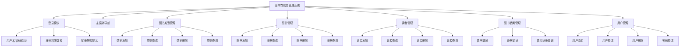
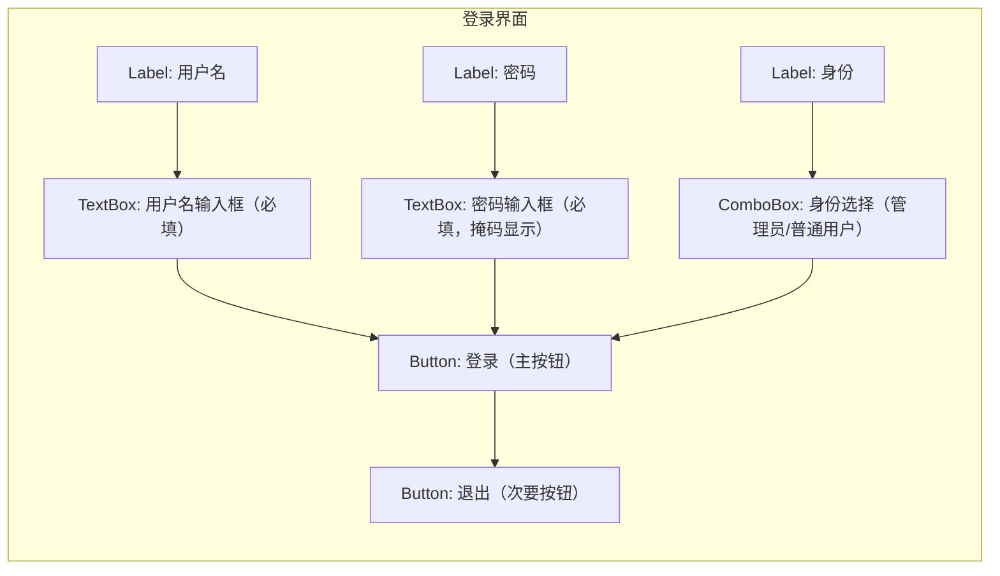
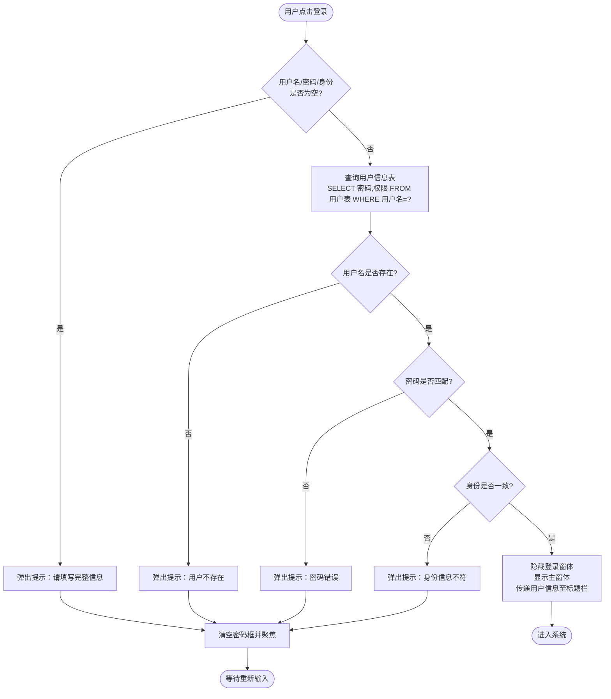
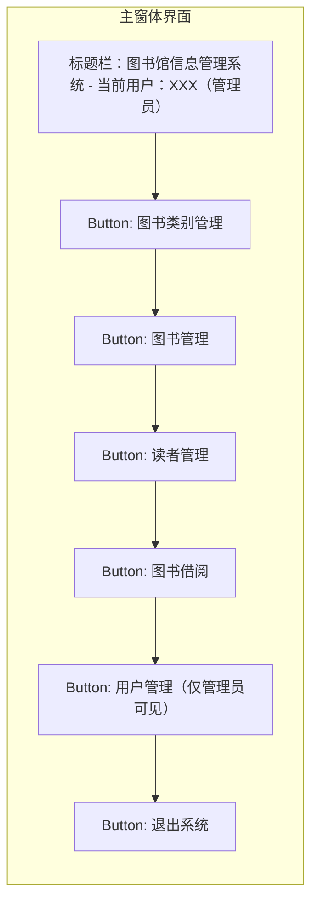
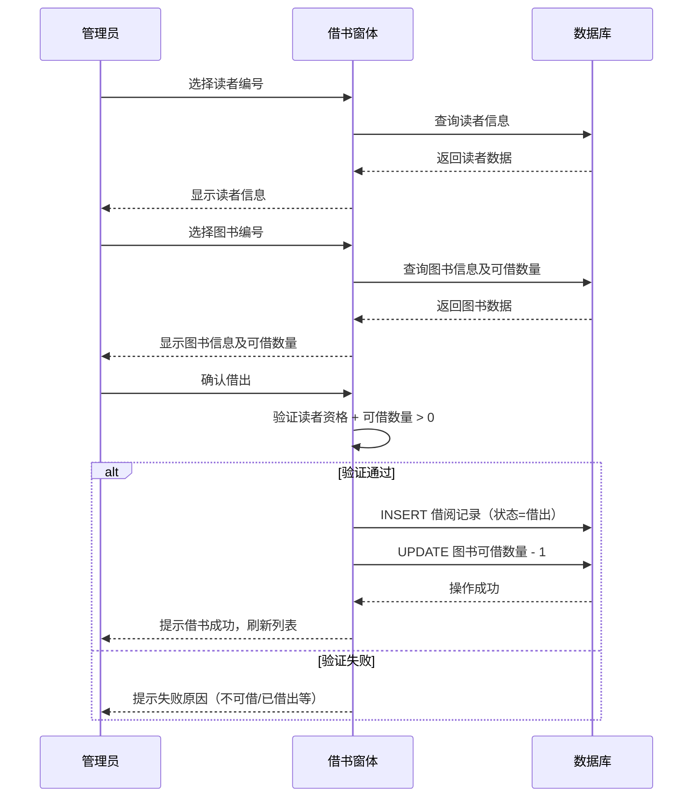
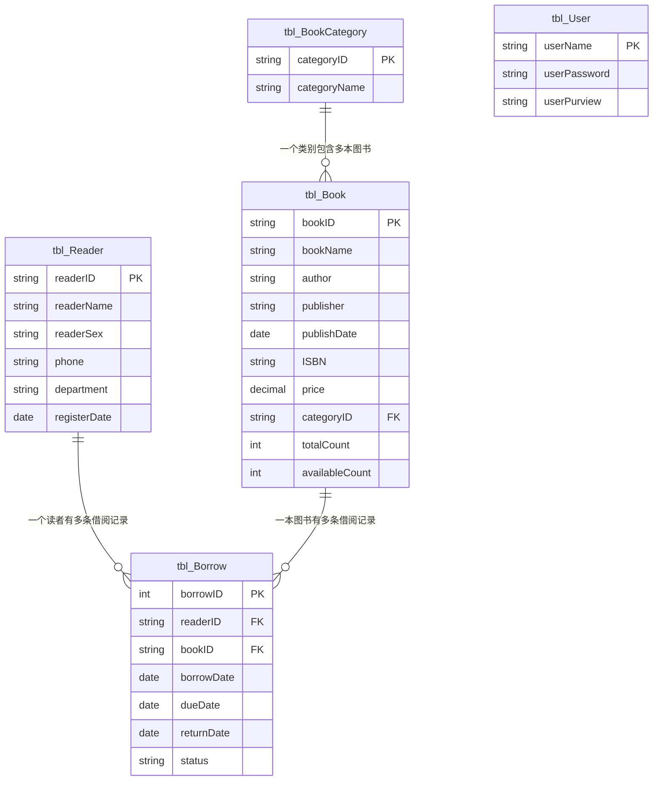

# 图书馆信息管理系统 - 产品需求文档（PRD）

> 文档创建日期：2026-07-10  
> 项目来源：东北石油大学 面向对象课程设计  
> 文档版本：v1.0

---

## 1. 需求背景

### 1.1 业务背景

当前图书馆的日常管理仍依赖人工操作或分散的电子表格，图书类别维护、图书信息登记、读者档案管理、借还书记录等环节存在数据孤岛、查询效率低、易出错等问题。随着馆藏规模增长和读者数量增加，传统管理方式已无法满足业务需求，亟需一套结构化的信息管理系统将管理流程规范化、系统化。

### 1.2 触发来源

本项目为东北石油大学计算机与信息技术学院"面向对象课程设计"课程实践任务，要求运用面向对象编程思想和 C/S 架构完成图书馆信息管理系统的完整设计与开发，涵盖需求分析、功能模块设计、数据库表结构设计、编码实现与系统测试全流程。

### 1.3 现状与痛点

- **图书管理分散**：图书类别与图书基本信息缺乏统一管理入口，新增、修改、查询操作依赖人工台账，数据一致性难以保证
- **读者信息维护困难**：读者档案更新滞后，借阅资格验证依赖人工核对，容易出现超期借阅或无权借阅的情况
- **借还流程不可追溯**：借书、还书记录缺乏结构化存储，历史借阅数据无法快速检索和统计
- **权限控制缺失**：所有操作人员拥有相同权限，无法区分管理员与普通用户的操作范围

### 1.4 证据强度标注

- 业务痛点描述：`[PM 假设]` — 基于课程设计任务书要求推导
- 功能需求范围：`[任务书定义]` — 由课程设计任务书明确指定

---

## 2. 目标与范围

### 2.1 产品目标

构建一套基于 C/S 架构的图书馆信息管理系统，实现图书类别管理、图书管理、读者管理、图书借阅及用户权限管理的完整业务闭环，使图书馆管理工作规范化、系统化、程序化，提高信息处理的速度和准确性。

### 2.2 项目约束

| 约束项 | 内容 |
|--------|------|
| 开发环境 | Microsoft Visual Studio 2010 或以上版本 |
| 编程语言 | C# |
| 数据库 | SQL Server 2010 或以上版本 |
| 架构模式 | C/S（客户端/服务器） |
| 完成期限 | 第 18-19 周 |

> **说明**：以上技术约束由课程设计任务书强制规定，不属于 PRD 层面的技术选型决策。

### 2.3 范围界定

| 类别 | 包含 | 不包含 |
|------|------|--------|
| 图书管理 | 图书类别增删改查、图书信息增删改查 | 图书封面图片上传、图书推荐算法 |
| 读者管理 | 读者档案增删改查、借阅资格验证 | 读者信用评分体系、读者行为分析 |
| 借阅管理 | 借书登记、还书登记、借阅记录查询 | 自动续期、逾期罚款在线支付 |
| 用户管理 | 管理员/普通用户角色区分、用户增删改查 | 多级权限体系、SSO 单点登录 |
| 统计报表 | 基础数据浏览 | 数据可视化大屏、导出 PDF 报表 |

---

## 3. 用户与场景

### 3.1 用户角色

| 角色 | 描述 | 操作权限 | 使用频率 |
|------|------|----------|----------|
| **管理员** | 图书馆工作人员，负责系统全部数据维护 | 图书类别管理、图书管理、读者管理、借阅管理、用户管理 | 高频（每日） |
| **普通用户** | 辅助管理人员或实习生，权限受限 | 图书信息查询、读者信息查询、借阅信息查询 | 中频（每周） |

### 3.2 核心场景

| 优先级 | 场景 | 角色 | 描述 |
|--------|------|------|------|
| P0 | 管理员登录系统 | 管理员 | 输入用户名、密码和身份选择，验证通过后进入主窗体 |
| P0 | 新书入库登记 | 管理员 | 选择图书类别，录入图书编号、书名、作者、出版社等信息并提交 |
| P0 | 读者档案登记 | 管理员 | 录入读者编号、姓名、性别、联系方式等信息并提交 |
| P0 | 办理借书 | 管理员 | 选择读者和图书，登记借阅日期，系统更新图书状态和借阅记录 |
| P0 | 办理还书 | 管理员 | 根据借阅记录找到对应借阅信息，登记归还日期，更新图书状态 |
| P1 | 图书类别维护 | 管理员 | 新增、修改、删除图书类别（如计算机类、文学类、经济类等） |
| P1 | 信息查询 | 管理员/普通用户 | 按条件检索图书、读者或借阅记录 |
| P1 | 用户账号管理 | 管理员 | 新增、修改、删除系统用户，设置用户权限 |
| P2 | 修改个人密码 | 管理员/普通用户 | 用户修改自己的登录密码 |

### 3.3 系统功能模块图

---

## 4. 功能需求

### 4.1 功能概览表

| 编号 | 模块 | 功能描述 |
|------|------|----------|
| F-01 | 登录模块 | 用户输入用户名、密码并选择身份（管理员/普通用户），系统验证账号密码与身份是否匹配。验证通过后进入主窗体并将登录信息传递至标题栏显示；验证失败则弹出错误提示并清空密码框等待重新输入。用户名、密码、身份三项均不可为空。 |
| F-02 | 主窗体导航 | 登录成功后展示主界面，根据用户权限动态启用/禁用功能按钮（管理员可操作全部功能，普通用户仅可查询）。用户点击功能按钮进入对应子模块窗体，主窗体隐藏。关闭主窗体时终止应用程序。提供退出按钮返回登录界面。 |
| F-03 | 图书类别管理-添加 | 管理员录入图书类别编号和类别名称（如"计算机类"、"文学类"），系统验证编号唯一性后写入数据库。编号和名称均为必填项。 |
| F-04 | 图书类别管理-修改 | 管理员在列表中选中已有图书类别，修改类别名称后提交。系统验证类别存在性并更新数据库记录。**类别编号为主键，不允许修改**，仅允许修改类别名称。 |
| F-05 | 图书类别管理-删除 | 管理员选中图书类别执行删除，系统检查该类别下是否有关联图书：有则提示"存在关联图书，无法删除"；无则确认后删除。 |
| F-06 | 图书类别管理-查询 | 管理员/普通用户可按类别名称关键字模糊检索图书类别列表，列表展示类别编号和名称。 |
| F-07 | 图书管理-添加 | 管理员选择图书类别，录入图书编号、书名、作者、出版社、出版日期、ISBN、价格、馆藏数量等信息，系统验证图书编号唯一性后写入数据库。编号、书名为必填项。 |
| F-08 | 图书管理-修改 | 管理员在列表中选中图书记录，修改各项信息后提交。系统验证图书存在性并更新记录。 |
| F-09 | 图书管理-删除 | 管理员选中图书记录执行删除，系统检查该书是否有未归还的借阅记录：有则提示"存在未归还借阅，无法删除"；无则确认后删除。 |
| F-10 | 图书管理-查询 | 管理员/普通用户可按书名、作者、类别、ISBN 等条件组合检索图书列表，列表展示图书编号、书名、作者、类别、馆藏数量等关键字段。 |
| F-11 | 读者管理-添加 | 管理员录入读者编号、姓名、性别、联系电话、所在院系、注册日期等信息，系统验证读者编号唯一性后写入数据库。编号、姓名为必填项，性别限定"男"/"女"。 |
| F-12 | 读者管理-修改 | 管理员在列表中选中读者记录，修改各项信息后提交。系统验证读者存在性并更新记录。 |
| F-13 | 读者管理-删除 | 管理员选中读者记录执行删除，系统检查该读者是否有未归还的借阅记录：有则提示"存在未归还图书，无法删除"；无则确认后删除。 |
| F-14 | 读者管理-查询 | 管理员/普通用户可按读者编号、姓名、院系等条件检索读者列表，列表展示读者编号、姓名、性别、联系电话等关键字段。 |
| F-15 | 图书借阅-借书登记 | 管理员选择读者和图书，系统自动填充借阅日期（当前日期），验证读者借阅资格和图书可借数量后生成借阅记录，同时扣减图书可借库存。借阅记录包含读者编号、图书编号、借出日期、应还日期、状态（借出/已还）。 |
| F-16 | 图书借阅-还书登记 | 管理员根据读者编号或图书编号查找借出状态的借阅记录，登记归还日期，更新借阅记录状态为"已还"，同时恢复图书可借库存。**归还时系统比较归还日期与应还日期**：若归还日期 ≤ 应还日期，正常归还；若归还日期 > 应还日期，弹出逾期提示"该书已逾期 X 天，请提醒读者注意"，但**仍允许归还**（课程设计阶段不做罚款处理），记录中标记逾期状态。 |
| F-17 | 图书借阅-借阅记录查询 | 管理员/普通用户可按读者编号、图书编号、借阅状态（借出/已还）、日期范围等条件检索借阅记录列表。 |
| F-18 | 用户管理-添加 | 管理员录入用户名、密码、确认密码、权限（管理员/普通用户），系统验证用户名唯一性及两次密码一致性后写入数据库。用户名、密码为必填项。 |
| F-19 | 用户管理-修改 | 管理员选中用户记录，可修改密码和权限，提交后更新数据库记录。 |
| F-20 | 用户管理-删除 | 管理员选中用户记录执行删除。不允许删除当前登录用户自身账号。 |
| F-21 | 密码修改 | 当前登录用户可修改自身密码，需输入旧密码验证通过后设置新密码，两次输入新密码需一致。 |

### 4.2 模块详细设计

#### 4.2.1 登录模块

**业务逻辑**：用户在登录界面输入用户名、密码，从下拉框选择身份（管理员/普通用户）。系统查询用户信息表，验证用户名是否存在、密码是否匹配、身份是否一致。三者均通过则加载主窗体并隐藏登录界面；任一不通过则弹出提示消息，清空密码输入框并聚焦等待重新输入。

**交互逻辑**：
- 点击【登录】按钮 → 系统校验输入非空 → 查询数据库验证 → 成功：隐藏登录窗体、显示主窗体；失败：弹出错误提示、清空密码框
- 点击【退出】按钮 → 关闭登录界面、终止应用程序

**规则约束**：
- 用户名：文本，必填，不可为空
- 密码：文本，必填，不可为空，输入时掩码显示
- 身份：下拉选择，必选，取值为"管理员"或"普通用户"
- 连续登录失败无次数限制（课程设计阶段不锁定账号）

**权限逻辑**：登录身份决定主窗体功能按钮的启用/禁用状态。管理员可操作全部功能；普通用户仅可使用查询类功能。

**边界与异常**：
- 数据库连接失败：弹出异常提示消息框，不导致程序崩溃
- 输入包含特殊字符：**统一采用参数化查询（SqlParameter）传递用户输入，从数据访问层防止 SQL 注入**；业务层不对特殊字符做额外过滤

#### 4.2.2 主窗体导航模块

**业务逻辑**：主窗体作为系统导航中枢，登录成功后加载。窗体标题栏显示当前登录用户名和身份信息。根据用户权限动态设置各功能按钮的 Enabled 状态。用户点击功能按钮后实例化对应子窗体并显示，同时隐藏主窗体。子窗体关闭后返回主窗体。

**交互逻辑**：
- 窗体加载 → 读取登录传递的用户信息 → 设置标题栏 → 根据权限启用/禁用按钮
- 点击功能按钮 → 实例化子窗体 → 显示子窗体 → 隐藏主窗体
- 点击退出按钮 → 关闭主窗体 → 显示登录界面
- 点击窗体关闭按钮 → 终止应用程序

**权限逻辑**：
- 管理员：全部按钮可用（图书类别管理、图书管理、读者管理、图书借阅、用户管理）
- 普通用户：仅查询类按钮可用（图书查询、读者查询、借阅记录查询）

#### 4.2.3 图书管理模块

**业务逻辑**：管理员可对图书信息执行增、删、改、查操作。添加图书时需先选择图书类别，再录入图书详细信息。图书列表以数据表格形式展示，支持按多条件组合检索。删除前系统检查是否存在未归还的借阅记录。

**交互逻辑**：
- 添加：点击【添加】按钮 → 弹出添加窗体 → 选择类别 → 填写信息 → 点击【提交】→ 验证通过后写入数据库 → 刷新列表
- 修改：选中列表行 → 点击【修改】按钮 → 弹出修改窗体（回填数据）→ 修改后提交 → 更新数据库 → 刷新列表
- 删除：选中列表行 → 点击【删除】按钮 → 弹出确认对话框 → 确认后检查关联借阅 → 无关联则删除 → 刷新列表
- 查询：在查询条件区输入关键字 → 点击【查询】按钮 → 列表过滤显示匹配结果

**规则约束**：
- 图书编号：字符串，必填，唯一，长度不超过 20
- 书名：字符串，必填，长度不超过 100
- 作者：字符串，选填，长度不超过 50
- 出版社：字符串，选填，长度不超过 50
- 出版日期：日期型，选填
- ISBN：字符串，选填，长度 13 位
- 价格：数值型，选填，大于 0
- 馆藏数量：整数，必填，大于等于 0
- 可借数量：整数，系统维护，等于馆藏数量减去当前借出数量

**权限逻辑**：管理员可执行全部操作；普通用户仅可查询和浏览。

#### 4.2.4 读者管理模块

**业务逻辑**：管理员可对读者档案执行增、删、改、查操作。读者信息以数据表格形式展示，支持按编号、姓名、院系等条件检索。删除前系统检查该读者是否存在未归还的借阅记录。

**交互逻辑**：与图书管理模块一致（添加→弹窗填写→提交→刷新；修改→选中→回填→提交→刷新；删除→选中→确认→检查关联→删除→刷新；查询→输入条件→过滤展示）。

**规则约束**：
- 读者编号：字符串，必填，唯一，长度不超过 20
- 姓名：字符串，必填，长度不超过 8
- 性别：字符串，必填，取值为"男"或"女"
- 联系电话：字符串，选填，长度不超过 15
- 所在院系：字符串，选填，长度不超过 20
- 注册日期：日期型，系统自动填充为当前日期

**权限逻辑**：管理员可执行全部操作；普通用户仅可查询和浏览。

#### 4.2.5 图书借阅管理模块

**业务逻辑**：借书时管理员选择读者和图书，系统验证读者借阅资格（是否存在、是否有效）和图书可借数量（大于 0），验证通过后生成借阅记录并扣减可借数量。还书时根据读者编号或图书编号查找借出状态的记录，登记归还日期，更新状态为"已还"并恢复可借数量。

**交互逻辑**：
- 借书：点击【借书登记】→ 弹出借书窗体 → 选择/输入读者编号 → 选择/输入图书编号 → 系统自动填充借出日期和应还日期 → 点击【确认借出】→ 验证通过后写入记录 → 刷新借阅列表
- 还书：点击【还书登记】→ 弹出还书窗体 → 输入读者编号或图书编号 → 系统检索借出状态记录 → 选中记录 → 点击【确认归还】→ 更新记录状态和日期 → 刷新借阅列表
- 查询：在查询条件区输入条件（读者编号/图书编号/状态/日期范围）→ 点击【查询】→ 列表过滤显示

**规则约束**：
- 借阅记录编号：系统自动生成，唯一
- 读者编号：外键，引用读者信息表
- 图书编号：外键，引用图书信息表
- 借出日期：日期型，系统自动填充为当前日期
- 应还日期：日期型，系统自动计算（借出日期 + 借阅期限，默认 30 天）
- 归还日期：日期型，还书时自动填充
- 状态：枚举值，"借出"或"已还"

**边界与异常**：
- 图书可借数量为 0：提示"该图书已全部借出，无法借阅"
- 读者有超期未还图书：提示"该读者有超期未还图书，请先归还"，**限制其继续借书**
- 重复借阅同一本书：提示"该读者已借阅此书且未归还"
- 借阅数量上限：**每位读者同时借阅图书上限为 5 本**（命名常量 `MAX_BORROW_LIMIT = 5`，可在配置中调整），超出时提示"读者已达到借阅上限（5 本），请先归还"

**并发控制策略**：
- C/S 架构下多客户端同时借阅同一图书时，采用**数据库行级锁 + 事务**保证 `availableCount` 扣减的原子性：借书事务内执行 `UPDATE tbl_Book SET availableCount = availableCount - 1 WHERE bookID = ? AND availableCount > 0`，通过受影响行数判断是否扣减成功（0 行表示已被并发扣减完）
- 课程设计阶段若部署为单机模式，可声明"单客户端串行操作，不做并发控制"，但数据访问层应预留事务封装

#### 4.2.6 用户管理模块

**业务逻辑**：管理员可对系统用户执行增、删、改操作。用户分为管理员和普通用户两种权限。添加用户时验证用户名唯一性和两次密码一致性。不允许删除当前登录用户自身账号。所有用户均可修改自身密码。

**规则约束**：
- 用户名：字符串，必填，唯一，长度不超过 16
- 密码：字符串，必填，长度不超过 16
- 权限：字符串，必填，取值为"管理员"或"普通用户"

**权限逻辑**：仅管理员可访问用户管理模块。管理员可管理所有用户账号。普通用户无权访问用户管理模块，但可修改自身密码。

---

## 5. 数据模型

### 5.1 数据表设计

基于系统功能需求，数据库（LibraryDB）包含以下数据表：

#### 5.1.1 系统用户表（tbl_User）

| 列名 | 说明 | 数据类型 | 约束 |
|------|------|----------|------|
| userName | 用户名 | 字符串，长度 16 | 主键 |
| userPassword | 用户密码 | 字符串，长度 16 | 非空 |
| userPurview | 权限 | 字符串，长度 16 | 取值为"管理员"或"普通用户" |

#### 5.1.2 图书类别表（tbl_BookCategory）

| 列名 | 说明 | 数据类型 | 约束 |
|------|------|----------|------|
| categoryID | 类别编号 | 字符串，长度 10 | 主键 |
| categoryName | 类别名称 | 字符串，长度 20 | 非空 |

#### 5.1.3 图书信息表（tbl_Book）

| 列名 | 说明 | 数据类型 | 约束 |
|------|------|----------|------|
| bookID | 图书编号 | 字符串，长度 20 | 主键 |
| bookName | 书名 | 字符串，长度 100 | 非空 |
| author | 作者 | 字符串，长度 50 | - |
| publisher | 出版社 | 字符串，长度 50 | - |
| publishDate | 出版日期 | 日期型 | - |
| ISBN | ISBN 号 | 字符串，长度 13 | - |
| price | 价格 | 数值型 | 大于 0 |
| categoryID | 类别编号 | 字符串，长度 10 | 外键，引用 tbl_BookCategory |
| totalCount | 馆藏数量 | 整数 | 大于等于 0 |
| availableCount | 可借数量 | 整数 | 大于等于 0，小于等于 totalCount |

> **availableCount 一致性策略**：该字段为冗余字段（可通过 `totalCount - 借出未还数量` 计算得出），冗余存储的目的是避免每次查询图书列表时关联 tbl_Borrow 表进行统计计算。**一致性维护规则**：借书/还书操作必须在同一数据库事务中同时更新 tbl_Borrow 记录和 tbl_Book.availableCount，保证两者原子性提交；系统不提供直接修改 availableCount 的接口，该字段仅由借还业务逻辑维护。

#### 5.1.4 读者信息表（tbl_Reader）

| 列名 | 说明 | 数据类型 | 约束 |
|------|------|----------|------|
| readerID | 读者编号 | 字符串，长度 20 | 主键 |
| readerName | 姓名 | 字符串，长度 8 | 非空 |
| readerSex | 性别 | 字符串，长度 2 | 取值为"男"或"女" |
| phone | 联系电话 | 字符串，长度 15 | - |
| department | 所在院系 | 字符串，长度 20 | - |
| registerDate | 注册日期 | 日期型 | - |

#### 5.1.5 借阅信息表（tbl_Borrow）

| 列名 | 说明 | 数据类型 | 约束 |
|------|------|----------|------|
| borrowID | 借阅编号 | 整数，自增 | 主键 |
| readerID | 读者编号 | 字符串，长度 20 | 外键，引用 tbl_Reader |
| bookID | 图书编号 | 字符串，长度 20 | 外键，引用 tbl_Book |
| borrowDate | 借出日期 | 日期型 | 非空 |
| dueDate | 应还日期 | 日期型 | 非空 |
| returnDate | 归还日期 | 日期型 | 可空（未归还时为 NULL） |
| status | 借阅状态 | 字符串，长度 4 | 取值为"借出"或"已还" |

### 5.2 表关系图

---

## 6. 非功能需求

| 类别 | 需求描述 |
|------|----------|
| **性能** | 单次简单查询响应时间不超过 1 秒；组合条件查询不超过 2 秒；数据表格加载 1000 条记录不超过 3 秒（含网络传输） |
| **可用性** | 系统在正常操作下不崩溃；图书馆营业时间内（8:00-22:00）可稳定运行，异常退出后可重启恢复 |
| **安全性** | 用户密码采用 **SHA-256 哈希加密存储**（课程设计阶段统一采用哈希，不使用明文）；数据库连接字符串配置在 App.config 中，不可硬编码在 UI 层；所有数据库查询统一采用 **参数化查询（SqlParameter）防止 SQL 注入** |
| **易用性** | 界面操作方式与主流管理系统相似，功能按钮命名清晰，关键操作（删除）需二次确认 |
| **可维护性** | 数据库访问逻辑封装在公共类中，各模块通过调用公共方法访问数据库，避免重复代码 |
| **兼容性** | 客户端运行于 Windows 操作系统，支持 Windows 7 及以上版本 |
| **容错性** | 数据库连接失败时弹出友好提示而非程序崩溃；非法输入数据时给出明确的错误信息 |

---

## 7. 验收标准

| 编号 | 验收项 | 验收标准 | 对应功能 |
|------|--------|----------|----------|
| AC-01 | 管理员登录 | 输入正确的管理员用户名、密码并选择"管理员"身份，成功进入主窗体，标题栏显示用户信息，全部功能按钮可用 | F-01, F-02 |
| AC-02 | 普通用户登录 | 输入正确的普通用户账号登录，主窗体中管理类功能按钮禁用，仅查询功能可用 | F-01, F-02 |
| AC-03 | 登录失败处理 | 输入错误密码或不匹配的身份，弹出错误提示，密码框清空并聚焦 | F-01 |
| AC-04a | 图书类别-添加 | 录入类别编号和名称，提交后列表新增一条记录；重复编号被拦截 | F-03 |
| AC-04b | 图书类别-修改 | 选中类别修改名称后提交，列表对应记录更新；类别编号字段不可编辑 | F-04 |
| AC-04c | 图书类别-删除 | 选中无关联图书的类别可删除；选中有关联图书的类别被拦截并提示 | F-05 |
| AC-04d | 图书类别-查询 | 按类别名称关键字检索，列表正确过滤显示 | F-06 |
| AC-05a | 图书-添加 | 选择类别并录入图书信息，提交后列表新增记录；重复编号被拦截；必填项为空被拦截 | F-07 |
| AC-05b | 图书-修改 | 选中图书修改信息后提交，列表对应记录更新 | F-08 |
| AC-05c | 图书-删除 | 选中无未归还借阅的图书可删除；选中有未归还借阅的图书被拦截并提示 | F-09 |
| AC-05d | 图书-查询 | 按书名/作者/类别/ISBN 组合条件检索，列表正确过滤显示 | F-10 |
| AC-06a | 读者-添加 | 录入读者信息，提交后列表新增记录；重复编号被拦截；性别非"男"/"女"被拦截 | F-11 |
| AC-06b | 读者-修改 | 选中读者修改信息后提交，列表对应记录更新 | F-12 |
| AC-06c | 读者-删除 | 选中无未归还借阅的读者可删除；选中有未归还借阅的读者被拦截并提示 | F-13 |
| AC-06d | 读者-查询 | 按编号/姓名/院系检索，列表正确过滤显示 | F-14 |
| AC-07 | 借书流程 | 选择读者和图书后成功生成借阅记录，图书可借数量减 1；可借数量为 0 时被拦截；读者达到借阅上限（5 本）时被拦截；读者有超期未还图书时被拦截 | F-15 |
| AC-08 | 还书流程 | 查找借出记录并登记归还，借阅状态更新为"已还"，图书可借数量加 1；逾期归还时弹出逾期提示但仍允许归还 | F-16 |
| AC-09 | 借阅记录查询 | 可按读者编号、图书编号、状态、日期范围等条件检索借阅记录 | F-17 |
| AC-10a | 用户-添加 | 录入用户信息，两次密码一致后提交成功；用户名重复被拦截；两次密码不一致被拦截 | F-18 |
| AC-10b | 用户-修改 | 选中用户修改密码/权限后提交，记录更新 | F-19 |
| AC-10c | 用户-删除 | 选中非当前登录用户可删除；选中当前登录用户被拦截 | F-20 |
| AC-11 | 密码修改 | 用户输入正确旧密码后可修改为新密码，新密码需两次一致；旧密码错误被拦截 | F-21 |
| AC-12a | 空数据库查询 | 数据库无数据时执行查询，列表显示空表，不报错 | 全部查询功能 |
| AC-12b | 输入超长字符串 | 输入超过字段长度的字符串，系统拦截并提示，不崩溃 | 全部输入功能 |
| AC-12c | 必填项为空 | 必填项留空提交，系统拦截并提示具体字段名 | F-03, F-07, F-11, F-18 |
| AC-12d | 主键重复 | 添加记录时使用已存在的主键，系统拦截并提示"编号已存在" | F-03, F-07, F-11, F-18 |
| AC-12e | 数据库连接异常 | 数据库连接失败时，系统弹出友好提示，不崩溃 | 全部 |

---

## 8. 假设与待确认项

| 编号 | 假设/待确认内容 | 说明 |
|------|-----------------|------|
| A-01 | `[假设 — 已设定]` 借阅期限默认为 30 天 | 文档未明确借阅期限，此处按常见图书馆业务设定。**借阅期限提取为命名常量 `DEFAULT_BORROW_DAYS = 30`**，避免在代码中硬编码魔法值，后续可改为配置项 |
| A-02 | `[假设 — 已设定]` 读者同时借书数量上限为 5 本 | 文档未定义借书数量限制，此处按常见图书馆业务设定为 5 本。**上限提取为命名常量 `MAX_BORROW_LIMIT = 5`**，可在配置中调整 |
| A-03 | `[假设 — 已设定]` 逾期处理策略 | 文档未涉及逾期罚款规则，当前版本策略为：**还书时检测逾期并提示，但仍允许归还，不做罚款处理**；**有超期未还图书的读者限制继续借书**。后续如需罚款功能可扩展 tbl_Borrow 表增加 fineAmount 字段 |
| A-04 | `[假设 — 待确认]` 图书类别层级关系 | 当前设计为单层类别（无父子类别），如需树状分类需扩展 tbl_BookCategory 表增加 parentCategoryID 字段 |
| A-05 | `[已确定]` 密码加密方式 | 统一采用 **SHA-256 哈希加密存储**，不使用明文。课程设计阶段使用 SHA-256 即可满足安全性要求，生产环境可升级为 bcrypt/PBKDF2 |

---

## 9. 术语表

| 术语 | 说明 |
|------|------|
| C/S 架构 | 客户端/服务器架构，客户端安装专用软件，通过局域网访问服务器端数据库 |
| 管理员 | 拥有系统全部操作权限的用户角色 |
| 普通用户 | 仅拥有查询权限的用户角色 |
| 图书类别 | 对图书按学科或类型分类的标识，如"计算机类"、"文学类" |
| 借阅记录 | 记录读者借阅某本图书的完整信息，包含借出日期、应还日期、归还日期和状态 |
| 可借数量 | 图书当前可供借阅的库存数量，等于馆藏数量减去已借出未归还数量 |
