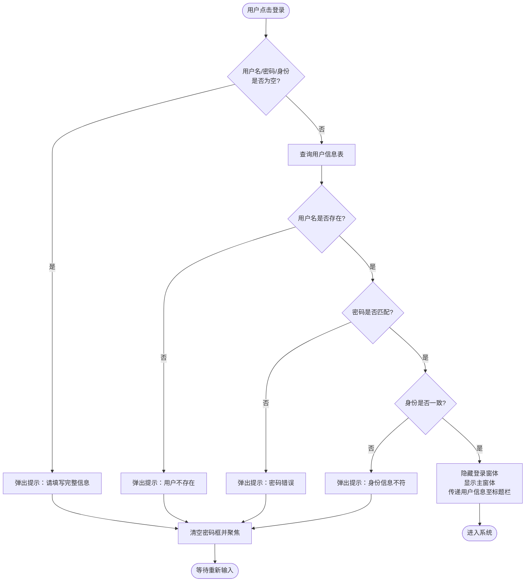
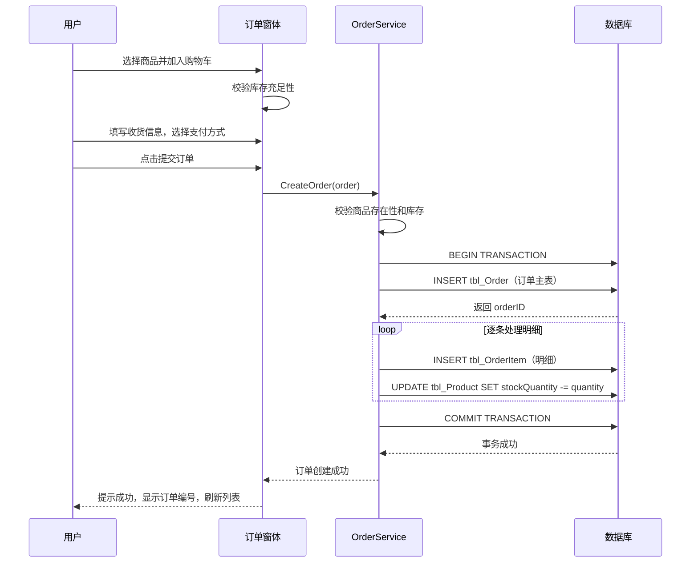
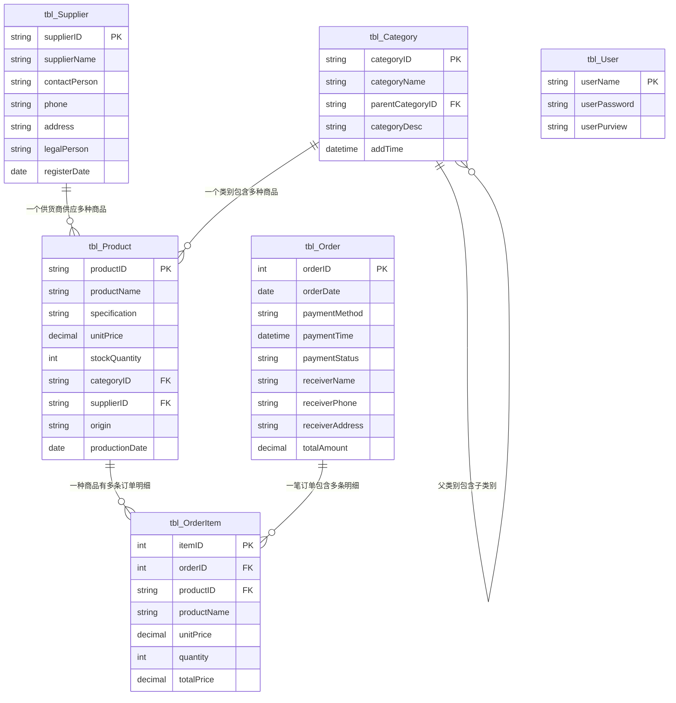

# 校园易购信息管理系统 - 产品需求文档（PRD）

> 文档创建日期：2026-07-11  
> 最后更新日期：2026-07-11  
> 项目来源：东北石油大学 面向对象课程设计  
> 文档版本：v2.0（对齐任务书完整字段要求 + 售卖模块重构为订单双表结构）  
> 原始文档：报告-计科25-1班01-刘雅婷-校园易购信息管理系统的开发(3).doc

---

## 1. 需求背景

### 1.1 业务背景

随着校园信息化的推进，高校师生对便捷购物需求日益增长。传统校园超市、便利店存在排队等候时间长、商品信息不透明、库存管理粗放等问题。校园易购信息管理系统旨在将商品类别管理、商品信息维护、供货商管理、订单售卖等环节纳入统一的信息化平台，实现校园商品管理的规范化、系统化、程序化，提高信息处理的速度和准确性。

### 1.2 触发来源

本项目为东北石油大学计算机与信息技术学院"面向对象课程设计"课程实践任务，要求运用面向对象编程思想和 C/S 架构完成校园易购信息管理系统的完整设计与开发，涵盖需求分析、功能模块设计、数据库表结构设计、编码实现与系统测试全流程。

> **任务书原文**：本次课程设计主要完成校园易购管理系统的设计与开发。对校园易购管理系统的需求进行任务分解，完成功能模块设计，数据库表结构设计要合理、关系清晰，并最终实现商品类别管理、商品信息管理、供货商管理、商品售卖及其它系统所需的附加信息管理等功能。

> **任务书字段要求**（v2.0 新增对齐）：
> - 商品类别：类别编号、类别名称、**类别描述**、**添加时间**
> - 商品信息：商品编号、商品名称、类别、单价、**产地**、**生产日期**、库存数量、供货商
> - 供货商：供货商编号、名称、地址、**法人**、**注册日期**、联系人、联系方式
> - 商品售卖：**订单表**（订单编号、支付方式、支付时间、支付状态、收货人姓名、收货人手机号、收货地址）+ **订单商品列表**（商品编号、订单编号、商品名称、单价、数量、总价）

### 1.3 现状与痛点

- **商品管理分散**：商品类别与商品基本信息缺乏统一管理入口，新增、修改、查询操作依赖人工台账，数据一致性难以保证
- **供货商信息维护困难**：供货商档案更新滞后，采购时难以快速查询供货商联系方式和供货记录
- **售卖流程不可追溯**：商品销售记录缺乏结构化存储，历史销售数据无法快速检索和统计，库存扣减依赖人工核对
- **权限控制缺失**：所有操作人员拥有相同权限，无法区分管理员与普通用户的操作范围

### 1.4 证据强度标注

- 业务痛点描述：`[PM 假设]` — 基于课程设计任务书要求推导
- 功能需求范围：`[任务书定义]` — 由课程设计任务书明确指定
- 字段完整性要求：`[任务书定义]` — v2.0 对齐任务书 PPT 第 24 页字段建议

---

## 2. 目标与范围

### 2.1 产品目标

构建一套基于 C/S 架构的校园易购信息管理系统，实现商品类别管理、商品信息管理、供货商管理、订单售卖及用户权限管理的完整业务闭环，使校园商品管理工作规范化、系统化、程序化，提高信息处理的速度和准确性。

### 2.2 项目约束

| 约束项 | 内容 |
|--------|------|
| 开发环境 | Microsoft Visual Studio 2010 或以上版本 |
| 编程语言 | C# |
| 数据库 | SQL Server 2010 或以上版本 |
| 架构模式 | C/S（客户端/服务器） |
| 完成期限 | 第 18-20 周 |

> **说明**：以上技术约束由课程设计任务书强制规定，不属于 PRD 层面的技术选型决策。

### 2.3 范围界定

| 类别 | 包含 | 不包含 |
|------|------|--------|
| 商品类别管理 | 类别增删改查、树状层级分类、类别描述、添加时间 | 类别自动推荐算法 |
| 商品信息管理 | 商品增删改查、库存管理、产地、生产日期 | 商品图片上传、商品评价系统 |
| 供货商管理 | 供货商档案增删改查、供货关系维护、法人代表、注册日期 | 供货商信用评分、合同管理 |
| 订单售卖 | 购物车模式下单、订单+明细双表结构、支付方式/状态管理、库存自动扣减、收货信息管理 | 在线支付对接、订单物流跟踪 |
| 用户管理 | 管理员/普通用户角色区分、用户增删改查 | 多级权限体系、SSO 单点登录 |
| 统计报表 | 基础数据浏览 | 数据可视化大屏、导出 PDF 报表 |

---

## 3. 用户与场景

### 3.1 用户角色

| 角色 | 描述 | 操作权限 | 使用频率 |
|------|------|----------|----------|
| **管理员** | 校园超市/商店工作人员，负责系统全部数据维护 | 商品类别管理、商品管理、供货商管理、订单管理（含下单+确认支付）、用户管理 | 高频（每日） |
| **普通用户** | 辅助管理人员或实习生，权限受限 | 商品信息查询、供货商信息查询、订单查询、创建订单 | 中频（每周） |

### 3.2 核心场景

| 优先级 | 场景 | 角色 | 描述 |
|--------|------|------|------|
| P0 | 管理员登录系统 | 管理员 | 输入用户名、密码和身份选择，验证通过后进入主窗体 |
| P0 | 新商品入库登记 | 管理员 | 选择商品类别和供货商，录入商品编号、名称、价格、库存、产地、生产日期等信息并提交 |
| P0 | 供货商档案登记 | 管理员 | 录入供货商编号、名称、联系人、联系电话、法人代表、注册日期等信息并提交 |
| P0 | 创建订单（购物车下单） | 管理员/普通用户 | 选择商品加入购物车，填写收货信息，选择支付方式，提交订单后系统自动扣减库存 |
| P0 | 确认支付 | 管理员 | 将待支付订单更新为已支付状态，记录支付时间 |
| P1 | 商品类别维护 | 管理员 | 新增、修改、删除商品类别（含类别描述），支持树状层级 |
| P1 | 信息查询 | 管理员/普通用户 | 按条件检索商品、供货商或订单记录 |
| P1 | 用户账号管理 | 管理员 | 新增、修改、删除系统用户，设置用户权限 |
| P2 | 修改个人密码 | 管理员/普通用户 | 用户修改自己的登录密码 |

### 3.3 系统功能模块图

```mermaid
graph TD
    A[校园易购信息管理系统]
    A --> B[登录模块]
    A --> C[主窗体导航]
    A --> D[商品类别管理]
    A --> E[商品信息管理]
    A --> F[供货商管理]
    A --> G[订单管理]
    A --> H[用户管理]

    B --> B1[用户名/密码验证]
    B --> B2[身份权限选择]
    B --> B3[登录失败提示]

    D --> D1[类别添加]
    D --> D2[类别修改]
    D --> D3[类别删除]
    D --> D4[类别查询]

    E --> E1[商品添加]
    E --> E2[商品修改]
    E --> E3[商品删除]
    E --> E4[商品查询]

    F --> F1[供货商添加]
    F --> F2[供货商修改]
    F --> F3[供货商删除]
    F --> F4[供货商查询]

    G --> G1[购物车下单]
    G --> G2[订单列表查询]
    G --> G3[订单明细查看]
    G --> G4[确认支付]
    G --> G5[库存自动扣减]

    H --> H1[用户添加]
    H --> H2[用户修改]
    H --> H3[用户删除]
    H --> H4[密码修改]
```

---

## 4. 功能需求

### 4.1 功能概览表

| 编号 | 模块 | 功能描述 |
|------|------|----------|
| F-01 | 登录模块 | 用户输入用户名、密码并选择身份（管理员/普通用户），系统验证账号密码与身份是否匹配。验证通过后进入主窗体并将登录信息传递至标题栏显示；验证失败则弹出错误提示并清空密码框等待重新输入。用户名、密码、身份三项均不可为空。 |
| F-02 | 主窗体导航 | 登录成功后展示主界面，根据用户权限动态启用/禁用功能按钮（管理员可操作全部功能，普通用户可查询+下单）。用户点击功能按钮进入对应子模块窗体，主窗体隐藏。关闭主窗体时终止应用程序。提供退出按钮返回登录界面。 |
| F-03 | 商品类别管理-添加 | 管理员录入商品类别编号、类别名称和**类别描述**，可选择父类别构成树状层级结构。系统验证编号唯一性后写入数据库，**添加时间由系统自动记录**。编号和名称均为必填项。 |
| F-04 | 商品类别管理-修改 | 管理员在列表中选中已有商品类别，修改类别名称、父类别或**类别描述**后提交。系统验证类别存在性并更新数据库记录。**类别编号为主键，不允许修改**。 |
| F-05 | 商品类别管理-删除 | 管理员选中商品类别执行删除，系统检查该类别下是否有关联商品：有则提示"存在关联商品，无法删除"；无则确认后删除。 |
| F-06 | 商品类别管理-查询 | 管理员/普通用户可按类别名称关键字模糊检索商品类别列表，列表以树状结构展示类别编号、名称、描述和层级关系。 |
| F-07 | 商品信息管理-添加 | 管理员选择商品类别和供货商，录入商品编号、商品名称、规格、单价、库存数量、**产地**、**生产日期**等信息，系统验证商品编号唯一性后写入数据库。编号、商品名称为必填项。 |
| F-08 | 商品信息管理-修改 | 管理员在列表中选中商品记录，修改各项信息（含**产地**、**生产日期**）后提交。系统验证商品存在性并更新记录。 |
| F-09 | 商品信息管理-删除 | 管理员选中商品记录执行删除，系统检查该商品是否有订单明细记录：有则提示"存在订单明细记录，无法删除"；无则确认后删除。 |
| F-10 | 商品信息管理-查询 | 管理员/普通用户可按商品名称、类别、供货商等条件组合检索商品列表，列表展示商品编号、名称、规格、单价、库存、产地、生产日期、类别、供货商等关键字段。 |
| F-11 | 供货商管理-添加 | 管理员录入供货商编号、供货商名称、联系人、联系电话、地址、**法人代表**、**注册日期**等信息，系统验证供货商编号唯一性后写入数据库。编号、名称为必填项。 |
| F-12 | 供货商管理-修改 | 管理员在列表中选中供货商记录，修改各项信息（含**法人代表**、**注册日期**）后提交。系统验证供货商存在性并更新记录。 |
| F-13 | 供货商管理-删除 | 管理员选中供货商记录执行删除，系统检查该供货商下是否有关联商品：有则提示"存在关联商品，无法删除"；无则确认后删除。 |
| F-14 | 供货商管理-查询 | 管理员/普通用户可按供货商编号、名称等条件检索供货商列表，列表展示供货商编号、名称、联系人、联系电话、法人代表、注册日期等关键字段。 |
| F-15 | 订单管理-创建订单 | 用户通过**购物车模式**创建订单：选择商品并指定数量加入购物车，可添加多个商品；填写收货人姓名、手机号、收货地址；选择支付方式（现金/微信/支付宝）和支付状态（待支付/已支付）。提交后系统在**同一事务**中插入订单主表+明细表并扣减库存。订单总金额自动计算为所有明细总价之和。商品名称和单价在订单中为**快照值**，后续修改商品信息不影响历史订单。 |
| F-16 | 订单管理-订单查询 | 管理员/普通用户可按收货人名称、支付状态等条件检索订单列表。选中订单可查看其包含的商品明细列表（商品编号、名称、单价、数量、总价）。 |
| F-17 | 订单管理-确认支付 | 管理员可将"待支付"订单更新为"已支付"状态，系统自动记录支付时间。已支付订单不可重复确认。 |
| F-18 | 用户管理-添加 | 管理员录入用户名、密码、确认密码、权限（管理员/普通用户），系统验证用户名唯一性及两次密码一致性后写入数据库。用户名、密码为必填项。 |
| F-19 | 用户管理-修改 | 管理员选中用户记录，可修改密码和权限，提交后更新数据库记录。 |
| F-20 | 用户管理-删除 | 管理员选中用户记录执行删除。不允许删除当前登录用户自身账号。 |
| F-21 | 密码修改 | 当前登录用户可修改自身密码，需输入旧密码验证通过后设置新密码，两次输入新密码需一致。 |

### 4.2 模块详细设计

#### 4.2.1 登录模块

**业务逻辑**：用户在登录界面输入用户名、密码，从下拉框选择身份（管理员/普通用户）。系统查询用户信息表，验证用户名是否存在、密码是否匹配、身份是否一致。三者均通过则加载主窗体并隐藏登录界面；任一不通过则弹出提示消息，清空密码输入框并聚焦等待重新输入。

**交互逻辑**：
- 点击【登录】按钮 → 系统校验输入非空 → 查询数据库验证 → 成功：隐藏登录窗体、显示主窗体；失败：弹出错误提示、清空密码框
- 点击【退出】按钮 → 关闭登录界面、终止应用程序

**规则约束**：
- 用户名：文本，必填，不可为空
- 密码：文本，必填，不可为空，输入时掩码显示
- 身份：下拉选择，必选，取值为"管理员"或"普通用户"
- 连续登录失败无次数限制（课程设计阶段不锁定账号）

**权限逻辑**：登录身份决定主窗体功能按钮的启用/禁用状态。管理员可操作全部功能；普通用户可使用查询类功能和创建订单功能。

**边界与异常**：
- 数据库连接失败：弹出异常提示消息框，不导致程序崩溃
- 输入包含特殊字符：**统一采用参数化查询（SqlParameter）传递用户输入，从数据访问层防止 SQL 注入**

#### 4.2.2 主窗体导航模块

**业务逻辑**：主窗体作为系统导航中枢，登录成功后加载。窗体标题栏显示当前登录用户名和身份信息。根据用户权限动态设置各功能按钮的 Enabled 状态。用户点击功能按钮后实例化对应子窗体并显示，同时隐藏主窗体。子窗体关闭后返回主窗体。

**权限逻辑**：
- 管理员：全部按钮可用（商品类别管理、商品管理、供货商管理、订单管理、用户管理）
- 普通用户：商品类别管理和用户管理禁用；商品管理、供货商管理、订单管理可用（查询+下单）

#### 4.2.3 商品类别管理模块

**业务逻辑**：管理员可对商品类别执行增、删、改、查操作。商品类别支持树状层级结构（父子类别关系），列表以 TreeView 控件展示层级关系。每个类别包含描述信息和添加时间。删除前系统检查是否存在关联商品。

**规则约束**：
- 类别编号：字符串，必填，唯一，长度不超过 10
- 类别名称：字符串，必填，长度不超过 20
- 父类别编号：字符串，选填，引用本表 categoryID，构成树状层级
- **类别描述：字符串，选填，长度不超过 100**
- **添加时间：日期时间型，系统自动填充为当前时间（GETDATE()），不可手动修改**

#### 4.2.4 商品信息管理模块

**业务逻辑**：管理员可对商品信息执行增、删、改、查操作。添加商品时需先选择商品类别和供货商，再录入商品详细信息（含产地和生产日期）。商品列表以 DataGridView 展示，支持按多条件组合检索。删除前系统检查是否存在订单明细记录。

**规则约束**：
- 商品编号：字符串，必填，唯一，长度不超过 20
- 商品名称：字符串，必填，长度不超过 50
- 规格：字符串，选填，长度不超过 30
- 单价：数值型，必填，大于 0
- 库存数量：整数，必填，大于等于 0
- 类别编号：外键，引用 tbl_Category
- 供货商编号：外键，引用 tbl_Supplier
- **产地：字符串，选填，长度不超过 50**
- **生产日期：日期型，选填**

#### 4.2.5 供货商管理模块

**业务逻辑**：管理员可对供货商档案执行增、删、改、查操作。供货商信息以 DataGridView 展示，支持按编号、名称等条件检索。删除前系统检查该供货商下是否有关联商品。

**规则约束**：
- 供货商编号：字符串，必填，唯一，长度不超过 20
- 供货商名称：字符串，必填，长度不超过 50
- 联系人：字符串，选填，长度不超过 20
- 联系电话：字符串，选填，长度不超过 15
- 地址：字符串，选填，长度不超过 100
- **法人代表：字符串，选填，长度不超过 20**
- **注册日期：日期型，选填**

#### 4.2.6 订单管理模块

**业务逻辑**：用户通过**购物车模式**创建订单。选择商品并指定数量后加入购物车，可添加多个不同商品，也可移除已添加的商品。填写收货人信息（姓名、手机号、地址）和支付信息（支付方式、支付状态）后提交订单。系统在**同一数据库事务**中完成：插入订单主表记录 → 逐条插入订单明细记录 → 扣减对应商品库存。订单创建后可在列表中查看，选中订单可展开查看其包含的商品明细。管理员可对待支付订单执行"确认支付"操作。

**交互逻辑**：
- 创建订单：选择商品 → 输入数量 → 点击【加入购物车】→ 重复添加多个商品 → 填写收货信息 → 选择支付方式和状态 → 点击【提交订单】→ 系统事务执行（插入订单+明细+扣减库存）→ 提示成功并刷新列表
- 查询订单：输入收货人名称/选择支付状态 → 点击【查询】→ 列表过滤显示 → 选中订单查看明细
- 确认支付：在订单列表中选中待支付订单 → 点击【确认支付】→ 系统更新支付状态和支付时间

**规则约束**：
- 订单编号：系统自动生成，唯一，自增
- 下单日期：日期型，系统自动填充为当前日期
- 支付方式：字符串，选填（现金/微信/支付宝等）
- 支付时间：日期时间型，待支付时为空，确认支付时自动填充
- 支付状态：字符串，必填，取值为"待支付"或"已支付"
- 收货人姓名：字符串，选填，长度不超过 20
- 收货人手机号：字符串，选填，长度不超过 15
- 收货地址：字符串，选填，长度不超过 200
- 总金额：数值型，系统自动计算（所有明细总价之和）
- 明细-商品编号：外键，引用 tbl_Product
- 明细-商品名称：字符串，下单时从商品表读取的**快照值**
- 明细-单价：数值型，下单时从商品表读取的**快照值**
- 明细-数量：整数，必填，大于 0
- 明细-总价：数值型，系统自动计算（单价 × 数量）

**边界与异常**：
- 购物车为空时提交：提示"购物车为空，请先添加商品"
- 库存不足：提示"商品 XXX 库存不足，当前库存仅剩 N 件"，**阻止下单**
- 事务失败：自动回滚，订单和库存均不变更
- 重复确认支付：提示"该订单已支付，无需重复操作"

#### 4.2.7 用户管理模块

**业务逻辑**：管理员可对系统用户执行增、删、改操作。用户分为管理员和普通用户两种权限。添加用户时验证用户名唯一性和两次密码一致性。不允许删除当前登录用户自身账号。所有用户均可修改自身密码。

**规则约束**：
- 用户名：字符串，必填，唯一，长度不超过 16
- 密码：字符串，必填，长度不超过 16
- 权限：字符串，必填，取值为"管理员"或"普通用户"

---

## 5. 数据模型

### 5.1 数据表设计

基于系统功能需求，数据库（CampusShop）包含以下数据表：

#### 5.1.1 系统用户表（tbl_User）

| 列名 | 说明 | 数据类型 | 约束 |
|------|------|----------|------|
| userName | 用户名 | NVARCHAR(16) | 主键 |
| userPassword | 用户密码 | NVARCHAR(64) | 非空（SHA-256 哈希值） |
| userPurview | 权限 | NVARCHAR(16) | 非空，取值为"管理员"或"普通用户" |

#### 5.1.2 商品类别表（tbl_Category）

| 列名 | 说明 | 数据类型 | 约束 |
|------|------|----------|------|
| categoryID | 类别编号 | NVARCHAR(10) | 主键 |
| categoryName | 类别名称 | NVARCHAR(20) | 非空 |
| parentCategoryID | 父类别编号 | NVARCHAR(10) | 外键，引用 tbl_Category（可为空，空表示根类别） |
| **categoryDesc** | **类别描述** | **NVARCHAR(100)** | **可为空** |
| **addTime** | **添加时间** | **DATETIME** | **可为空，默认值 GETDATE()** |

#### 5.1.3 供货商信息表（tbl_Supplier）

| 列名 | 说明 | 数据类型 | 约束 |
|------|------|----------|------|
| supplierID | 供货商编号 | NVARCHAR(20) | 主键 |
| supplierName | 供货商名称 | NVARCHAR(50) | 非空 |
| contactPerson | 联系人 | NVARCHAR(20) | - |
| phone | 联系电话 | NVARCHAR(15) | - |
| address | 地址 | NVARCHAR(100) | - |
| **legalPerson** | **法人代表** | **NVARCHAR(20)** | **可为空** |
| **registerDate** | **注册日期** | **DATE** | **可为空** |

#### 5.1.4 商品信息表（tbl_Product）

| 列名 | 说明 | 数据类型 | 约束 |
|------|------|----------|------|
| productID | 商品编号 | NVARCHAR(20) | 主键 |
| productName | 商品名称 | NVARCHAR(50) | 非空 |
| specification | 规格 | NVARCHAR(30) | - |
| unitPrice | 单价 | DECIMAL(10,2) | 大于 0 |
| stockQuantity | 库存数量 | INT | 大于等于 0 |
| categoryID | 类别编号 | NVARCHAR(10) | 外键，引用 tbl_Category |
| supplierID | 供货商编号 | NVARCHAR(20) | 外键，引用 tbl_Supplier |
| **origin** | **产地** | **NVARCHAR(50)** | **可为空** |
| **productionDate** | **生产日期** | **DATE** | **可为空** |

> **stockQuantity 一致性策略**：该字段为冗余字段，冗余存储的目的是避免每次查询商品列表时关联订单明细表进行统计计算。**一致性维护规则**：订单创建操作必须在同一数据库事务中同时插入 tbl_Order + tbl_OrderItem 记录和扣减 tbl_Product.stockQuantity，保证三者原子性提交；系统不提供直接修改 stockQuantity 的接口，该字段仅由订单业务逻辑维护（商品入库时通过添加商品设置初始值）。

#### 5.1.5 订单主表（tbl_Order）

| 列名 | 说明 | 数据类型 | 约束 |
|------|------|----------|------|
| orderID | 订单编号 | INT | 主键，自增 |
| orderDate | 下单日期 | DATE | 非空 |
| paymentMethod | 支付方式 | NVARCHAR(20) | 可为空（现金/微信/支付宝等） |
| paymentTime | 支付时间 | DATETIME | 可为空（待支付时为 NULL） |
| paymentStatus | 支付状态 | NVARCHAR(10) | 非空，默认"待支付"，取值为"待支付"或"已支付" |
| receiverName | 收货人姓名 | NVARCHAR(20) | 可为空 |
| receiverPhone | 收货人手机号 | NVARCHAR(15) | 可为空 |
| receiverAddress | 收货地址 | NVARCHAR(200) | 可为空 |
| totalAmount | 订单总金额 | DECIMAL(10,2) | 非空，默认 0（所有明细总价之和） |

#### 5.1.6 订单商品明细表（tbl_OrderItem）

| 列名 | 说明 | 数据类型 | 约束 |
|------|------|----------|------|
| itemID | 明细编号 | INT | 主键，自增 |
| orderID | 订单编号 | INT | 外键，引用 tbl_Order |
| productID | 商品编号 | NVARCHAR(20) | 外键，引用 tbl_Product |
| productName | 商品名称 | NVARCHAR(50) | 非空（下单时的名称快照） |
| unitPrice | 单价 | DECIMAL(10,2) | 大于 0（下单时的单价快照） |
| quantity | 购买数量 | INT | 大于 0 |
| totalPrice | 总价 | DECIMAL(10,2) | 等于 quantity × unitPrice |

### 5.2 表关系图

### 5.3 三层架构映射

| 层 | 职责 | 文件 |
|----|------|------|
| **Model（实体层）** | 数据实体定义 | Category.cs, Product.cs, Supplier.cs, Order.cs, OrderItem.cs, User.cs |
| **DAL（数据访问层）** | 数据库 CRUD 操作，参数化查询 | CategoryDAL.cs, ProductDAL.cs, SupplierDAL.cs, OrderDAL.cs, UserDAL.cs, DBConnection.cs |
| **BLL（业务逻辑层）** | 业务校验、事务控制、关联性检查 | CategoryService.cs, ProductService.cs, SupplierService.cs, OrderService.cs, UserService.cs, BusinessConstants.cs, BusinessException.cs |
| **UI（表示层）** | 窗体交互、输入校验、权限控制 | LoginForm.cs, MainForm.cs, CategoryForm.cs, ProductForm.cs, SupplierForm.cs, OrderForm.cs, UserForm.cs, ChangePasswordForm.cs |
| **Common（公共层）** | 通用工具 | ValidationHelper.cs, PasswordHelper.cs |

---

## 6. 非功能需求

| 类别 | 需求描述 |
|------|----------|
| **性能** | 单次简单查询响应时间不超过 1 秒；组合条件查询不超过 2 秒；数据表格加载 1000 条记录不超过 3 秒（含网络传输） |
| **可用性** | 系统在正常操作下不崩溃；营业时间内可稳定运行，异常退出后可重启恢复 |
| **安全性** | 用户密码采用 **SHA-256 哈希加密存储**；数据库连接字符串配置在 App.config 中；所有数据库查询统一采用 **参数化查询（SqlParameter）防止 SQL 注入** |
| **易用性** | 界面操作方式与主流管理系统相似，功能按钮命名清晰，关键操作（删除）需二次确认 |
| **可维护性** | 采用三层架构（UI/BLL/DAL），数据库访问逻辑封装在 DAL 层公共类中，各模块通过调用公共方法访问数据库，避免重复代码 |
| **兼容性** | 客户端运行于 Windows 操作系统，支持 Windows 7 及以上版本 |
| **容错性** | 数据库连接失败时弹出友好提示而非程序崩溃；非法输入数据时给出明确的错误信息 |
| **事务一致性** | 订单创建操作在单一数据库事务中完成（插入订单主表 + 插入明细表 + 扣减库存），任一步骤失败则整体回滚 |

---

## 7. 验收标准

| 编号 | 验收项 | 验收标准 | 对应功能 |
|------|--------|----------|----------|
| AC-01 | 管理员登录 | 输入正确的管理员用户名、密码并选择"管理员"身份，成功进入主窗体，标题栏显示用户信息，全部功能按钮可用 | F-01, F-02 |
| AC-02 | 普通用户登录 | 输入正确的普通用户账号登录，主窗体中管理类功能按钮禁用，查询和下单功能可用 | F-01, F-02 |
| AC-03 | 登录失败处理 | 输入错误密码或不匹配的身份，弹出错误提示，密码框清空并聚焦 | F-01 |
| AC-04a | 商品类别-添加 | 录入类别编号、名称和描述，提交后列表新增一条记录；重复编号被拦截；添加时间自动记录 | F-03 |
| AC-04b | 商品类别-修改 | 选中类别修改名称/描述后提交，列表对应记录更新；类别编号字段不可编辑 | F-04 |
| AC-04c | 商品类别-删除 | 选中无关联商品的类别可删除；选中有关联商品的类别被拦截并提示 | F-05 |
| AC-04d | 商品类别-查询 | 按类别名称关键字检索，列表正确过滤显示 | F-06 |
| AC-05a | 商品-添加 | 选择类别和供货商并录入商品信息（含产地/生产日期），提交后列表新增记录 | F-07 |
| AC-05b | 商品-修改 | 选中商品修改信息（含产地/生产日期）后提交，列表对应记录更新 | F-08 |
| AC-05c | 商品-删除 | 选中无订单明细的商品可删除；选中有订单明细的商品被拦截并提示 | F-09 |
| AC-05d | 商品-查询 | 按商品名称/类别/供货商组合条件检索，列表正确过滤显示 | F-10 |
| AC-06a | 供货商-添加 | 录入供货商信息（含法人/注册日期），提交后列表新增记录 | F-11 |
| AC-06b | 供货商-修改 | 选中供货商修改信息后提交，列表对应记录更新 | F-12 |
| AC-06c | 供货商-删除 | 选中无关联商品的供货商可删除；选中有关联商品的供货商被拦截并提示 | F-13 |
| AC-06d | 供货商-查询 | 按编号/名称检索，列表正确过滤显示 | F-14 |
| AC-07a | 创建订单-单商品 | 选择1个商品加入购物车，填写收货信息，提交后订单创建成功，库存扣减正确 | F-15 |
| AC-07b | 创建订单-多商品 | 选择多个商品加入购物车，提交后订单包含多条明细，总金额正确，各商品库存分别扣减 | F-15 |
| AC-07c | 创建订单-库存不足 | 购买数量超过库存时被拦截，提示库存不足 | F-15 |
| AC-07d | 创建订单-空购物车 | 购物车为空时提交被拦截，提示"购物车为空" | F-15 |
| AC-08 | 订单查询 | 按收货人名称/支付状态检索订单，选中订单可查看明细列表 | F-16 |
| AC-09 | 确认支付 | 选中待支付订单，点击确认支付后状态更新为"已支付"，支付时间自动记录；已支付订单重复确认被拦截 | F-17 |
| AC-10a | 用户-添加 | 录入用户信息，两次密码一致后提交成功；用户名重复被拦截 | F-18 |
| AC-10b | 用户-修改 | 选中用户修改密码/权限后提交，记录更新 | F-19 |
| AC-10c | 用户-删除 | 选中非当前登录用户可删除；选中当前登录用户被拦截 | F-20 |
| AC-11 | 密码修改 | 用户输入正确旧密码后可修改为新密码，新密码需两次一致；旧密码错误被拦截 | F-21 |
| AC-12a | 空数据库查询 | 数据库无数据时执行查询，列表显示空表，不报错 | 全部查询功能 |
| AC-12b | 输入超长字符串 | 输入超过字段长度的字符串，系统拦截并提示，不崩溃 | 全部输入功能 |
| AC-12c | 必填项为空 | 必填项留空提交，系统拦截并提示具体字段名 | F-03, F-07, F-11, F-18 |
| AC-12d | 主键重复 | 添加记录时使用已存在的主键，系统拦截并提示"编号已存在" | F-03, F-07, F-11, F-18 |
| AC-12e | 数据库连接异常 | 数据库连接失败时，系统弹出友好提示，不崩溃 | 全部 |
| AC-12f | 事务回滚 | 订单创建过程中若任一步骤失败（如库存扣减失败），订单和明细记录自动回滚，数据不变更 | F-15 |

---

## 8. 假设与待确认项

| 编号 | 假设/待确认内容 | 说明 |
|------|-----------------|------|
| A-01 | `[假设 — 已设定]` 订单明细中商品名称和单价为快照值 | 下单时从商品表读取并固化到 tbl_OrderItem，后续修改商品信息不影响历史订单 |
| A-02 | `[假设 — 已设定]` 商品类别支持树状层级结构 | 任务书提到"商品类别管理"但未明确是否需要层级。本设计支持父子类别（parentCategoryID） |
| A-03 | `[假设 — 已设定]` 不支持商品退货 | 课程设计阶段不涉及退货流程，订单一旦创建不可撤销 |
| A-04 | `[假设 — 已设定]` 不涉及在线支付对接 | 订单仅记录支付方式和状态，不对接实际支付系统。支付状态由管理员手动确认 |
| A-05 | `[已确定]` 密码加密方式 | 统一采用 SHA-256 哈希加密存储，不使用明文 |
| A-06 | `[假设 — 已设定]` 购物车为内存临时数据 | 购物车数据仅在窗体运行期间存在于内存中，不持久化。提交订单后购物车清空，关闭窗体后购物车数据丢失 |

---

## 9. v2.0 变更记录

| 变更项 | v1.0 | v2.0 | 变更原因 |
|--------|------|------|----------|
| 商品类别表 | 3 个字段（编号/名称/父类别） | 5 个字段（+类别描述+添加时间） | 对齐任务书 PPT 字段要求 |
| 商品信息表 | 7 个字段 | 9 个字段（+产地+生产日期） | 对齐任务书 PPT 字段要求 |
| 供货商表 | 5 个字段 | 7 个字段（+法人代表+注册日期） | 对齐任务书 PPT 字段要求 |
| 售卖模块 | 单表 tbl_Sale（一条记录=一次售卖） | 双表 tbl_Order + tbl_OrderItem（一笔订单可含多个商品） | 对齐任务书 PPT 订单结构要求 |
| 售卖交互 | 单商品售卖登记 | 购物车模式（多商品+收货信息+支付方式） | 对齐任务书 PPT 订单字段要求 |
| 删除校验 | 商品删除检查 tbl_Sale | 商品删除检查 tbl_OrderItem | 表结构变更联动 |
| 库存扣减 | 单条 UPDATE | 事务内扣减（INSERT订单+INSERT明细+UPDATE库存） | 保证原子性 |
| 功能编号 | F-01 ~ F-20 | F-01 ~ F-21（新增确认支付 F-17） | 订单双表结构新增功能 |
| 文件结构 | Sale.cs/SaleDAL.cs/SaleService.cs/SaleForm.cs | Order.cs/OrderItem.cs/OrderDAL.cs/OrderService.cs/OrderForm.cs | 模块重构 |

---

## 10. 术语表

| 术语 | 说明 |
|------|------|
| C/S 架构 | 客户端/服务器架构，客户端安装专用软件，通过局域网访问服务器端数据库 |
| 管理员 | 拥有系统全部操作权限的用户角色 |
| 普通用户 | 拥有查询和下单权限的用户角色 |
| 商品类别 | 对商品按类型分类的标识，如"食品类"、"文具类"、"日用品类"，支持父子层级 |
| 供货商 | 向校园商店供应商品的合作方，记录其名称、联系人、电话、法人代表等信息 |
| 订单 | 记录一次完整交易的信息，包含收货信息和支付信息，可包含多个商品明细 |
| 订单明细 | 订单中单个商品的购买记录，包含商品名称快照、单价快照、购买数量和总价 |
| 快照值 | 下单时从商品表读取并固化到订单明细中的值，后续修改商品信息不影响已生成的订单 |
| 库存数量 | 商品当前可供售卖的库存数量，订单创建时在同一事务中自动扣减 |
| 三层架构 | UI（表示层）→ BLL（业务逻辑层）→ DAL（数据访问层）的分层架构模式 |
| 事务 | 数据库操作的原子执行单元，要么全部成功提交，要么全部失败回滚 |

---

## 附录：原始文档解析摘要

### 学生信息

| 项目 | 内容 |
|------|------|
| 姓名 | 刘雅婷 |
| 学号 | 250702940701 |
| 班级 | 计科25-1班01 |
| 院系 | 计算机与信息技术学院 |
| 指导教师 | 王磊 |

### 任务书参考资料

| 编号 | 文献 |
|------|------|
| [1] | 江红．C#程序设计教程[M]．北京：清华大学出版社，2024． |
| [2] | 明日科技．SQL Server完全自学教程[M]．北京：人民邮电出版社，2023． |
| [3] | 曹宇，许高峰，王佳丽．C#程序设计与编程案例[M]．北京：清华大学出版社，2022． |
| [4] | 崔祥．基于Web的在线购物系统设计[J]．无线互联科技，2022，19(24)：71-74． |

### 团队信息

| 项目 | 内容 |
|------|------|
| 开发小组 | 校园易购信息管理系统开发团队 |
| 团队组长 | 程静 |
| 记录人员 | 谢明天 |
| 团队组员 | 张红洋、谢明天、胡云鹏 |
| 指导教师 | 王磊 |
| 会议地点 | 1C205 |

### 原始文档问题说明

> 原始 Word 文档为模板，存在以下内容与项目主题不一致的问题，本 PRD 已根据任务书重新定义：
> 1. 正文仍为"学生选课系统"模板文本，未替换为"校园易购信息管理系统"
> 2. 数据库表仍为 tbl_Student/tbl_Course/tbl_SC，未替换为商品/供货商相关表
> 3. 测试用例中出现"种植户"、"水稻种植管理系统"等无关内容
> 4. 结论部分出现"班级圈"、"请假管理"等无关功能描述
