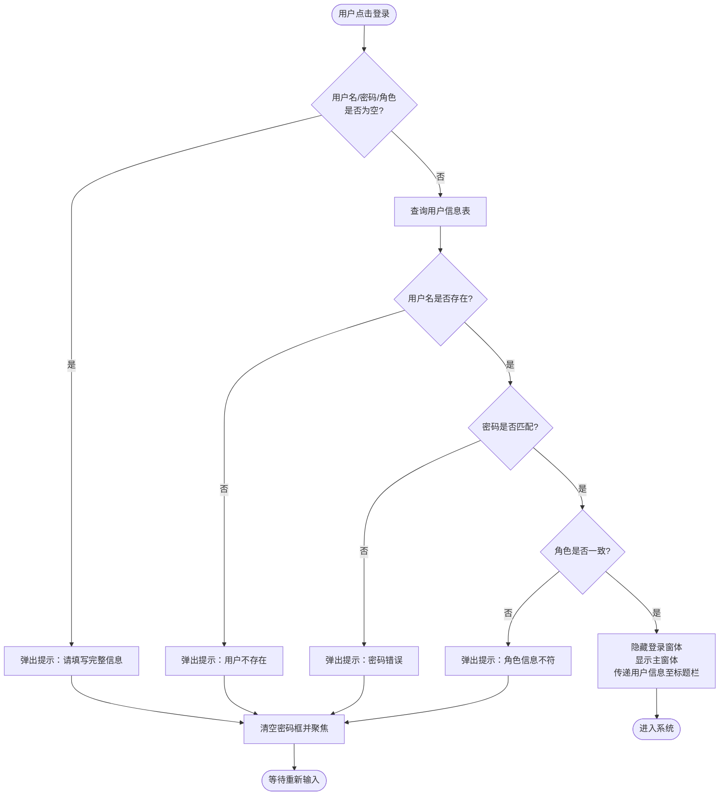
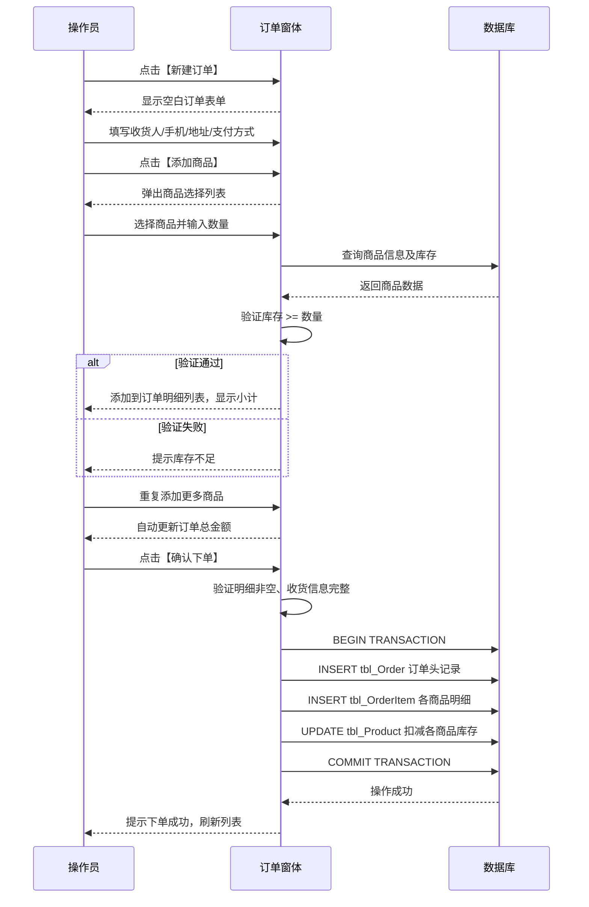
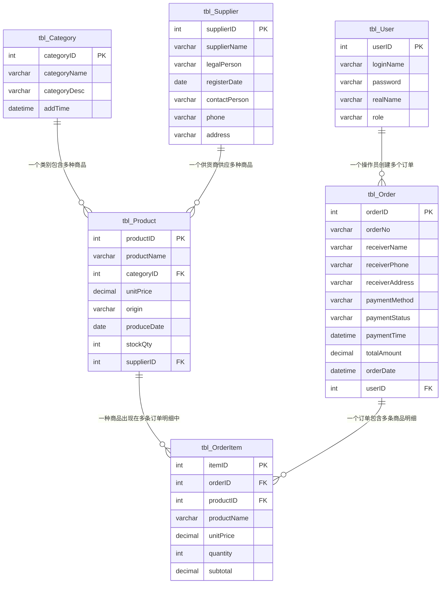

# 校园易购信息管理系统 - 产品需求文档（PRD）

> 文档创建日期：2026-07-11  
> 项目来源：东北石油大学 面向对象课程设计  
> 文档版本：v1.0  
> 原始文档：报告-计科25-3班25-李哲-校园易购信息管理系统的开发.doc  
> 任务书：面向对象课程设计 - 任务安排 - Chn(3).pptx  

---

## 1. 需求背景

### 1.1 业务背景

校园商业活动日趋活跃，学生对商品信息的透明度、购买流程的便捷性提出了更高要求。传统校园商店依赖人工记录商品信息和销售数据，存在订单管理粗放、商品信息查询不便、供货商档案维护滞后等问题。校园易购信息管理系统旨在将商品类别管理、商品信息维护、供货商管理、商品售卖（订单管理）及报表导出等环节纳入统一的信息化平台，实现校园商品管理的规范化、系统化、程序化，提高信息处理的速度和准确性。

### 1.2 触发来源

本项目为东北石油大学计算机与信息技术学院"面向对象课程设计"课程实践任务，要求运用面向对象编程思想和 C/S 架构完成校园易购信息管理系统的完整设计与开发，涵盖需求分析、功能模块设计、数据库表结构设计、编码实现与系统测试全流程。

> **任务书原文（PPTX Slide 24）**：校园易购信息管理系统的开发，包含以下功能模块：
> 1. 商品类别管理：商品类别编号、类别名称、类别描述、添加时间
> 2. 商品信息管理：商品编号、商品名称、类别、单价、产地、生产日期、库存数量、供货商
> 3. 供货商信息管理：供货商编号、名称、地址、法人、注册日期、联系人、联系方式
> 4. 商品售卖：订单表（订单编号、支付方式、支付时间、支付状态、收货人姓名、收货人手机号、收货地址）、订单商品列表（商品编号、订单编号、商品名称、单价、数量、总价）
>
> **扩展建议**：统计结果导出（如Excel形式的报表）

### 1.3 现状与痛点

- **商品信息维度不足**：商品缺少产地、生产日期等追溯信息，消费者无法判断商品来源和新鲜度
- **供货商档案不完整**：缺少法人代表和注册日期等关键工商信息，供货商资质难以核实
- **售卖流程过于简化**：一次购买只能记录一种商品，无法支持多商品合并下单，收货信息和支付信息缺失
- **数据导出能力空白**：销售数据和商品清单无法导出为 Excel 报表，管理人员难以进行线下分析和归档

### 1.4 证据强度标注

- 业务痛点描述：`[PM 假设]` — 基于课程设计任务书要求推导
- 功能需求范围：`[任务书定义]` — 由课程设计任务书 PPTX 明确指定

---

## 2. 目标与范围

### 2.1 产品目标

构建一套基于 C/S 三层架构的校园易购信息管理系统，实现商品类别管理、商品信息管理、供货商管理、商品售卖（订单+订单明细）及 Excel 报表导出的完整业务闭环，使校园商品管理工作规范化、系统化、程序化，提高信息处理的速度和准确性。

### 2.2 项目约束

| 约束项 | 内容 |
|--------|------|
| 开发环境 | Microsoft Visual Studio 2022 |
| 编程语言 | C# (.NET 8.0) |
| 数据库 | SQL Server 2019 或以上版本 |
| 架构模式 | C/S（客户端/服务器），三层架构（UI / BLL / DAL） |
| 第三方库 | NPOI（Excel 导出）、Microsoft.Data.SqlClient |
| 完成期限 | 第 18-20 周 |

> **说明**：以上技术约束由课程设计任务书规定，技术选型遵循任务书要求。

### 2.3 范围界定

| 类别 | 包含 | 不包含 |
|------|------|--------|
| 商品类别管理 | 类别增删改查、类别描述、添加时间记录 | 树状层级分类（本系统采用扁平结构） |
| 商品信息管理 | 商品增删改查、产地/生产日期追溯、库存管理 | 商品图片上传、商品评价系统 |
| 供货商管理 | 供货商档案增删改查、法人/注册日期信息维护 | 供货商信用评分、合同管理 |
| 商品售卖 | 订单创建（多商品）、订单明细、支付信息登记、收货信息管理、库存扣减 | 在线支付对接、物流追踪 |
| Excel 导出 | 商品清单导出、订单列表导出 | PDF 报表导出、图表可视化 |
| 用户管理 | 管理员/操作员角色区分、用户增删改查 | 多级权限体系、SSO 单点登录 |

---

## 3. 用户与场景

### 3.1 用户角色

| 角色 | 描述 | 操作权限 | 使用频率 |
|------|------|----------|----------|
| **管理员** | 校园商店管理人员，负责系统全部数据维护 | 商品类别管理、商品管理、供货商管理、订单管理、用户管理、Excel 导出 | 高频（每日） |
| **操作员** | 日常值班人员，负责商品售卖和信息查询 | 商品信息查询、供货商查询、订单创建、订单查询、Excel 导出 | 高频（每日） |

### 3.2 核心场景

| 优先级 | 场景 | 角色 | 描述 |
|--------|------|------|------|
| P0 | 管理员登录系统 | 管理员 | 输入用户名、密码和角色选择，验证通过后进入主窗体 |
| P0 | 创建商品订单 | 管理员/操作员 | 选择多个商品加入订单，填写收货信息和支付方式，系统自动计算总金额、扣减库存并生成订单及明细记录 |
| P0 | 商品入库登记 | 管理员 | 选择商品类别和供货商，录入商品编号、名称、单价、产地、生产日期、库存等信息并提交 |
| P0 | 供货商档案登记 | 管理员 | 录入供货商编号、名称、法人、注册日期、联系人等信息并提交 |
| P1 | 商品类别维护 | 管理员 | 新增、修改、删除商品类别（记录类别描述和添加时间） |
| P1 | 信息查询 | 管理员/操作员 | 按条件检索商品、供货商或订单记录 |
| P1 | 用户账号管理 | 管理员 | 新增、修改、删除系统用户，设置用户角色 |
| P2 | Excel 报表导出 | 管理员/操作员 | 将商品清单或订单列表导出为 Excel 文件 |
| P2 | 修改个人密码 | 管理员/操作员 | 用户修改自己的登录密码 |

### 3.3 系统功能模块图

```mermaid
graph TD
    A[校园易购信息管理系统]
    A --> B[登录模块]
    A --> C[主窗体导航]
    A --> D[商品类别管理]
    A --> E[商品信息管理]
    A --> F[供货商管理]
    A --> G[订单管理]
    A --> H[用户管理]
    A --> I[Excel导出]

    B --> B1[用户名/密码验证]
    B --> B2[角色权限选择]
    B --> B3[登录失败提示]

    D --> D1[类别添加]
    D --> D2[类别修改]
    D --> D3[类别删除]
    D --> D4[类别查询]

    E --> E1[商品添加]
    E --> E2[商品修改]
    E --> E3[商品删除]
    E --> E4[商品查询]

    F --> F1[供货商添加]
    F --> F2[供货商修改]
    F --> F3[供货商删除]
    F --> F4[供货商查询]

    G --> G1[订单创建]
    G --> G2[订单明细管理]
    G --> G3[订单查询]
    G --> G4[库存自动扣减]
    G --> G5[订单状态管理]

    H --> H1[用户添加]
    H --> H2[用户修改]
    H --> H3[用户删除]
    H --> H4[密码修改]

    I --> I1[商品清单导出]
    I --> I2[订单列表导出]
```

---

## 4. 功能需求

### 4.1 功能概览表

| 编号 | 模块 | 功能描述 |
|------|------|----------|
| F-01 | 登录模块 | 用户输入用户名、密码并选择角色（管理员/操作员），系统验证账号密码与角色是否匹配。验证通过后进入主窗体并将登录信息传递至标题栏显示；验证失败则弹出错误提示并清空密码框等待重新输入。用户名、密码、角色三项均不可为空。 |
| F-02 | 主窗体导航 | 登录成功后展示主界面，采用 MenuStrip 菜单栏导航。根据用户角色动态启用/禁用菜单项（管理员可操作全部功能，操作员不可操作类别管理、供货商管理、用户管理）。选择菜单项进入对应子窗体，主窗体隐藏。提供退出菜单返回登录界面。 |
| F-03 | 商品类别管理-添加 | 管理员录入类别名称和类别描述，系统自动记录添加时间并生成自增类别编号后写入数据库。类别名称为必填项。 |
| F-04 | 商品类别管理-修改 | 管理员在列表中选中已有商品类别，修改类别名称或类别描述后提交。系统验证类别存在性并更新数据库记录。**类别编号为主键，不允许修改**。 |
| F-05 | 商品类别管理-删除 | 管理员选中商品类别执行删除，系统检查该类别下是否有关联商品：有则提示"存在关联商品，无法删除"；无则确认后删除。 |
| F-06 | 商品类别管理-查询 | 管理员/操作员可按类别名称关键字模糊检索商品类别列表，列表展示类别编号、名称、描述、添加时间。 |
| F-07 | 商品信息管理-添加 | 管理员选择商品类别和供货商，录入商品名称、单价、产地、生产日期、库存数量等信息，系统生成自增商品编号后写入数据库。商品名称、单价为必填项。 |
| F-08 | 商品信息管理-修改 | 管理员在列表中选中商品记录，修改各项信息后提交。系统验证商品存在性并更新记录。 |
| F-09 | 商品信息管理-删除 | 管理员选中商品记录执行删除，系统检查该商品是否有订单明细记录：有则提示"存在订单记录，无法删除"；无则确认后删除。 |
| F-10 | 商品信息管理-查询 | 管理员/操作员可按商品名称、类别、供货商等条件组合检索商品列表，列表展示商品编号、名称、类别、单价、产地、生产日期、库存数量等关键字段。 |
| F-11 | 供货商管理-添加 | 管理员录入供货商名称、法人代表、注册日期、联系人、联系电话、地址等信息，系统生成自增供货商编号后写入数据库。供货商名称为必填项。 |
| F-12 | 供货商管理-修改 | 管理员在列表中选中供货商记录，修改各项信息后提交。系统验证供货商存在性并更新记录。 |
| F-13 | 供货商管理-删除 | 管理员选中供货商记录执行删除，系统检查该供货商下是否有关联商品：有则提示"存在关联商品，无法删除"；无则确认后删除。 |
| F-14 | 供货商管理-查询 | 管理员/操作员可按供货商名称、法人等条件检索供货商列表，列表展示供货商编号、名称、法人、注册日期、联系人、联系电话等关键字段。 |
| F-15 | 订单管理-订单创建 | 管理员/操作员创建新订单，依次选择多个商品加入订单明细，系统自动填充商品名称和单价。操作员输入每种商品的购买数量，系统验证库存充足后自动计算小计金额（单价 × 数量）。填写收货人姓名、手机号、收货地址和支付方式后，系统自动计算订单总金额、生成订单编号和订单明细记录，同时扣减各商品库存数量。 |
| F-16 | 订单管理-订单查询 | 管理员/操作员可按订单编号、收货人姓名、支付状态、日期范围等条件检索订单列表。选择某条订单可查看其订单明细（包含商品名称、单价、数量、小计金额）。 |
| F-17 | 订单管理-订单状态管理 | 管理员可修改订单的支付状态（未支付 → 已支付）和记录支付时间。订单一旦创建，订单明细不可修改。 |
| F-18 | Excel 导出-商品清单 | 管理员/操作员点击导出按钮，系统将当前商品列表（含编号、名称、类别、单价、产地、生产日期、库存）导出为 Excel 文件（.xlsx），保存到用户指定路径。 |
| F-19 | Excel 导出-订单列表 | 管理员/操作员点击导出按钮，系统将当前订单列表（含订单编号、收货人、支付方式、支付状态、总金额、日期）导出为 Excel 文件（.xlsx），保存到用户指定路径。 |
| F-20 | 用户管理-添加 | 管理员录入用户名、密码、确认密码、角色（管理员/操作员），系统验证用户名唯一性及两次密码一致性后写入数据库。用户名、密码为必填项。 |
| F-21 | 用户管理-修改 | 管理员选中用户记录，可修改密码和角色，提交后更新数据库记录。 |
| F-22 | 用户管理-删除 | 管理员选中用户记录执行删除。不允许删除当前登录用户自身账号。 |
| F-23 | 密码修改 | 当前登录用户可修改自身密码，需输入旧密码验证通过后设置新密码，两次输入新密码需一致。 |

### 4.2 模块详细设计

#### 4.2.1 登录模块

**业务逻辑**：用户在登录界面输入用户名、密码，从下拉框选择角色（管理员/操作员）。系统查询用户信息表，验证用户名是否存在、密码是否匹配、角色是否一致。三者均通过则加载主窗体并隐藏登录界面；任一不通过则弹出提示消息，清空密码输入框并聚焦等待重新输入。

**交互逻辑**：
- 点击【登录】按钮 → 系统校验输入非空 → 查询数据库验证 → 成功：隐藏登录窗体、显示主窗体；失败：弹出错误提示、清空密码框
- 点击【退出】按钮 → 关闭登录界面、终止应用程序

**规则约束**：
- 用户名：文本，必填，不可为空
- 密码：文本，必填，不可为空，输入时掩码显示（PasswordChar='*'）
- 角色：下拉选择，必选，取值为"管理员"或"操作员"
- 连续登录失败无次数限制（课程设计阶段不锁定账号）

**权限逻辑**：登录角色决定主窗体菜单项的启用/禁用状态。管理员可操作全部功能；操作员不可操作类别管理、供货商管理、用户管理。

**边界与异常**：
- 数据库连接失败：弹出异常提示消息框，不导致程序崩溃
- 输入包含特殊字符：**统一采用参数化查询（SqlParameter）传递用户输入，从数据访问层防止 SQL 注入**

#### 4.2.2 主窗体导航模块

**业务逻辑**：主窗体作为系统导航中枢，采用 MenuStrip 菜单栏布局。登录成功后加载，窗体标题栏显示当前登录用户名和角色信息。根据用户角色动态设置各菜单项的 Enabled 状态。用户选择菜单项后实例化对应子窗体并显示，同时隐藏主窗体。子窗体关闭后返回主窗体。

**权限逻辑**：
- 管理员：全部菜单项可用（商品类别管理、商品管理、供货商管理、订单管理、用户管理、Excel 导出）
- 操作员：仅商品查询、供货商查询、订单管理、Excel 导出可用；商品类别管理、供货商管理、用户管理菜单项禁用

#### 4.2.3 商品类别管理模块

**业务逻辑**：管理员可对商品类别执行增、删、改、查操作。商品类别采用**扁平结构**（无父子层级），每个类别记录类别名称、类别描述和添加时间。列表以 DataGridView 展示。删除前系统检查是否存在关联商品。

**规则约束**：
- 类别编号：整数，自增，主键，系统自动生成
- 类别名称：字符串，必填，长度不超过 20
- 类别描述：字符串，选填，长度不超过 100
- 添加时间：日期时间型，系统自动填充为当前时间

#### 4.2.4 商品信息管理模块

**业务逻辑**：管理员可对商品信息执行增、删、改、查操作。添加商品时需先选择商品类别和供货商，再录入商品详细信息（含产地和生产日期）。商品列表以 DataGridView 展示，支持按多条件组合检索。删除前系统检查是否存在订单明细记录。

**规则约束**：
- 商品编号：整数，自增，主键，系统自动生成
- 商品名称：字符串，必填，长度不超过 50
- 单价：数值型，必填，大于 0
- 产地：字符串，选填，长度不超过 50
- 生产日期：日期型，选填
- 库存数量：整数，必填，大于等于 0
- 类别编号：外键，引用 tbl_Category
- 供货商编号：外键，引用 tbl_Supplier

#### 4.2.5 供货商管理模块

**业务逻辑**：管理员可对供货商档案执行增、删、改、查操作。供货商信息以 DataGridView 展示，支持按名称、法人等条件检索。删除前系统检查该供货商下是否有关联商品。

**规则约束**：
- 供货商编号：整数，自增，主键，系统自动生成
- 供货商名称：字符串，必填，长度不超过 50
- 法人代表：字符串，选填，长度不超过 20
- 注册日期：日期型，选填
- 联系人：字符串，选填，长度不超过 20
- 联系电话：字符串，选填，长度不超过 15
- 地址：字符串，选填，长度不超过 100

#### 4.2.6 订单管理模块

**业务逻辑**：创建订单时，管理员/操作员依次选择多个商品加入订单明细列表，系统自动填充商品名称和单价。操作员输入每种商品的购买数量，系统验证库存充足后自动计算小计金额（单价 × 数量）。填写收货人姓名、手机号、收货地址和支付方式后，系统自动计算订单总金额（所有小计之和）、生成订单编号，同时扣减各商品库存数量。

订单创建采用主从表模式：tbl_Order 为主表（订单头信息），tbl_OrderItem 为从表（订单明细），通过 orderID 关联。

**交互逻辑**：
- 订单创建：点击【新建订单】→ 弹出订单窗体 → 填写收货信息 → 点击【添加商品】→ 选择商品并输入数量 → 系统验证库存、计算小计 → 重复添加多个商品 → 系统自动汇总总金额 → 选择支付方式 → 点击【确认下单】→ 生成订单和明细记录 → 扣减库存 → 刷新列表
- 订单查询：在查询条件区输入条件（订单编号/收货人/支付状态/日期范围）→ 点击【查询】→ 列表过滤显示 → 选择某条订单 → 查看明细
- 订单状态管理：选中订单 → 点击【确认支付】→ 修改支付状态为"已支付"并记录支付时间

**规则约束**：
- 订单编号：整数，自增，主键，系统自动生成
- 订单编号（可读）：字符串，格式为"ORD" + yyyyMMdd + 3位流水号（如 ORD20260711001），唯一
- 收货人姓名：字符串，必填，长度不超过 20
- 收货人手机号：字符串，必填，长度 11，纯数字
- 收货地址：字符串，选填，长度不超过 200
- 支付方式：下拉选择，取值为"现金"、"微信"、"支付宝"
- 支付状态：字符串，默认"未支付"，可由管理员修改为"已支付"
- 支付时间：日期时间型，支付状态变更为"已支付"时系统自动填充
- 订单日期：日期时间型，系统自动填充为当前时间
- 订单总金额：数值型，系统自动计算（所有订单明细小计之和）
- 操作员编号：外键，引用 tbl_User，记录创建订单的用户

**订单明细规则约束**：
- 明细编号：整数，自增，主键
- 订单编号：外键，引用 tbl_Order
- 商品编号：外键，引用 tbl_Product
- 商品名称：字符串，下单时从商品表快照（后续修改商品名称不影响已生成的订单明细）
- 单价：数值型，下单时从商品表快照（后续修改商品单价不影响已生成的订单明细）
- 数量：整数，大于 0
- 小计金额：数值型，系统自动计算（单价 × 数量）

**边界与异常**：
- 库存不足：提示"商品【XXX】库存不足，当前库存仅剩 X 件"，**阻止该商品加入订单**
- 商品已售罄（库存为 0）：提示"该商品已售罄，无法加入订单"
- 订单明细为空：提示"请至少添加一种商品后再提交订单"
- 收货人手机号格式错误：提示"请输入正确的11位手机号码"

#### 4.2.7 Excel 导出模块

**业务逻辑**：管理员/操作员可在商品列表或订单列表界面点击导出按钮，系统使用 NPOI 库将当前列表数据写入 Excel 文件。导出文件包含表头行和所有数据行，支持用户选择保存路径。

**规则约束**：
- 导出格式：.xlsx（Office Open XML）
- 表头行：加粗、居中、浅蓝色背景
- 数据行：自动适配列宽
- 文件名规则：商品清单_YYYYMMDD.xlsx 或 订单列表_YYYYMMDD.xlsx
- 导出数据范围：当前查询结果（非全表数据）

#### 4.2.8 用户管理模块

**业务逻辑**：管理员可对系统用户执行增、删、改操作。用户分为管理员和操作员两种角色。添加用户时验证用户名唯一性和两次密码一致性。不允许删除当前登录用户自身账号。所有用户均可修改自身密码。

**规则约束**：
- 用户编号：整数，自增，主键，系统自动生成
- 用户名：字符串，必填，唯一，长度不超过 20
- 密码：字符串，必填，长度不超过 64（存储 SHA-256 哈希值）
- 角色：字符串，必填，取值为"管理员"或"操作员"

---

## 5. 数据模型

### 5.1 数据表设计

基于系统功能需求，数据库（CampusMart）包含以下数据表：

#### 5.1.1 系统用户表（tbl_User）

| 列名 | 说明 | 数据类型 | 约束 |
|------|------|----------|------|
| userID | 用户编号 | int | 主键，自增 |
| loginName | 用户名 | varchar(20) | 唯一，非空 |
| password | 密码 | varchar(64) | 非空（SHA-256 哈希值） |
| realName | 真实姓名 | varchar(20) | - |
| role | 角色 | varchar(10) | 非空，取值为"管理员"或"操作员" |

#### 5.1.2 商品类别表（tbl_Category）

| 列名 | 说明 | 数据类型 | 约束 |
|------|------|----------|------|
| categoryID | 类别编号 | int | 主键，自增 |
| categoryName | 类别名称 | varchar(20) | 非空 |
| categoryDesc | 类别描述 | varchar(100) | - |
| addTime | 添加时间 | datetime | 非空，默认当前时间 |

> **设计说明**：本系统商品类别采用**扁平结构**（无父子层级），依据任务书 PPTX Slide 24 的字段定义（类别编号、类别名称、类别描述、添加时间）。类别描述用于记录该类别的经营范围说明，添加时间用于追溯类别创建时序。

#### 5.1.3 供货商信息表（tbl_Supplier）

| 列名 | 说明 | 数据类型 | 约束 |
|------|------|----------|------|
| supplierID | 供货商编号 | int | 主键，自增 |
| supplierName | 供货商名称 | varchar(50) | 非空 |
| legalPerson | 法人代表 | varchar(20) | - |
| registerDate | 注册日期 | date | - |
| contactPerson | 联系人 | varchar(20) | - |
| phone | 联系电话 | varchar(15) | - |
| address | 地址 | varchar(100) | - |

#### 5.1.4 商品信息表（tbl_Product）

| 列名 | 说明 | 数据类型 | 约束 |
|------|------|----------|------|
| productID | 商品编号 | int | 主键，自增 |
| productName | 商品名称 | varchar(50) | 非空 |
| categoryID | 类别编号 | int | 外键，引用 tbl_Category |
| unitPrice | 单价 | decimal(10,2) | 非空，大于 0 |
| origin | 产地 | varchar(50) | - |
| produceDate | 生产日期 | date | - |
| stockQty | 库存数量 | int | 非空，大于等于 0 |
| supplierID | 供货商编号 | int | 外键，引用 tbl_Supplier |

> **stockQty 一致性策略**：该字段为冗余字段，一致性维护规则：订单创建必须在同一数据库事务中同时插入 tbl_Order 记录、tbl_OrderItem 记录和扣减 tbl_Product.stockQty，保证三者原子性提交；系统不提供直接修改 stockQty 的接口，该字段仅由订单业务逻辑维护（商品入库时通过添加商品设置初始值）。

#### 5.1.5 订单表（tbl_Order）

| 列名 | 说明 | 数据类型 | 约束 |
|------|------|----------|------|
| orderID | 订单编号 | int | 主键，自增 |
| orderNo | 订单号 | varchar(20) | 唯一，格式 ORD + yyyyMMdd + 3位流水号 |
| receiverName | 收货人姓名 | varchar(20) | 非空 |
| receiverPhone | 收货人手机号 | varchar(11) | 非空，纯数字 |
| receiverAddress | 收货地址 | varchar(200) | - |
| paymentMethod | 支付方式 | varchar(10) | 取值为"现金"、"微信"、"支付宝" |
| paymentStatus | 支付状态 | varchar(10) | 默认"未支付"，可修改为"已支付" |
| paymentTime | 支付时间 | datetime | 支付状态变更时填充 |
| totalAmount | 订单总金额 | decimal(10,2) | 系统自动计算（所有明细小计之和） |
| orderDate | 下单日期 | datetime | 非空，默认当前时间 |
| userID | 操作员编号 | int | 外键，引用 tbl_User |

#### 5.1.6 订单商品明细表（tbl_OrderItem）

| 列名 | 说明 | 数据类型 | 约束 |
|------|------|----------|------|
| itemID | 明细编号 | int | 主键，自增 |
| orderID | 订单编号 | int | 外键，引用 tbl_Order |
| productID | 商品编号 | int | 外键，引用 tbl_Product |
| productName | 商品名称 | varchar(50) | 下单时快照 |
| unitPrice | 单价 | decimal(10,2) | 下单时快照 |
| quantity | 购买数量 | int | 大于 0 |
| subtotal | 小计金额 | decimal(10,2) | 等于 unitPrice × quantity |

> **快照策略**：订单明细中的 productName 和 unitPrice 为下单时的快照值，后续修改商品名称或单价不影响已生成的订单明细。此设计确保历史订单数据的不可变性。

### 5.2 表关系图

---

## 6. 非功能需求

| 类别 | 需求描述 |
|------|----------|
| **性能** | 单次简单查询响应时间不超过 1 秒；组合条件查询不超过 2 秒；数据表格加载 1000 条记录不超过 3 秒（含网络传输）；Excel 导出 500 条记录不超过 5 秒 |
| **可用性** | 系统在正常操作下不崩溃；营业时间内可稳定运行，异常退出后可重启恢复 |
| **安全性** | 用户密码采用 **SHA-256 哈希加密存储**；数据库连接字符串配置在 App.config 中，不可硬编码在 UI 层；所有数据库查询统一采用 **参数化查询（SqlParameter）防止 SQL 注入**；订单创建采用数据库事务保证原子性 |
| **易用性** | 采用 MenuStrip 菜单栏导航，操作方式与主流管理系统相似；功能菜单命名清晰；关键操作（删除、下单）需二次确认 |
| **可维护性** | 采用三层架构（UI / BLL / DAL），数据库访问逻辑封装在 DAL 层 Dao 类中，各模块通过调用 Dao 方法访问数据库，避免重复代码；公共工具类（密码哈希、数据校验、Excel 导出）封装在 Common 层 |
| **兼容性** | 客户端运行于 Windows 操作系统，支持 Windows 10 及以上版本 |
| **容错性** | 数据库连接失败时弹出友好提示而非程序崩溃；非法输入数据时给出明确的错误信息；订单事务失败时自动回滚，不产生脏数据 |

---

## 7. 验收标准

| 编号 | 验收项 | 验收标准 | 对应功能 |
|------|--------|----------|----------|
| AC-01 | 管理员登录 | 输入正确的管理员用户名、密码并选择"管理员"角色，成功进入主窗体，标题栏显示用户信息，全部菜单项可用 | F-01, F-02 |
| AC-02 | 操作员登录 | 输入正确的操作员账号登录，主窗体中类别管理、供货商管理、用户管理菜单项禁用 | F-01, F-02 |
| AC-03 | 登录失败处理 | 输入错误密码或不匹配的角色，弹出错误提示，密码框清空并聚焦 | F-01 |
| AC-04a | 商品类别-添加 | 录入类别名称和描述，提交后列表新增一条记录，添加时间自动填充 | F-03 |
| AC-04b | 商品类别-修改 | 选中类别修改名称或描述后提交，列表对应记录更新；类别编号字段不可编辑 | F-04 |
| AC-04c | 商品类别-删除 | 选中无关联商品的类别可删除；选中有关联商品的类别被拦截并提示 | F-05 |
| AC-04d | 商品类别-查询 | 按类别名称关键字检索，列表正确过滤显示 | F-06 |
| AC-05a | 商品-添加 | 选择类别和供货商并录入商品信息（含产地、生产日期），提交后列表新增记录；必填项为空被拦截 | F-07 |
| AC-05b | 商品-修改 | 选中商品修改信息后提交，列表对应记录更新 | F-08 |
| AC-05c | 商品-删除 | 选中无订单记录的商品可删除；选中有订单记录的商品被拦截并提示 | F-09 |
| AC-05d | 商品-查询 | 按商品名称/类别/供货商组合条件检索，列表正确过滤显示 | F-10 |
| AC-06a | 供货商-添加 | 录入供货商信息（含法人、注册日期），提交后列表新增记录 | F-11 |
| AC-06b | 供货商-修改 | 选中供货商修改信息后提交，列表对应记录更新 | F-12 |
| AC-06c | 供货商-删除 | 选中无关联商品的供货商可删除；选中有关联商品的供货商被拦截并提示 | F-13 |
| AC-06d | 供货商-查询 | 按名称/法人检索，列表正确过滤显示 | F-14 |
| AC-07 | 订单创建 | 选择多个商品加入订单，填写收货信息和支付方式，成功生成订单和明细记录，各商品库存扣减对应数量；库存不足时该商品被拦截 | F-15 |
| AC-08 | 订单查询 | 可按订单编号、收货人、支付状态、日期范围检索订单；选择订单可查看明细 | F-16 |
| AC-09 | 订单状态管理 | 选中未支付订单，确认支付后状态变更为"已支付"，支付时间自动填充 | F-17 |
| AC-10 | Excel导出-商品 | 点击导出按钮，成功生成 .xlsx 文件，包含表头和全部商品数据 | F-18 |
| AC-11 | Excel导出-订单 | 点击导出按钮，成功生成 .xlsx 文件，包含表头和全部订单数据 | F-19 |
| AC-12a | 用户-添加 | 录入用户信息，两次密码一致后提交成功；用户名重复被拦截 | F-20 |
| AC-12b | 用户-修改 | 选中用户修改密码/角色后提交，记录更新 | F-21 |
| AC-12c | 用户-删除 | 选中非当前登录用户可删除；选中当前登录用户被拦截 | F-22 |
| AC-13 | 密码修改 | 用户输入正确旧密码后可修改为新密码，新密码需两次一致；旧密码错误被拦截 | F-23 |
| AC-14a | 空数据库查询 | 数据库无数据时执行查询，列表显示空表，不报错 | 全部查询功能 |
| AC-14b | 输入超长字符串 | 输入超过字段长度的字符串，系统拦截并提示，不崩溃 | 全部输入功能 |
| AC-14c | 必填项为空 | 必填项留空提交，系统拦截并提示具体字段名 | F-03, F-07, F-11, F-15, F-20 |
| AC-14d | 数据库连接异常 | 数据库连接失败时，系统弹出友好提示，不崩溃 | 全部 |
| AC-14e | 订单事务回滚 | 订单创建过程中数据库异常时，事务回滚，不产生孤立订单头或库存错误扣减 | F-15 |

---

## 8. 假设与待确认项

| 编号 | 假设/待确认内容 | 说明 |
|------|-----------------|------|
| A-01 | `[假设 — 已设定]` 订单明细中的单价和商品名称为快照值 | 下单时从商品表读取并固化，后续修改商品信息不影响已生成的订单明细 |
| A-02 | `[假设 — 已设定]` 商品类别采用扁平结构 | 任务书 PPTX Slide 24 的字段定义中未包含父类别字段，因此采用扁平结构而非树状层级 |
| A-03 | `[假设 — 已设定]` 不支持订单退款 | 课程设计阶段不涉及退款流程，订单一旦创建不可撤销。如需退款可扩展 tbl_Order 表增加退款状态字段和退款记录表 |
| A-04 | `[假设 — 已设定]` 不涉及在线支付对接 | 订单仅记录支付方式和支付状态，不对接实际支付系统。支付状态由管理员手动确认 |
| A-05 | `[已确定]` 密码加密方式 | 统一采用 **SHA-256 哈希加密存储**，不使用明文 |
| A-06 | `[假设 — 已设定]` 订单号格式 | 订单号采用"ORD" + yyyyMMdd + 3位流水号的格式（如 ORD20260711001），便于人工识别和沟通 |

---

## 9. 术语表

| 术语 | 说明 |
|------|------|
| C/S 架构 | 客户端/服务器架构，客户端安装专用软件，通过局域网访问服务器端数据库 |
| 三层架构 | UI（界面层）/ BLL（业务逻辑层）/ DAL（数据访问层），各层职责分离，降低耦合 |
| 管理员 | 拥有系统全部操作权限的用户角色 |
| 操作员 | 拥有商品查询、供货商查询、订单管理和 Excel 导出权限的用户角色 |
| 商品类别 | 对商品按类型分类的标识，如"食品类"、"文具类"、"日用品类" |
| 供货商 | 向校园商店供应商品的合作方，记录其名称、法人、注册日期、联系人等信息 |
| 订单 | 记录一次商品交易的头信息，包含收货人、支付方式、支付状态、总金额等 |
| 订单明细 | 记录订单中每种商品的具体信息，包含商品名称、单价、数量、小计金额 |
| 库存数量 | 商品当前可供售卖的库存数量，订单创建时自动扣减 |
| Excel 导出 | 将系统中的商品或订单数据导出为 .xlsx 格式文件，便于线下分析和归档 |
| 快照 | 下单时从商品表读取并固化的商品名称和单价，后续商品信息修改不影响历史订单 |

---

## 10. 代码差异化策略

> **目的**：cs-3 与 cs-2 虽同为校园易购系统，但需在数据模型、命名规范、代码结构和 UI 布局上实现全面差异化，确保查重无风险。
>
> **更新说明**：cs-2 代码已于近期更新，从原始的单商品售卖（tbl_Sale）升级为订单+明细模型（tbl_Order + tbl_OrderItem），并增加了产地、生产日期、法人、注册日期等字段。以下差异化策略已根据 cs-2 最新代码状态重新校准。

### 10.1 项目与命名差异

| 维度 | cs-2 | cs-3 |
|------|------|------|
| 项目名称 | CampusShop | CampusMart |
| 命名空间 | CampusShop | CampusMart |
| 角色名称 | 管理员/普通用户 | 管理员/操作员 |
| UI 导航 | Button 按钮垂直排列 | MenuStrip 菜单栏 + ToolStrip 工具栏 |
| Form 命名 | LoginForm, MainForm, ProductForm, OrderForm... | FrmLogin, FrmMain, FrmGoods, FrmOrder... |
| Model 命名 | Product, Category, Supplier, Order, OrderItem | GoodsInfo, CategoryInfo, SupplierInfo, OrderInfo, OrderItemInfo |
| BLL 命名 | ProductService, CategoryService, OrderService... | GoodsBiz, CategoryBiz, OrderBiz... |
| DAL 命名 | ProductDAL, CategoryDAL, OrderDAL... | GoodsDao, CategoryDao, OrderDao... |
| Common 命名 | PasswordHelper, ValidationHelper | SecurityUtil, ValidateUtil, ExcelUtil |
| 角色常量 | BusinessConstants.ROLE_ADMIN | RoleConstants.ADMIN |

### 10.2 数据模型差异

| 维度 | cs-2（当前） | cs-3 |
|------|-------------|------|
| 主键策略 | 混合策略：User/Category/Supplier/Product 用字符串主键，Order/OrderItem 用 int 自增 | **统一 int 自增主键**（全部表） |
| 商品类别 | 树状层级（parentCategoryID）+ 类别描述 + 添加时间 | **扁平结构**（无 parentCategoryID）+ 类别描述 + 添加时间 |
| 商品字段 | specification + origin + productionDate（三者均有） | origin + productionDate（**无 specification**） |
| 供货商字段 | contactPerson, phone, address, legalPerson, registerDate | 相同（cs-2 已补齐法人/注册日期） |
| 用户表 | userName(字符串主键), userPassword, userPurview（3 字段） | userID(int 自增主键), loginName, password, realName, role（**5 字段**） |
| 订单表 | orderID, orderDate, paymentMethod, paymentTime, paymentStatus, receiverName, receiverPhone, receiverAddress, totalAmount（9 字段，无操作员关联） | 增加 **orderNo（可读订单号）** 和 **userID（操作员外键）**（11 字段） |
| 订单明细 | itemID, orderID, productID, productName, unitPrice, quantity, **totalPrice** | itemID, orderID, productID, productName, unitPrice, quantity, **subtotal**（字段名不同） |
| 支付状态取值 | "待支付" / "已支付" | "**未支付**" / "已支付"（取值不同） |
| 表数量 | 6 张 | 6 张（表数量相同，但表结构不同） |

### 10.3 数据访问层差异

| 维度 | cs-2（当前） | cs-3 |
|------|-------------|------|
| 数据读取方式 | SqlDataReader + HasColumn 辅助方法 | **SqlDataAdapter + DataTable** 填充模式 |
| DAL 基类 | DBConnection（静态类，仅提供连接字符串） | **BaseDao（实例类，封装连接+命令+适配器）** |
| 事务使用 | DeductStock 接受外部 SqlTransaction 参数 | **OrderDao 内部管理事务**（ BeginTransaction/Commit/Rollback） |
| 连接管理 | 静态连接字符串 + 每次操作 using SqlConnection | BaseDao 封装 using SqlConnection（调用方无需管理连接） |
| SQL 构建 | 字符串拼接 WHERE 子句 + SqlParameter | **SqlDataAdapter + SelectCommand** 配合参数化 |

### 10.4 UI 布局差异

| 维度 | cs-2（当前） | cs-3 |
|------|-------------|------|
| 主窗体导航 | Button 按钮垂直排列（CreateMenuButton 方法） | **MenuStrip 菜单栏 + ToolStrip 工具栏** |
| 按钮样式 | 蓝色背景 FlatStyle.Flat + 白色文字 | 菜单项 + 工具栏图标按钮 |
| 列表控件 | DataGridView | DataGridView（**列样式、列头颜色不同**） |
| 添加/修改窗体 | 独立窗体弹出 | 独立窗体弹出（**布局、控件排列不同**） |
| 订单界面 | OrderForm（主从表模式） | FrmOrder（**购物车式列表 + 左侧商品选择面板**） |
| 权限控制 | 按钮 Enabled + 背景色变灰 | **菜单项 Enabled + 可见性控制** |

---

## 11. 开发计划

| 阶段 | 内容 | 预计学时 |
|------|------|----------|
| 需求分析与功能模块设计 | PRD 编写、功能模块图、数据表设计 | 8 学时 |
| 数据库表结构设计及开发 | 建表 SQL、初始数据、约束验证 | 4 学时 |
| 架构设计及公共类开发 | BaseDao、SecurityUtil、ValidateUtil、ExcelUtil | 4 学时 |
| 系统编码实现 | UI + BLL + DAL 全模块编码 | 52 学时 |
| 系统测试与完善 | 测试用例执行、缺陷修复 | 4 学时 |
| 文档撰写与任务验收 | 课程设计报告、源码整理 | 8 学时 |
| **合计** | | **80 学时** |

---

## 附录：原始文档解析摘要

### 学生信息

| 项目 | 内容 |
|------|------|
| 姓名 | 李哲 |
| 班级 | 计科25-3班25 |
| 院系 | 计算机与信息技术学院 |
| 指导教师 | 王磊 |

### 任务书功能定义（PPTX Slide 24）

> **任务书原文**：
> 1. 商品类别管理：商品类别编号、类别名称、类别描述、添加时间
> 2. 商品信息管理：商品编号、商品名称、类别、单价、产地、生产日期、库存数量、供货商
> 3. 供货商信息管理：供货商编号、名称、地址、法人、注册日期、联系人、联系方式
> 4. 商品售卖：订单表（订单编号、支付方式、支付时间、支付状态、收货人姓名、收货人手机号、收货地址）、订单商品列表（商品编号、订单编号、商品名称、单价、数量、总价）
>
> **扩展建议**：工作人员信息管理功能、打折促销等附加服务功能、用户建议与留言功能、图形统计、统计结果导出（Excel报表）

### 原始文档问题说明

> 原始 Word 文档为模板，存在以下内容与项目主题不一致的问题，本 PRD 已根据任务书重新定义：
> 1. 正文仍为"学生选课系统"模板文本，未替换为"校园易购信息管理系统"
> 2. 登录章节出现"研究生信息管理系统"无关内容
> 3. 会议记录中出现"客房管理"、"客户入住"等酒店管理系统的无关内容
> 4. 结论部分出现"班级圈"、"请假管理"、"即时聊天"等无关功能描述
> 5. 学生信息表中姓名为"李轩赫"（模板遗留），实际学生应为"李哲"
> 6. 学号 250702940701 与 cs-2 学生（刘雅婷）学号相同，为模板未修改的遗留数据

### 任务书参考资料

| 编号 | 文献 |
|------|------|
| [1] | 江红．C#程序设计教程[M]．北京：清华大学出版社，2024． |
| [2] | 明日科技．SQL Server完全自学教程[M]．北京：人民邮电出版社，2023． |
| [3] | 曹宇，许高峰，王佳丽．C#程序设计与编程案例[M]．北京：清华大学出版社，2022． |
| [4] | 崔祥．基于Web的在线购物系统设计[J]．无线互联科技，2022，19(24)：71-74． |
| [5] | NPOI 官方文档．NPOI - .NET Library for Office Documents[EB/OL]．https://npoi.github.io/ |
