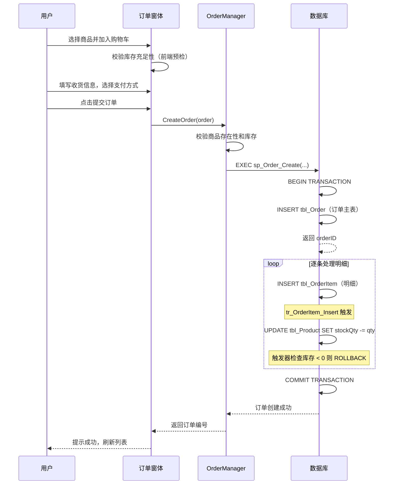
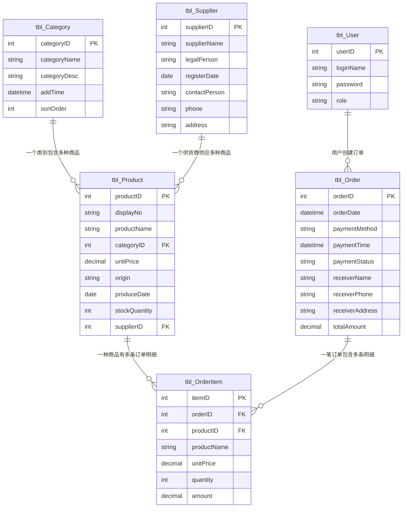

# 校园易购信息管理系统 - 产品需求文档（PRD）

> 文档创建日期：2026-07-12  
> 项目来源：东北石油大学 面向对象课程设计  
> 文档版本：v1.0  
> 学生信息：李轩赫 / 计科25-1班01 / 250702940701  
> 原始文档：报告-计科25-1班01-刘雅婷-校园易购信息管理系统的开发(4).doc  
> 项目代号：CampusStore  

---

## 0. 与同题项目差异化声明

本项目（cs-4）与工作区中已有的 cs-2（CampusShop）、cs-3（CampusMart）基于同一份课程设计任务书，但采用**完全不同的数据访问架构**实现差异化：

| 维度 | cs-2 CampusShop | cs-3 CampusMart | **cs-4 CampusStore** |
|------|------|------|------|
| 数据访问方式 | DAL 内联参数化 SQL | Dao+BaseDao 内联 SQL | **存储过程 + 视图驱动** |
| 库存扣减 | BLL 层 SqlTransaction | BLL 层 SqlTransaction | **INSERT 触发器自动扣减** |
| 组合查询 | DAL 层手写 JOIN | Dao 层手写 JOIN | **视图绑定（v_Product_Detail 等）** |
| 总价计算 | 应用层算后写入 | 应用层算后写入 | **计算列 PERSISTED 自动算** |
| 主键策略 | NVARCHAR 字符串 | INT IDENTITY | INT IDENTITY + 可读编号列 |
| 类别结构 | 树状层级（自引用外键） | 扁平结构 | 扁平 + sortOrder 排序号 |
| 用户角色 | 管理员/普通用户 | 管理员/操作员 | **管理员/店员** |
| 支付状态 | 待支付/已支付 | 未支付/已支付 | **未结款/已结款** |
| 明细小计字段 | totalPrice | subtotal | **amount** |
| 命名风格 | Service/DAL/Form | Biz/Dao/Frm | **Manager/Repository/Frm** |
| 扩展功能 | 无 | Excel 导出(NPOI) | **库存预警面板** |
| 商品编号 | 手动输入 P0001 | 自增不可读 | **自增 + displayNo 可读列** |

**论文层面差异**：cs-4 的"数据库设计"章节包含存储过程、视图、触发器、计算列的完整代码，这是 cs-2/cs-3 完全没有的内容。

---

## 1. 需求背景

### 1.1 业务背景

随着校园信息化的推进，高校师生对便捷购物需求日益增长。传统校园超市、便利店存在排队等候时间长、商品信息不透明、库存管理粗放等问题。校园易购信息管理系统旨在将商品类别管理、商品信息维护、供货商管理、订单售卖等环节纳入统一的信息化平台，实现校园商品管理的规范化、系统化、程序化，提高信息处理的速度和准确性。

### 1.2 触发来源

本项目为东北石油大学计算机与信息技术学院"面向对象课程设计"课程实践任务，要求运用面向对象编程思想和 C/S 架构完成校园易购信息管理系统的完整设计与开发，涵盖需求分析、功能模块设计、数据库表结构设计、编码实现与系统测试全流程。

> **任务书原文**：本次课程设计主要完成校园易购管理系统的设计与开发。对校园易购管理系统的需求进行任务分解，完成功能模块设计，数据库表结构设计要合理、关系清晰，并最终实现商品类别管理、商品信息管理、供货商管理、商品售卖及其它系统所需的附加信息管理等功能。

> **任务书字段要求**：
> - 商品类别：类别编号、类别名称、类别描述、添加时间
> - 商品信息：商品编号、商品名称、类别、单价、产地、生产日期、库存数量、供货商
> - 供货商：供货商编号、名称、地址、法人、注册日期、联系人、联系方式
> - 商品售卖：订单表（订单编号、支付方式、支付时间、支付状态、收货人姓名、收货人手机号、收货地址）+ 订单商品列表（商品编号、订单编号、商品名称、单价、数量、总价）

### 1.3 现状与痛点

- **商品管理分散**：商品类别与商品基本信息缺乏统一管理入口，新增、修改、查询操作依赖人工台账，数据一致性难以保证
- **供货商信息维护困难**：供货商档案更新滞后，采购时难以快速查询供货商联系方式和供货记录
- **售卖流程不可追溯**：商品销售记录缺乏结构化存储，历史销售数据无法快速检索和统计，库存扣减依赖人工核对
- **库存预警缺失**：低库存商品无法及时发现，导致缺货断货影响正常经营
- **权限控制缺失**：所有操作人员拥有相同权限，无法区分管理员与普通店员的操作范围

### 1.4 证据强度标注

- 业务痛点描述：`[PM 假设]` — 基于课程设计任务书要求推导
- 功能需求范围：`[任务书定义]` — 由课程设计任务书明确指定
- 字段完整性要求：`[任务书定义]` — 对齐任务书字段要求

---

## 2. 目标与范围

### 2.1 产品目标

构建一套基于 C/S 架构的校园易购信息管理系统，实现商品类别管理、商品信息管理、供货商管理、订单售卖及用户权限管理的完整业务闭环。系统采用**存储过程+视图+触发器**的数据库端逻辑架构，将业务规则下沉至数据库层，确保数据一致性和业务规则的强制执行。

### 2.2 项目约束

| 约束项 | 内容 |
|--------|------|
| 开发环境 | Microsoft Visual Studio 2022 |
| 编程语言 | C# (.NET 8.0) |
| 数据库 | SQL Server 2019 或以上版本 |
| 架构模式 | C/S（客户端/服务器），三层架构（UI / BLL / DAL） |
| 数据访问 | 存储过程 + 视图 + 触发器（非内联 SQL） |
| 第三方库 | Microsoft.Data.SqlClient |
| 完成期限 | 第 18-20 周 |

### 2.3 范围界定

| 类别 | 包含 | 不包含 |
|------|------|--------|
| 商品类别管理 | 类别增删改查、类别描述、添加时间、排序号 | 树状层级分类（本系统采用扁平+排序结构） |
| 商品信息管理 | 商品增删改查、库存管理、产地、生产日期、可读编号 | 商品图片上传、商品评价系统 |
| 供货商管理 | 供货商档案增删改查、法人代表、注册日期 | 供货商信用评分、合同管理 |
| 订单售卖 | 购物车模式下单、订单+明细双表结构、支付方式/状态管理、库存自动扣减（触发器）、收货信息管理 | 在线支付对接、订单物流跟踪 |
| 库存预警 | 低库存商品自动标记、库存预警面板展示 | 自动采购建议、库存预测算法 |
| 用户管理 | 管理员/店员角色区分、用户增删改查 | 多级权限体系、SSO 单点登录 |

---

## 3. 用户与场景

### 3.1 用户角色

| 角色 | 描述 | 操作权限 | 使用频率 |
|------|------|----------|----------|
| **管理员** | 校园超市/商店负责人，负责系统全部数据维护 | 商品类别管理、商品管理、供货商管理、订单管理（含下单+确认结款）、用户管理、库存预警查看 | 高频（每日） |
| **店员** | 日常值班人员，负责商品售卖和信息查询 | 商品信息查询、供货商信息查询、订单查询、创建订单 | 高频（每日） |

### 3.2 核心场景

| 优先级 | 场景 | 角色 | 描述 |
|--------|------|------|------|
| P0 | 管理员登录系统 | 管理员 | 输入用户名、密码和身份选择，验证通过后进入主窗体 |
| P0 | 新商品入库登记 | 管理员 | 选择商品类别和供货商，录入商品信息并提交 |
| P0 | 供货商档案登记 | 管理员 | 录入供货商编号、名称、联系人、法人代表、注册日期等信息并提交 |
| P0 | 创建订单（购物车下单） | 管理员/店员 | 选择商品加入购物车，填写收货信息，选择支付方式，提交订单后系统通过触发器自动扣减库存 |
| P0 | 确认结款 | 管理员 | 将未结款订单更新为已结款状态，记录结款时间 |
| P1 | 商品类别维护 | 管理员 | 新增、修改、删除商品类别（含类别描述和排序号） |
| P1 | 信息查询 | 管理员/店员 | 按条件检索商品、供货商或订单记录 |
| P1 | 库存预警查看 | 管理员 | 查看库存低于阈值的商品列表，及时补货 |
| P1 | 用户账号管理 | 管理员 | 新增、修改、删除系统用户，设置用户权限 |
| P2 | 修改个人密码 | 管理员/店员 | 用户修改自己的登录密码 |

### 3.3 系统功能模块图

```mermaid
graph TD
    A[校园易购信息管理系统]
    A --> B[登录模块]
    A --> C[主窗体导航]
    A --> D[商品类别管理]
    A --> E[商品信息管理]
    A --> F[供货商管理]
    A --> G[订单管理]
    A --> H[用户管理]
    A --> I[库存预警]

    B --> B1[用户名/密码验证]
    B --> B2[身份权限选择]
    B --> B3[登录失败提示]

    D --> D1[类别添加]
    D --> D2[类别修改]
    D --> D3[类别删除]
    D --> D4[类别查询]

    E --> E1[商品添加]
    E --> E2[商品修改]
    E --> E3[商品删除]
    E --> E4[商品查询]

    F --> F1[供货商添加]
    F --> F2[供货商修改]
    F --> F3[供货商删除]
    F --> F4[供货商查询]

    G --> G1[购物车下单]
    G --> G2[订单列表查询]
    G --> G3[订单明细查看]
    G --> G4[确认结款]
    G --> G5[触发器自动扣减库存]

    H --> H1[用户添加]
    H --> H2[用户修改]
    H --> H3[用户删除]
    H --> H4[密码修改]

    I --> I1[低库存商品列表]
    I --> I2[库存阈值标记]
```



---

## 4. 功能需求

### 4.1 功能概览表

| 编号 | 模块 | 功能描述 |
|------|------|----------|
| F-01 | 登录模块 | 用户输入用户名、密码并选择身份（管理员/店员），系统通过存储过程 `sp_User_Validate` 验证账号密码与身份是否匹配。验证通过后进入主窗体并将登录信息传递至标题栏显示；验证失败则弹出错误提示并清空密码框等待重新输入。用户名、密码、身份三项均不可为空。 |
| F-02 | 主窗体导航 | 登录成功后展示主界面，根据用户权限动态启用/禁用功能按钮（管理员可操作全部功能，店员可查询+下单）。用户点击功能按钮进入对应子模块窗体，主窗体隐藏。关闭主窗体时终止应用程序。提供退出按钮返回登录界面。 |
| F-03 | 商品类别管理-添加 | 管理员录入商品类别名称、类别描述和排序号，系统通过存储过程 `sp_Category_Add` 写入数据库，添加时间由系统自动记录（GETDATE）。类别名称为必填项。 |
| F-04 | 商品类别管理-修改 | 管理员在列表中选中已有商品类别，修改类别名称、描述或排序号后提交。系统通过存储过程 `sp_Category_Update` 更新数据库记录。 |
| F-05 | 商品类别管理-删除 | 管理员选中商品类别执行删除，系统通过存储过程 `sp_Category_Delete` 检查该类别下是否有关联商品：有则提示"存在关联商品，无法删除"；无则确认后删除。 |
| F-06 | 商品类别管理-查询 | 管理员/店员可按类别名称关键字模糊检索商品类别列表，通过视图 `v_Category_List` 获取数据。 |
| F-07 | 商品信息管理-添加 | 管理员选择商品类别和供货商，录入商品信息，系统通过存储过程 `sp_Product_Add` 写入数据库。商品名称为必填项。 |
| F-08 | 商品信息管理-修改 | 管理员在列表中选中商品记录，修改各项信息后提交。系统通过存储过程 `sp_Product_Update` 更新记录。 |
| F-09 | 商品信息管理-删除 | 管理员选中商品记录执行删除，系统通过存储过程 `sp_Product_Delete` 检查该商品是否有订单明细记录：有则提示"存在订单明细记录，无法删除"；无则确认后删除。 |
| F-10 | 商品信息管理-查询 | 管理员/店员可按商品名称、类别、供货商等条件组合检索商品列表，通过视图 `v_Product_Detail` 获取数据（已 JOIN 类别名称和供货商名称）。 |
| F-11 | 供货商管理-添加 | 管理员录入供货商信息，系统通过存储过程 `sp_Supplier_Add` 写入数据库。名称为必填项。 |
| F-12 | 供货商管理-修改 | 管理员在列表中选中供货商记录，修改各项信息后提交。系统通过存储过程 `sp_Supplier_Update` 更新记录。 |
| F-13 | 供货商管理-删除 | 管理员选中供货商记录执行删除，系统通过存储过程 `sp_Supplier_Delete` 检查该供货商下是否有关联商品：有则提示"存在关联商品，无法删除"；无则确认后删除。 |
| F-14 | 供货商管理-查询 | 管理员/店员可按供货商名称等条件检索供货商列表。 |
| F-15 | 订单管理-创建订单 | 用户通过购物车模式创建订单：选择商品并指定数量加入购物车，可添加多个商品；填写收货人姓名、手机号、收货地址；选择支付方式（现金/微信/支付宝）和结款状态（未结款/已结款）。提交后系统通过存储过程 `sp_Order_Create` 在同一事务中插入订单主表+明细表，库存扣减由 `tr_OrderItem_Insert` 触发器自动完成。订单总金额由计算列自动汇总。商品名称和单价在订单中为快照值。 |
| F-16 | 订单管理-订单查询 | 管理员/店员可按收货人名称、结款状态等条件检索订单列表。选中订单可查看其包含的商品明细列表。 |
| F-17 | 订单管理-确认结款 | 管理员可将"未结款"订单更新为"已结款"状态，系统通过存储过程 `sp_Order_Confirm` 自动记录结款时间。已结款订单不可重复确认。 |
| F-18 | 用户管理-添加 | 管理员录入用户名、密码、确认密码、权限（管理员/店员），系统通过存储过程 `sp_User_Add` 验证用户名唯一性及两次密码一致性后写入数据库。 |
| F-19 | 用户管理-修改 | 管理员选中用户记录，可修改密码和权限，提交后通过存储过程 `sp_User_Update` 更新数据库记录。 |
| F-20 | 用户管理-删除 | 管理员选中用户记录执行删除。不允许删除当前登录用户自身账号。 |
| F-21 | 密码修改 | 当前登录用户可修改自身密码，需输入旧密码验证通过后设置新密码，两次输入新密码需一致。 |
| F-22 | 库存预警 | 管理员可查看库存低于预警阈值（默认 20 件）的商品列表，通过视图 `v_LowStock_Product` 获取数据。列表展示商品编号、名称、当前库存、类别、供货商等信息，支持按库存量升序排列。 |

### 4.2 模块详细设计

#### 4.2.1 登录模块

**业务逻辑**：用户在登录界面输入用户名、密码，从下拉框选择身份（管理员/店员）。系统调用存储过程 `sp_User_Validate` 验证用户名是否存在、密码是否匹配、身份是否一致。三者均通过则加载主窗体并隐藏登录界面；任一不通过则弹出提示消息，清空密码输入框并聚焦等待重新输入。

**权限逻辑**：登录身份决定主窗体功能按钮的启用/禁用状态。管理员可操作全部功能；店员可使用查询类功能、创建订单和库存预警查看。

**边界与异常**：
- 数据库连接失败：弹出异常提示消息框，不导致程序崩溃
- 输入包含特殊字符：存储过程内部使用参数化查询，从数据库层面防止 SQL 注入

#### 4.2.2 主窗体导航模块

**业务逻辑**：主窗体作为系统导航中枢，登录成功后加载。窗体标题栏显示当前登录用户名和身份信息。根据用户权限动态设置各功能按钮的 Enabled 状态。用户点击功能按钮后实例化对应子窗体并显示，同时隐藏主窗体。子窗体关闭后返回主窗体。

**权限逻辑**：
- 管理员：全部按钮可用（商品类别管理、商品管理、供货商管理、订单管理、用户管理、库存预警）
- 店员：商品类别管理和用户管理禁用；商品管理、供货商管理、订单管理、库存预警可用（查询+下单）

#### 4.2.3 商品类别管理模块

**业务逻辑**：管理员可对商品类别执行增、删、改、查操作。商品类别采用**扁平结构 + 排序号**设计（非树状层级），列表以 DataGridView 展示，支持按排序号排列。每个类别包含描述信息和添加时间。删除前系统通过存储过程检查是否存在关联商品。

**规则约束**：
- 类别编号：INT 自增主键
- 类别名称：字符串，必填，长度不超过 20
- 类别描述：字符串，选填，长度不超过 100
- 添加时间：日期时间型，系统自动填充为当前时间（GETDATE()），不可手动修改
- 排序号：整数，选填，用于列表展示顺序，默认 0

#### 4.2.4 商品信息管理模块

**业务逻辑**：管理员可对商品信息执行增、删、改、查操作。添加商品时需先选择商品类别和供货商，再录入商品详细信息。商品列表通过视图 `v_Product_Detail` 绑定，自动关联显示类别名称和供货商名称，无需应用层 JOIN。删除前系统通过存储过程检查是否存在订单明细记录。

**规则约束**：
- 商品编号：INT 自增主键（内部使用），另有 displayNo 可读编号列（如"SP00001"）供展示
- 商品名称：字符串，必填，长度不超过 50
- 单价：数值型，必填，大于 0
- 库存数量：整数，必填，大于等于 0
- 类别编号：外键，引用 tbl_Category
- 供货商编号：外键，引用 tbl_Supplier
- 产地：字符串，选填，长度不超过 50
- 生产日期：日期型，选填
- displayNo：计算列，格式为 'SP' + RIGHT('00000' + CAST(productID AS NVARCHAR(10)), 5)

#### 4.2.5 供货商管理模块

**业务逻辑**：管理员可对供货商档案执行增、删、改、查操作。供货商信息以 DataGridView 展示，支持按编号、名称等条件检索。删除前系统通过存储过程检查该供货商下是否有关联商品。

**规则约束**：
- 供货商编号：INT 自增主键
- 供货商名称：字符串，必填，长度不超过 50
- 联系人：字符串，选填，长度不超过 20
- 联系电话：字符串，选填，长度不超过 15
- 地址：字符串，选填，长度不超过 100
- 法人代表：字符串，选填，长度不超过 20
- 注册日期：日期型，选填

#### 4.2.6 订单管理模块

**业务逻辑**：用户通过购物车模式创建订单。选择商品并指定数量后加入购物车，可添加多个不同商品，也可移除已添加的商品。填写收货人信息和支付信息后提交订单。系统调用存储过程 `sp_Order_Create` 在同一事务中完成：插入订单主表记录 → 逐条插入订单明细记录。**库存扣减由 `tr_OrderItem_Insert` 触发器自动完成**，无需应用层显式执行 UPDATE 语句。订单创建后可在列表中查看，选中订单可展开查看其包含的商品明细。管理员可对待结款订单执行"确认结款"操作。

**触发器扣减机制**：
- `tr_OrderItem_Insert`：在 tbl_OrderItem 执行 INSERT 后，自动更新 tbl_Product.stockQuantity -= inserted.quantity
- 触发器内含库存检查：若扣减后库存 < 0，则 ROLLBACK 并抛出错误
- 此设计确保无论通过何种途径插入订单明细，库存都会被正确扣减

**交互逻辑**：
- 创建订单：选择商品 → 输入数量 → 点击【加入购物车】→ 重复添加多个商品 → 填写收货信息 → 选择支付方式和状态 → 点击【提交订单】→ 存储过程执行（插入订单+明细，触发器扣减库存）→ 提示成功并刷新列表
- 查询订单：输入收货人名称/选择结款状态 → 点击【查询】→ 列表过滤显示 → 选中订单查看明细
- 确认结款：在订单列表中选中未结款订单 → 点击【确认结款】→ 存储过程更新状态和结款时间

**规则约束**：
- 订单编号：INT 自增主键
- 下单日期：日期时间型，系统自动填充为当前时间
- 支付方式：字符串，选填（现金/微信/支付宝等）
- 结款时间：日期时间型，未结款时为空，确认结款时自动填充
- 结款状态：字符串，必填，默认"未结款"，取值为"未结款"或"已结款"
- 收货人姓名：字符串，选填，长度不超过 20
- 收货人手机号：字符串，选填，长度不超过 15
- 收货地址：字符串，选填，长度不超过 200
- 总金额：计算列 PERSISTED，等于该订单所有明细 amount 之和（由触发器维护）
- 明细-商品编号：外键，引用 tbl_Product
- 明细-商品名称：字符串，下单时从商品表读取的快照值
- 明细-单价：数值型，下单时从商品表读取的快照值
- 明细-数量：整数，必填，大于 0
- 明细-小计金额(amount)：**计算列 PERSISTED**，等于 unitPrice × quantity，数据库自动计算

**边界与异常**：
- 购物车为空时提交：提示"购物车为空，请先添加商品"
- 库存不足：触发器自动 ROLLBACK 并抛出错误，应用层捕获后提示"商品 XXX 库存不足"
- 事务失败：自动回滚，订单和库存均不变更
- 重复确认结款：提示"该订单已结款，无需重复操作"



#### 4.2.7 用户管理模块

**业务逻辑**：管理员可对系统用户执行增、删、改操作。用户分为管理员和店员两种权限。添加用户时验证用户名唯一性和两次密码一致性。不允许删除当前登录用户自身账号。所有用户均可修改自身密码。

**规则约束**：
- 用户编号：INT 自增主键
- 登录名：字符串，必填，唯一，长度不超过 20
- 密码：字符串，必填，长度不超过 64（SHA-256 哈希值）
- 权限：字符串，必填，取值为"管理员"或"店员"

#### 4.2.8 库存预警模块

**业务逻辑**：管理员可在主窗体点击"库存预警"按钮查看库存低于预警阈值的商品列表。数据通过视图 `v_LowStock_Product` 获取，该视图筛选 stockQuantity < 20 的商品，并关联显示类别名称和供货商名称。列表按库存量升序排列，库存最少的商品排在最前。

**规则约束**：
- 预警阈值：默认 20 件（硬编码于视图定义中）
- 预警列表字段：商品编号、可读编号、商品名称、当前库存、类别名称、供货商名称、产地
- 只读列表：此面板仅用于查看，不支持直接修改库存

---

## 5. 数据模型

### 5.1 架构总览

本系统数据库（CampusStore）的核心设计理念是**将业务逻辑下沉至数据库端**，通过存储过程、视图、触发器、计算列四种数据库对象实现业务规则的强制执行：

| 数据库对象 | 数量 | 职责 | 与 cs-2/cs-3 的区别 |
|------------|------|------|------|
| 表(Table) | 6 | 数据存储 | cs-2/cs-3 也有 6 张表，但字段命名和类型不同 |
| **存储过程(SP)** | **15** | 所有 CRUD 操作 | cs-2/cs-3 无存储过程，全部内联 SQL |
| **视图(View)** | **3** | 组合查询、列表绑定 | cs-2/cs-3 无视图，JOIN 在 DAL 层完成 |
| **触发器(Trigger)** | **2** | 库存自动扣减+总价维护 | cs-2/cs-3 无触发器，库存扣减在 BLL 层 |
| **计算列(Computed)** | **3** | 总价/总金额/可读编号自动计算 | cs-2/cs-3 在应用层计算 |

### 5.2 数据表设计

#### 5.2.1 系统用户表（tbl_User）

| 列名 | 说明 | 数据类型 | 约束 |
|------|------|----------|------|
| userID | 用户编号 | INT | 主键，自增 |
| loginName | 登录名 | NVARCHAR(20) | 非空，唯一 |
| password | 密码哈希 | NVARCHAR(64) | 非空（SHA-256） |
| role | 权限 | NVARCHAR(10) | 非空，CHECK(管理员/店员) |

#### 5.2.2 商品类别表（tbl_Category）

| 列名 | 说明 | 数据类型 | 约束 |
|------|------|----------|------|
| categoryID | 类别编号 | INT | 主键，自增 |
| categoryName | 类别名称 | NVARCHAR(20) | 非空 |
| categoryDesc | 类别描述 | NVARCHAR(100) | 可为空 |
| addTime | 添加时间 | DATETIME | 非空，默认 GETDATE() |
| sortOrder | 排序号 | INT | 默认 0 |

#### 5.2.3 供货商信息表（tbl_Supplier）

| 列名 | 说明 | 数据类型 | 约束 |
|------|------|----------|------|
| supplierID | 供货商编号 | INT | 主键，自增 |
| supplierName | 供货商名称 | NVARCHAR(50) | 非空 |
| legalPerson | 法人代表 | NVARCHAR(20) | 可为空 |
| registerDate | 注册日期 | DATE | 可为空 |
| contactPerson | 联系人 | NVARCHAR(20) | 可为空 |
| phone | 联系电话 | NVARCHAR(15) | 可为空 |
| address | 地址 | NVARCHAR(100) | 可为空 |

#### 5.2.4 商品信息表（tbl_Product）

| 列名 | 说明 | 数据类型 | 约束 |
|------|------|----------|------|
| productID | 商品编号 | INT | 主键，自增 |
| displayNo | 可读编号 | 计算列 | PERSISTED, 'SP'+RIGHT('00000'+CAST(productID),5) |
| productName | 商品名称 | NVARCHAR(50) | 非空 |
| categoryID | 类别编号 | INT | 外键，引用 tbl_Category |
| unitPrice | 单价 | DECIMAL(10,2) | 非空，CHECK > 0 |
| origin | 产地 | NVARCHAR(50) | 可为空 |
| produceDate | 生产日期 | DATE | 可为空 |
| stockQuantity | 库存数量 | INT | 非空，CHECK >= 0 |
| supplierID | 供货商编号 | INT | 外键，引用 tbl_Supplier |

> **displayNo 计算列**：格式为 "SP00001"、"SP00002" 等，由 productID 自动生成。此列为 PERSISTED（物理存储），可建立索引。用户界面展示此列而非 productID，兼顾可读性和自增主键的查询效率。

#### 5.2.5 订单主表（tbl_Order）

| 列名 | 说明 | 数据类型 | 约束 |
|------|------|----------|------|
| orderID | 订单编号 | INT | 主键，自增 |
| orderDate | 下单日期 | DATETIME | 非空，默认 GETDATE() |
| paymentMethod | 支付方式 | NVARCHAR(10) | 可为空（现金/微信/支付宝） |
| paymentTime | 结款时间 | DATETIME | 可为空（未结款时为 NULL） |
| paymentStatus | 结款状态 | NVARCHAR(10) | 非空，默认"未结款"，CHECK(未结款/已结款) |
| receiverName | 收货人姓名 | NVARCHAR(20) | 可为空 |
| receiverPhone | 收货人手机号 | NVARCHAR(15) | 可为空 |
| receiverAddress | 收货地址 | NVARCHAR(200) | 可为空 |
| totalAmount | 订单总金额 | 计算列 | PERSISTED, 由触发器维护为明细 amount 之和 |

> **totalAmount 计算列**：此列不使用 SQL Server 的计算列公式（因为跨表计算不支持），而是通过 `tr_OrderItem_Insert/Delete` 触发器维护。触发器在明细变动后自动 UPDATE tbl_Order.totalAmount = SUM(明细 amount) WHERE orderID = affected。此设计与 cs-2/cs-3 在应用层计算后写入的方式完全不同。

#### 5.2.6 订单商品明细表（tbl_OrderItem）

| 列名 | 说明 | 数据类型 | 约束 |
|------|------|----------|------|
| itemID | 明细编号 | INT | 主键，自增 |
| orderID | 订单编号 | INT | 外键，引用 tbl_Order |
| productID | 商品编号 | INT | 外键，引用 tbl_Product |
| productName | 商品名称 | NVARCHAR(50) | 非空（下单时的名称快照） |
| unitPrice | 单价 | DECIMAL(10,2) | 非空（下单时的单价快照） |
| quantity | 购买数量 | INT | 非空，CHECK > 0 |
| amount | 小计金额 | 计算列 | PERSISTED, = unitPrice * quantity |

> **amount 计算列**：使用 SQL Server 计算列公式 `AS (unitPrice * quantity) PERSISTED`，数据库引擎自动维护，无需应用层计算。PERSISTED 表示物理存储，可建索引。

### 5.3 存储过程设计

存储过程是本系统与 cs-2/cs-3 的**核心差异**。所有数据操作均通过存储过程完成，DAL 层只需调用 `SqlCommand.CommandType = StoredProcedure` 并传递参数，不拼接任何 SQL 语句。

| 存储过程 | 功能 | 输入参数 | 输出 |
|----------|------|----------|------|
| sp_User_Validate | 验证登录 | @loginName, @password, @role | 用户信息或 NULL |
| sp_User_Add | 添加用户 | @loginName, @password, @role | 受影响行数 |
| sp_User_Update | 修改用户 | @userID, @password, @role | 受影响行数 |
| sp_User_Delete | 删除用户 | @userID | 受影响行数 |
| sp_Category_Add | 添加类别 | @categoryName, @categoryDesc, @sortOrder | 新 ID |
| sp_Category_Update | 修改类别 | @categoryID, @categoryName, @categoryDesc, @sortOrder | 受影响行数 |
| sp_Category_Delete | 删除类别 | @categoryID | 受影响行数（0=有关联商品） |
| sp_Product_Add | 添加商品 | @productName, @categoryID, @unitPrice, @origin, @produceDate, @stockQty, @supplierID | 新 ID |
| sp_Product_Update | 修改商品 | @productID, @productName, ... | 受影响行数 |
| sp_Product_Delete | 删除商品 | @productID | 受影响行数（0=有订单明细） |
| sp_Supplier_Add | 添加供货商 | @supplierName, @legalPerson, ... | 新 ID |
| sp_Supplier_Update | 修改供货商 | @supplierID, @supplierName, ... | 受影响行数 |
| sp_Supplier_Delete | 删除供货商 | @supplierID | 受影响行数（0=有关联商品） |
| sp_Order_Create | 创建订单 | @items (JSON/Table-valued param), @paymentMethod, ... | 订单 ID |
| sp_Order_Confirm | 确认结款 | @orderID | 受影响行数 |

> **sp_Order_Create 设计要点**：接收订单头信息 + 商品明细列表（使用 Table-Valued Parameter 传递），在存储过程内部开启事务，逐条 INSERT tbl_OrderItem（触发器自动扣减库存），最后返回 orderID。整个下单逻辑完全在数据库端完成，应用层只需一次调用。

### 5.4 视图设计

| 视图 | 功能 | 数据来源 | 使用场景 |
|------|------|----------|----------|
| v_Product_Detail | 商品列表（含类别名称+供货商名称） | tbl_Product JOIN tbl_Category JOIN tbl_Supplier | 商品管理列表绑定、查询 |
| v_Category_List | 类别列表（含商品数量统计） | tbl_Category LEFT JOIN tbl_Product | 类别管理列表绑定 |
| v_LowStock_Product | 低库存商品（库存 < 20） | tbl_Product JOIN tbl_Category JOIN tbl_Supplier WHERE stockQty < 20 | 库存预警面板 |

> **视图的优势**：DAL 层查询商品列表时只需 `SELECT * FROM v_Product_Detail WHERE ...`，无需手写 JOIN 语句。DataGridView 直接绑定视图结果，类别名称和供货商名称自动显示。cs-2/cs-3 的 DAL 层需要手写多表 JOIN SQL，这是架构上的本质区别。

### 5.5 触发器设计

#### 5.5.1 tr_OrderItem_Insert（库存自动扣减）

```sql
-- 触发时机：tbl_OrderItem 执行 INSERT 后
-- 职责：自动扣减商品库存，检查库存不足时回滚
CREATE TRIGGER tr_OrderItem_Insert
ON tbl_OrderItem AFTER INSERT
AS
BEGIN
    SET NOCOUNT ON;
    -- 检查库存是否充足
    IF EXISTS (
        SELECT 1 FROM inserted i
        JOIN tbl_Product p ON i.productID = p.productID
        WHERE p.stockQuantity - i.quantity < 0
    )
    BEGIN
        -- 库存不足，回滚并抛出错误
        DECLARE @productName NVARCHAR(50);
        SELECT TOP 1 @productName = p.productName
        FROM inserted i JOIN tbl_Product p ON i.productID = p.productID
        WHERE p.stockQuantity - i.quantity < 0;
        RAISERROR('商品 [%s] 库存不足，无法创建订单', 16, 1, @productName);
        ROLLBACK TRANSACTION;
        RETURN;
    END
    -- 扣减库存
    UPDATE p SET p.stockQuantity = p.stockQuantity - i.quantity
    FROM tbl_Product p JOIN inserted i ON p.productID = i.productID;
    -- 更新订单总金额
    UPDATE o SET o.totalAmount = (
        SELECT SUM(amount) FROM tbl_OrderItem WHERE orderID = i.orderID
    )
    FROM tbl_Order o JOIN (SELECT DISTINCT orderID FROM inserted) i
    ON o.orderID = i.orderID;
END
```

#### 5.5.2 tr_OrderItem_Delete（库存回补）

```sql
-- 触发时机：tbl_OrderItem 执行 DELETE 后
-- 职责：删除订单明细时自动回补库存（用于订单撤销场景）
CREATE TRIGGER tr_OrderItem_Delete
ON tbl_OrderItem AFTER DELETE
AS
BEGIN
    SET NOCOUNT ON;
    -- 回补库存
    UPDATE p SET p.stockQuantity = p.stockQuantity + d.quantity
    FROM tbl_Product p JOIN deleted d ON p.productID = d.productID;
    -- 更新订单总金额
    UPDATE o SET o.totalAmount = ISNULL((
        SELECT SUM(amount) FROM tbl_OrderItem WHERE orderID = d.orderID
    ), 0)
    FROM tbl_Order o JOIN (SELECT DISTINCT orderID FROM deleted) d
    ON o.orderID = d.orderID;
END
```

### 5.6 表关系图



### 5.7 三层架构映射

| 层 | 职责 | 文件 | 与 cs-2/cs-3 的区别 |
|----|------|------|------|
| **Model（实体层）** | 数据实体定义 | UserInfo.cs, CategoryInfo.cs, SupplierInfo.cs, ProductInfo.cs, OrderInfo.cs, OrderItemInfo.cs | 命名用 *Info 后缀 |
| **DAL（数据访问层）** | 调用存储过程、读取视图 | UserRepository.cs, CategoryRepository.cs, SupplierRepository.cs, ProductRepository.cs, OrderRepository.cs, DBConnection.cs | **Repository 模式，CommandType=StoredProcedure** |
| **BLL（业务逻辑层）** | 业务校验、调用 DAL | UserManager.cs, CategoryManager.cs, SupplierManager.cs, ProductManager.cs, OrderManager.cs, BusinessException.cs | **Manager 命名，不含 SQL 逻辑** |
| **UI（表示层）** | 窗体交互、输入校验、权限控制 | FrmLogin.cs, FrmMain.cs, FrmCategory.cs, FrmProduct.cs, FrmSupplier.cs, FrmOrder.cs, FrmUser.cs, FrmChangePassword.cs, FrmLowStock.cs | Frm 前缀，新增 FrmLowStock |
| **Common（公共层）** | 通用工具 | SecurityUtil.cs, ValidateUtil.cs | 密码哈希、输入校验 |

---

## 6. 非功能需求

| 类别 | 需求描述 |
|------|----------|
| **性能** | 单次简单查询响应时间不超过 1 秒；组合条件查询不超过 2 秒；数据表格加载 1000 条记录不超过 3 秒 |
| **可用性** | 系统在正常操作下不崩溃；营业时间内可稳定运行，异常退出后可重启恢复 |
| **安全性** | 用户密码采用 SHA-256 哈希加密存储；数据库连接字符串配置在 App.config 中；所有数据操作通过存储过程执行，天然防止 SQL 注入 |
| **易用性** | 界面操作方式与主流管理系统相似，功能按钮命名清晰，关键操作（删除）需二次确认 |
| **可维护性** | 采用三层架构（UI/BLL/DAL）；DAL 层仅调用存储过程，不包含 SQL 语句；业务规则集中在数据库端（存储过程+触发器），应用层职责更纯粹 |
| **数据一致性** | 库存扣减由数据库触发器强制执行，无论通过何种途径插入订单明细，库存都会被正确扣减；订单总金额由触发器自动维护，无需应用层计算 |
| **容错性** | 数据库连接失败时弹出友好提示而非程序崩溃；非法输入数据时给出明确的错误信息；触发器内库存检查失败时自动回滚事务 |

---

## 7. 验收标准

| 编号 | 验收项 | 验收标准 | 对应功能 |
|------|--------|----------|----------|
| AC-01 | 管理员登录 | 输入正确的管理员用户名、密码并选择"管理员"身份，成功进入主窗体 | F-01, F-02 |
| AC-02 | 店员登录 | 输入正确的店员账号登录，主窗体中管理类功能按钮禁用 | F-01, F-02 |
| AC-03 | 登录失败处理 | 输入错误密码或不匹配的身份，弹出错误提示，密码框清空并聚焦 | F-01 |
| AC-04a | 商品类别-添加 | 录入类别名称和描述，提交后列表新增一条记录；添加时间自动记录 | F-03 |
| AC-04b | 商品类别-修改 | 选中类别修改名称/描述/排序号后提交，列表对应记录更新 | F-04 |
| AC-04c | 商品类别-删除 | 选中无关联商品的类别可删除；选中有关联商品的类别被拦截 | F-05 |
| AC-04d | 商品类别-查询 | 按类别名称关键字检索，列表正确过滤显示 | F-06 |
| AC-05a | 商品-添加 | 选择类别和供货商并录入商品信息，提交后列表新增记录，displayNo 自动生成 | F-07 |
| AC-05b | 商品-修改 | 选中商品修改信息后提交，列表对应记录更新 | F-08 |
| AC-05c | 商品-删除 | 选中无订单明细的商品可删除；选中有订单明细的商品被拦截 | F-09 |
| AC-05d | 商品-查询 | 按商品名称/类别/供货商组合条件检索，列表正确过滤显示（视图 JOIN 自动显示名称） | F-10 |
| AC-06a | 供货商-添加 | 录入供货商信息，提交后列表新增记录 | F-11 |
| AC-06b | 供货商-修改 | 选中供货商修改信息后提交，列表对应记录更新 | F-12 |
| AC-06c | 供货商-删除 | 选中无关联商品的供货商可删除；选中有关联商品的供货商被拦截 | F-13 |
| AC-06d | 供货商-查询 | 按名称检索，列表正确过滤显示 | F-14 |
| AC-07a | 创建订单-单商品 | 选择1个商品加入购物车，提交后订单创建成功，库存扣减正确（触发器） | F-15 |
| AC-07b | 创建订单-多商品 | 选择多个商品加入购物车，提交后订单包含多条明细，总金额正确，各商品库存分别扣减 | F-15 |
| AC-07c | 创建订单-库存不足 | 购买数量超过库存时触发器回滚，提示库存不足 | F-15 |
| AC-07d | 创建订单-空购物车 | 购物车为空时提交被拦截 | F-15 |
| AC-07e | 订单总金额自动计算 | 订单创建后 totalAmount 自动等于所有明细 amount 之和（触发器维护） | F-15 |
| AC-07f | 明细小计自动计算 | tbl_OrderItem.amount 自动等于 unitPrice × quantity（计算列） | F-15 |
| AC-08 | 订单查询 | 按收货人名称/结款状态检索订单，选中订单可查看明细列表 | F-16 |
| AC-09 | 确认结款 | 选中未结款订单，点击确认结款后状态更新为"已结款"，结款时间自动记录 | F-17 |
| AC-10a | 用户-添加 | 录入用户信息，两次密码一致后提交成功 | F-18 |
| AC-10b | 用户-修改 | 选中用户修改密码/权限后提交，记录更新 | F-19 |
| AC-10c | 用户-删除 | 选中非当前登录用户可删除；选中当前登录用户被拦截 | F-20 |
| AC-11 | 密码修改 | 用户输入正确旧密码后可修改为新密码 | F-21 |
| AC-12 | 库存预警 | 点击库存预警按钮，列表显示库存低于 20 的商品，按库存量升序排列 | F-22 |
| AC-13a | 空数据库查询 | 数据库无数据时执行查询，列表显示空表，不报错 | 全部查询 |
| AC-13b | 输入超长字符串 | 输入超过字段长度的字符串，系统拦截并提示 | 全部输入 |
| AC-13c | 必填项为空 | 必填项留空提交，系统拦截并提示 | F-03, F-07, F-11, F-18 |
| AC-13d | 数据库连接异常 | 数据库连接失败时弹出友好提示，不崩溃 | 全部 |
| AC-13e | 事务回滚 | 订单创建过程中若触发器检查库存不足，订单和明细记录自动回滚 | F-15 |

---

## 8. 假设与待确认项

| 编号 | 假设/待确认内容 | 说明 |
|------|-----------------|------|
| A-01 | `[假设]` 订单明细中商品名称和单价为快照值 | 下单时从商品表读取并固化到 tbl_OrderItem |
| A-02 | `[假设]` 商品类别为扁平结构（非树状） | cs-2 已用树状结构，cs-4 采用扁平+排序号差异化 |
| A-03 | `[假设]` 不支持商品退货 | 课程设计阶段不涉及退货流程 |
| A-04 | `[假设]` 不涉及在线支付对接 | 订单仅记录支付方式和状态，支付状态由管理员手动确认 |
| A-05 | `[假设]` 库存预警阈值为固定值 20 | 硬编码于视图 v_LowStock_Product 中，不支持动态调整 |
| A-06 | `[假设]` 购物车为内存临时数据 | 不持久化，提交订单后清空 |
| A-07 | `[假设]` sp_Order_Create 使用 Table-Valued Parameter | 传递商品明细列表，需 SQL Server 2008+ 支持 |

---

## 9. 术语表

| 术语 | 说明 |
|------|------|
| C/S 架构 | 客户端/服务器架构 |
| 管理员 | 拥有系统全部操作权限的用户角色 |
| 店员 | 拥有查询和下单权限的用户角色 |
| 存储过程 | 预编译的 SQL 语句集合，存储在数据库中，应用层通过名称调用 |
| 视图 | 虚拟表，基于一张或多张表的查询结果，应用层可像普通表一样查询 |
| 触发器 | 在表上执行 INSERT/UPDATE/DELETE 操作时自动执行的特殊存储过程 |
| 计算列 | 值由表达式自动计算的列，PERSISTED 表示物理存储 |
| 快照值 | 下单时从商品表读取并固化到订单明细中的值 |
| Table-Valued Parameter | 表值参数，SQL Server 允许将一行或多行数据作为参数传递给存储过程 |

---

## 附录：学生信息

| 项目 | 内容 |
|------|------|
| 姓名 | 李轩赫 |
| 学号 | 250702940701 |
| 班级 | 计科25-1班01 |
| 院系 | 计算机与信息技术学院 |
| 指导教师 | 王磊 |

### 团队信息

| 项目 | 内容 |
|------|------|
| 开发小组 | 校园易购信息管理系统开发团队 |
| 团队组长 | 程静 |
| 记录人员 | 谢明天 |
| 团队组员 | 张红洋、谢明天、胡云鹏 |
| 指导教师 | 王磊 |
| 会议地点 | 1C205 |

### 任务书参考资料

| 编号 | 文献 |
|------|------|
| [1] | 江红．C#程序设计教程[M]．北京：清华大学出版社，2024． |
| [2] | 明日科技．SQL Server完全自学教程[M]．北京：人民邮电出版社，2023． |
| [3] | 曹宇，许高峰，王佳丽．C#程序设计与编程案例[M]．北京：清华大学出版社，2022． |
| [4] | 崔祥．基于Web的在线购物系统设计[J]．无线互联科技，2022，19(24)：71-74． |
