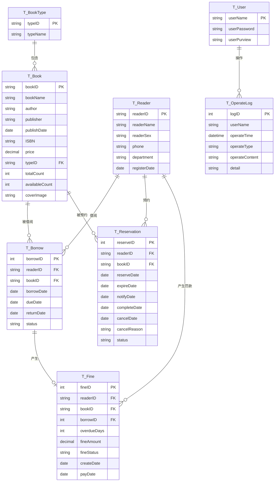

# 智慧图书馆管理系统 - 产品需求文档（PRD）

> 文档创建日期：2026-07-14
> 项目来源：东北石油大学 面向对象课程设计
> 文档版本：v2.0
> 项目编号：cs-5

---

## 1. 需求背景

### 1.1 业务背景

高校图书馆作为教学科研的重要支撑设施，日均处理大量图书借还、读者咨询、预约排队和馆藏维护业务。在传统管理模式下，热门图书全部借出后读者无法获知何时可借，只能频繁到馆询问；逾期图书缺乏自动化的罚款计算和催还机制；预约排队依赖人工登记，容易发生预约纠纷和漏通知。随着馆藏规模持续增长，亟需一套集成化的图书馆信息管理系统，将**图书预约排队、逾期罚款、借阅统计**等高级业务纳入统一平台，实现管理流程的规范化与数据化。

### 1.2 触发来源

本项目为东北石油大学计算机与信息技术学院"面向对象课程设计"课程实践任务。功能模块严格按照任务书功能模块图（7个模块）设计：系统登录、图书类别管理、图书管理、读者信息管理、借阅与归还、预约与逾期管理、系统用户管理。

### 1.3 现状与痛点

- **热门图书抢借难**：图书全部借出后读者无法预约排队，只能碰运气到馆询问，体验差
- **预约管理空白**：缺乏电子化预约登记，人工登记易出错、漏通知、无法跟踪预约状态
- **逾期管理缺失**：无法自动计算逾期罚款，罚款记录无据可依，欠款读者仍可继续借书
- **决策缺乏数据支撑**：管理者无法快速获取借阅热度、预约排行、逾期分布等统计指标
- **权限控制粗放**：无法区分管理员与普通用户的操作边界

### 1.4 证据强度标注

- 7个核心功能模块：`[任务书定义]` — 由课程设计任务书功能模块图明确指定
- 预约排队机制、罚款策略：`[PM 设计]` — 基于任务书"预约与逾期管理"模块的详细业务设计
- 借阅统计面板、操作日志：`[PM 假设]` — 任务书"附加信息管理"的延伸解读

---

## 2. 目标与范围

### 2.1 产品目标

构建一套基于 **C/S 三层架构** 的智慧图书馆管理系统，在基础的图书/读者/借还管理之上，重点实现**图书预约排队**和**逾期罚款管理**两大特色业务闭环，辅以统计面板和操作日志，使图书馆管理工作规范化、系统化、程序化。

### 2.2 项目约束

| 约束项 | 内容 |
|--------|------|
| 开发环境 | Microsoft Visual Studio 2022 |
| 编程语言 | C# (.NET 8.0 WinForms) |
| 数据库 | SQL Server 2019+ |
| 架构模式 | C/S 三层架构（UI / BLL / DAL），DAL 采用泛型 BaseRepository 基类 |
| UI 模式 | MDI 父窗体 + 左侧 TreeView 导航 + Panel 嵌入子窗体 |
| 完成期限 | 第 18-19 周 |

### 2.3 与同类项目的差异化定位

> 本项目与 cs-1 图书馆系统在**架构模式、UI 导航、命名规范、数据库设计、核心业务功能**上做了系统性区分。

| 差异维度 | **本项目（cs-5）** | cs-1 图书馆系统 |
|----------|-------------------|-----------------|
| **核心特色** | 图书预约排队 + 逾期罚款管理（7模块完整覆盖） | 基础 CRUD + 简单借还（无预约功能） |
| DAL 架构 | 泛型 `BaseRepository<T>` 基类封装公共 CRUD | 每个实体独立 DAL，CRUD 代码重复 |
| UI 导航 | **MDI 父窗体 + TreeView 左侧导航 + Dashboard 首页** | 大按钮网格 + 单窗体 Hide/Show 切换 |
| 主界面特色 | 统计仪表盘（卡片指标+排行榜） | 纯功能按钮入口，无首页概览 |
| 表命名前缀 | `T_`（如 `T_Book`、`T_Reservation`） | `tbl_`（如 `tbl_Book`） |
| 类命名规范 | `*Info`(Model) / `*Dao`(DAL) / `*Biz`(BLL) / `Frm*`(Forms) | 直接命名 / `*Service` / `*DAL` / `*Form` |
| 密码加密 | MD5 哈希（32位） | SHA-256 哈希（64位） |
| 借阅期限 | **45 天** | 30 天 |
| 借阅上限 | **3 本** | 5 本 |
| 罚款策略 | **0.3 元/天**，有未缴罚款限制借书 | 无罚款，仅提示逾期天数 |
| 预约功能 | **完整预约队列**（排队、有效期3天、还书自动通知首位预约者、超时自动取消） | 无 |
| 操作日志 | 有（记录关键操作的操作者、时间、内容） | 无 |
| 数据导出 | 支持导出 Excel | 无 |
| 额外模块 | 预约管理(FrmReservation) + 统计面板(FrmDashboard) | 修改密码窗体 |

### 2.4 范围界定

| 类别 | 包含 | 不包含 |
|------|------|--------|
| 图书类别管理 | 类别增删改查、关联图书校验 | 树状层级分类（扁平结构） |
| 图书管理 | 图书增删改查、多条件查询、库存自动维护、封面图片路径存储 | 图书封面上传（仅存路径字段预留）、图书推荐算法 |
| 读者管理 | 读者增删改查、多条件查询、借阅资格校验 | 读者信用评分、读者自助登录端 |
| 借阅与归还 | 借书登记、还书登记、借阅记录查询、借阅上限控制、并发安全扣减 | 自动续期 |
| **预约与逾期管理** | **预约排队、预约有效期管理、还书触发通知首位预约者、预约超时取消、逾期罚款计算、罚款缴费登记、欠款限制借书** | 在线支付、短信/邮件通知（仅系统内标记）、罚款减免审批 |
| 系统用户管理 | 用户增删改、密码修改、权限控制、操作日志记录 | 多级权限体系（仅管理员/普通用户两级） |
| 统计面板 | Dashboard 首页、馆藏/读者/借出/逾期统计卡片、借阅热度排行、预约排行、逾期读者列表 | PDF 报表、数据可视化图表控件（纯 DataGridView 展示） |

---

## 3. 用户与场景

### 3.1 用户角色

| 角色 | 描述 | 操作权限 | 使用频率 |
|------|------|----------|----------|
| **管理员** | 图书馆工作人员，负责系统全部数据维护 | 全部功能：图书类别/图书/读者/借阅/预约/罚款/用户管理、统计面板、操作日志查看 | 高频（每日） |
| **普通用户** | 辅助管理人员，权限受限 | 查询类功能：图书查询、读者查询、借阅记录查询、预约查询、统计面板查看 | 中频（每周） |

### 3.2 核心场景

| 优先级 | 场景 | 角色 | 描述 |
|--------|------|------|------|
| P0 | 管理员登录与首页 | 管理员 | 输入用户名/密码/身份后登录，进入 Dashboard 首页，看到馆藏总量、今日借出、逾期数量、预约待处理等概览指标 |
| P0 | 新书入库 | 管理员 | 选择图书类别，录入图书信息并提交，可借数=馆藏数 |
| P0 | 读者登记 | 管理员 | 录入读者基本信息并提交，注册日期默认为当天 |
| P0 | 办理借书 | 管理员 | 输入读者编号+图书编号，验证资格（无逾期、无欠款、未满3本）后借出，应还日期=当天+45天，扣减库存 |
| P0 | 办理还书 | 管理员 | 查找借出记录，登记归还。若逾期则自动计算罚款；若该书有预约队列，自动通知首位预约者（标记为"待取书"） |
| P0 | 图书预约 | 管理员 | 读者想借的书已全部借出时，可为其预约排队。同一读者同一本书只能预约一次 |
| P0 | 预约取书 | 管理员 | 收到取书通知的读者到馆，管理员为其办理借书（走特殊通道：不占用普通库存，直接扣减预约保留的1本） |
| P1 | 预约超时处理 | 系统/管理员 | 预约保留3天，超时未取书自动取消预约，释放给队列中下一位读者 |
| P1 | 逾期罚款缴费 | 管理员 | 读者缴纳罚款后，管理员登记缴费，清除借书限制 |
| P1 | 信息查询 | 管理员/普通用户 | 按多种条件检索图书、读者、借阅记录、预约记录 |
| P1 | 借阅统计 | 管理员/普通用户 | 查看 Dashboard 统计概览、热度排行 |
| P1 | 用户账号管理 | 管理员 | 新增/修改/删除系统用户 |
| P2 | 修改个人密码 | 全部 | 用户修改自己的登录密码 |
| P2 | 操作日志查看 | 管理员 | 查看谁在什么时间执行了什么操作 |

### 3.3 系统功能模块图

```mermaid
graph TD
    A[智慧图书馆管理系统] --> B[系统登录]
    A --> C[主窗体 MDI+TreeView]
    C --> C0[Dashboard 首页概览]
    A --> D[图书类别管理]
    A --> E[图书管理]
    A --> F[读者信息管理]
    A --> G[图书借阅与归还]
    A --> H[预约与逾期管理]
    A --> I[系统用户管理]
    A --> J[操作日志]

    B --> B1[用户名/密码/身份验证]
    B --> B2[登录失败处理]

    D --> D1[类别增删改查]

    E --> E1[图书增删改查]
    E --> E2[多条件组合查询]
    E --> E3[库存自动维护]

    F --> F1[读者增删改查]
    F --> F2[多条件查询]

    G --> G1[借书登记]
    G --> G2[还书登记]
    G --> G3[借阅记录查询]
    G --> G4[借阅上限/并发控制]
    G --> G5[还书触发预约通知]

    H --> H1[预约排队登记]
    H --> H2[预约队列管理]
    H --> H3[预约取书/取消]
    H --> H4[预约超时自动取消]
    H --> H5[逾期罚款自动计算]
    H --> H6[罚款缴费登记]
    H --> H7[欠款限制借书]

    I --> I1[用户增删改]
    I --> I2[密码修改]

    C0 --> C01[统计卡片]
    C0 --> C02[借阅热度排行]
    C0 --> C03[逾期/预约提醒]
```



---

## 4. 功能需求

### 4.1 功能概览表

| 编号 | 模块 | 功能描述 |
|------|------|----------|
| F-01 | 系统登录 | 输入用户名、密码，选择身份（管理员/普通用户），验证通过后进入 MDI 主窗体并加载 Dashboard；失败则提示并清空密码。三项均不可为空。 |
| F-02 | 主窗体与导航 | MDI 容器窗体，左侧 TreeView 导航树（按功能模块分组），右侧 Panel 区域嵌入子窗体；顶部显示当前用户信息和退出按钮；根据权限动态启用/禁用节点。 |
| F-03 | Dashboard 首页 | 登录后默认显示：馆藏总量、读者总数、当前借出数、今日借出数、当前逾期数、待处理预约数6个统计卡片，下方显示借阅热度 Top10 和今日逾期/待取书提醒列表。 |
| F-04 | 图书类别-增删改查 | 类别编号/名称的增删改查，按名称模糊查询；删除前检查关联图书。 |
| F-05 | 图书-增删改查 | 图书增删改查，支持书名/作者/类别/ISBN 四条件组合查询；修改馆藏时自动重算可借数；删除前检查未归还借阅。 |
| F-06 | 读者-增删改查 | 读者增删改查，支持编号/姓名/院系三条件查询；删除前检查未归还借阅和未缴罚款。 |
| F-07 | 借阅-借书 | 输入读者+图书编号，校验通过（读者存在、图书可借、无逾期、无欠款、未满3本、未重复借）后生成借阅记录，事务内扣减库存；应还日期=当天+45天。 |
| F-08 | 借阅-还书 | 查找借出记录登记归还，恢复库存。若逾期→自动计算罚款（0.3元/天）；若该书有有效预约→自动将队列首位预约状态改为"待取书"。 |
| F-09 | 借阅记录查询 | 按读者/图书/状态/日期范围多条件检索借阅记录。 |
| F-10 | 预约-登记 | 图书可借数为0时，读者可预约排队。校验：读者存在、无逾期无欠款、同一读者同一本书未重复预约、队列中位置自动追加。预约状态为"排队中"，预约日期=当天，有效期=当天+3天。 |
| F-11 | 预约-取书 | 状态为"待取书"的预约，管理员为读者办理借书。扣减该书可借库存1本（该书有预约保留，可借数可能为0但仍可借给预约读者），预约状态改为"已完成"。 |
| F-12 | 预约-取消 | 管理员可手动取消预约；系统每天自动检测超过有效期(3天)的"排队中"或"待取书"预约并自动取消（取书超时），若队列中还有其他人则顺位通知下一位。 |
| F-13 | 预约记录查询 | 按读者/图书/状态（排队中/待取书/已完成/已取消）检索预约记录。 |
| F-14 | 罚款-查询与缴费 | 查询未缴/已缴罚款记录，选中未缴罚款登记缴费，更新状态为"已缴"并记录缴费日期。 |
| F-15 | 用户管理 | 管理员对用户增删改，密码 MD5 加密；禁止删除自身账号。 |
| F-16 | 修改密码 | 当前用户验证旧密码后修改为新密码。 |
| F-17 | 操作日志 | 记录关键操作（登录、增删改数据、借还书、处理预约、缴费）的操作者、时间、操作类型、操作对象；管理员可查看。 |

### 4.2 模块详细设计

#### 4.2.1 系统登录模块

**业务逻辑**：输入用户名、密码，下拉选择身份。系统查询 `T_User` 验证用户名存在性、MD5密码一致性、权限匹配。全部通过则：记录登录日志 → 创建主窗体 → 隐藏登录窗 → 显示主窗体并加载 Dashboard。失败则弹出错误、清空密码框、聚焦。

**界面元素**：
- Label 标题标签
- TextBox 用户名输入框
- TextBox 密码输入框（`UseSystemPasswordChar = true`）
- ComboBox 身份选择框（DropDownList 样式，选项：管理员、普通用户）
- Button 登录按钮、退出按钮

**规则约束**：
- 三个字段均不可为空
- 连续失败无次数限制
- 密码以 MD5 哈希值存储和比对

**权限分发**：登录成功后将用户名和权限存入全局静态类 `CurrentUser`，主窗体根据权限控制 TreeView 节点可用性。

#### 4.2.2 主窗体与导航模块

**布局结构**：
```
┌─────────────────────────────────────────────────────┐
│ [Logo] 智慧图书馆管理系统   当前用户: admin [管理员] │
│                                          [退出登录] │
├──────────────┬──────────────────────────────────────┤
│  📊 首页概览  │                                      │
│  📚 图书管理  │                                      │
│    ├ 图书类别│     右侧 Panel 区域（嵌入子窗体）      │
│    └ 图书信息│                                      │
│  👥 读者管理  │                                      │
│  🔄 借还管理  │                                      │
│  📅 预约逾期  │                                      │
│  👤 用户管理  │                                      │
│  📋 操作日志  │                                      │
└──────────────┴──────────────────────────────────────┘
```

**交互逻辑**：
- 点击 TreeView 节点 → 销毁右侧 Panel 中已有子窗体 → 实例化新子窗体 → 设置 `TopLevel=false`、`Parent=panel`、`Dock=Fill` → 显示
- 点击退出登录 → 关闭所有 MDI 子窗体 → 显示登录窗体 → 隐藏主窗体
- 点击关闭按钮 → 确认后终止应用程序

**权限控制**：
- 管理员：全部节点可用
- 普通用户：图书类别、用户管理、操作日志节点禁用（灰色不可点击）；图书管理、读者管理、借还管理、预约逾期仅能查询不能增删改

#### 4.2.3 Dashboard 首页模块

**统计卡片（6个）**：
| 卡片 | SQL 查询 | 说明 |
|------|----------|------|
| 馆藏图书总量 | `SELECT COUNT(*) FROM T_Book` | 全馆图书种类数 |
| 注册读者总数 | `SELECT COUNT(*) FROM T_Reader` | 有效读者数 |
| 当前借出数 | `SELECT COUNT(*) FROM T_Borrow WHERE status='借出'` | 在借图书数量 |
| 今日借出数 | `SELECT COUNT(*) FROM T_Borrow WHERE borrowDate=GETDATE()` | 今日借出量 |
| 当前逾期数 | `SELECT COUNT(*) FROM T_Borrow WHERE status='借出' AND dueDate<GETDATE()` | 超期未还数（红色高亮） |
| 待处理预约 | `SELECT COUNT(*) FROM T_Reservation WHERE status='待取书'` | 等读者来取的预约数（橙色高亮） |

**列表区域（2-3个 DataGridView）**：
- 借阅热度 Top10：`SELECT TOP 10 b.bookName, COUNT(*) cnt FROM T_Borrow br JOIN T_Book b ON br.bookID=b.bookID GROUP BY b.bookName ORDER BY cnt DESC`
- 今日待处理：逾期未还读者列表 + 待取书预约列表（合并或分 Tab 显示）

#### 4.2.4 图书管理模块

**业务逻辑**：与 cs-1 类似，但命名和实现方式不同。
- 四条件组合查询（书名模糊、作者模糊、类别精确、ISBN精确）
- 添加时可借数=馆藏数
- 修改馆藏时校验：新馆藏数 ≥ 已借出数（`totalCount - availableCount`）
- 删除前检查是否有 `status='借出'` 的借阅记录
- DataGridView 展示完整信息，选中行回填输入区
- 主键字段（bookID）在选中后只读

#### 4.2.5 读者管理模块

**业务逻辑**：三条件查询（编号精确、姓名模糊、院系模糊），性别限定"男/女"，注册日期默认当天。删除前检查未归还借阅和未缴罚款。

#### 4.2.6 借阅与归还模块（核心业务）

**借书流程**：
1. 输入读者编号和图书编号
2. 校验链（按优先级排序）：
   - 读者是否存在
   - 图书是否存在且 `availableCount > 0`
   - 读者是否有逾期未还图书（`EXISTS 借出 AND dueDate<GETDATE()`）
   - 读者是否有未缴罚款（`EXISTS fineStatus='未缴'`）
   - 读者在借数是否达到上限 3 本
   - 读者是否已借此书未还（防重复借阅）
3. 全部通过 → 开启事务：
   - INSERT 借阅记录（borrowDate=GETDATE(), dueDate=DATEADD(DAY,45,GETDATE()), status='借出'）
   - UPDATE T_Book SET availableCount = availableCount - 1 WHERE bookID=@bookID AND availableCount > 0
   - 检查受影响行数，为0则回滚（说明并发扣减失败）
4. 记录操作日志

**还书流程**：
1. 根据读者编号/图书编号查找 `status='借出'` 的记录
2. 选中记录点击"确认归还" → 开启事务：
   - UPDATE T_Borrow SET returnDate=GETDATE(), status='已还'
   - UPDATE T_Book SET availableCount = availableCount + 1 WHERE bookID=@bookID
   - **预约触发检查**：查询该书是否有 `status='排队中'` 的预约，按预约日期排序取最早的一条，将其状态更新为 `'待取书'`，并记录通知时间（即归还日期）
3. 若 `returnDate > dueDate`：
   - 计算逾期天数 = DATEDIFF(DAY, dueDate, returnDate)
   - 罚款金额 = 逾期天数 × 0.3
   - INSERT T_Fine（状态='未缴'，createDate=GETDATE()）
4. 记录操作日志

**并发安全**：使用 `UPDATE ... SET availableCount = availableCount - 1 WHERE ... AND availableCount > 0` 模式，通过受影响行数判断扣减是否成功。

#### 4.2.7 预约与逾期管理模块（本项目核心差异化）

**预约生命周期状态机**：

```
排队中 ──→ (还书触发,成为队列首位) ──→ 待取书 ──→ (管理员办理借书) ──→ 已完成
  │                                      │
  │(超过预约有效期3天)                     │(超过取书有效期3天)
  ↓                                      ↓
已取消 ←──────────────────────── 已取消(超时) ──→ (若队列还有人) → 通知下一位
```

**预约登记（F-10）**：
- 前置条件：图书 `availableCount = 0`（已全部借出）才允许预约
- 校验：
  - 读者存在
  - 读者无逾期图书
  - 读者无未缴罚款
  - 同一读者对同一本书没有非终止状态（排队中/待取书）的预约
- 插入预约记录：status='排队中'，reserveDate=GETDATE()，expireDate=DATEADD(DAY,3,GETDATE())
- 同一本书的多个预约按预约时间先后排队，还书时 FIFO 通知

**预约取书（F-11）**：
- 管理员在预约列表中找到 `status='待取书'` 的记录，点击"办理取书"
- 系统调用借书逻辑的变体：
  - 正常借书要求 `availableCount > 0`，但预约取书允许 `availableCount = 0`（因为还书时已经为预约者保留了一本，走特殊通道）
  - 借书成功后将预约状态更新为'已完成'，completeDate=GETDATE()
  - 扣减库存（availableCount - 1）
- 校验：
  - 预约状态必须是'待取书'
  - 读者仍满足借阅资格（无新增逾期/欠款、未满3本）

**预约取消（F-12）**：
- **手动取消**：管理员选中排队中的预约，点击"取消预约"，状态改为'已取消'，cancelReason='手动取消'
- **自动取消（系统级）**：
  - 每次加载预约管理界面或启动系统时，检测：
    - `status='排队中' AND expireDate < GETDATE()` → 标记为'已取消(预约超时)'
    - `status='待取书' AND DATEDIFF(DAY, notifyDate, GETDATE()) > 3` → 标记为'已取消(取书超时)'
  - 取消后，检查该书是否还有其他'排队中'的预约：有则将最早的一条升级为'待取书'（顺位通知）

**逾期罚款管理**：
- 罚款在还书时自动生成（见还书流程）
- 罚款列表展示：读者编号、读者姓名、图书编号、书名、借阅编号、逾期天数、罚款金额、状态、生成日期、缴费日期
- 缴费：选中未缴罚款 → 点击"登记缴费" → 更新 status='已缴'，payDate=GETDATE()
- 借书校验链中检查未缴罚款，有则拦截

**逾期处理规则**：
- 逾期当天（returnDate > dueDate）即生成罚款
- 逾期天数按自然日计算（还书当天算逾期一天）
- 罚款金额四舍五入到分（DECIMAL(8,2)）

#### 4.2.8 系统用户管理模块

- 用户增删改查，密码字段以 MD5 哈希存储
- 添加用户：验证用户名唯一，两次密码一致
- 修改用户：密码可留空（留空则不修改密码）
- 删除用户：不能删除当前登录账号
- 权限选项：管理员/普通用户

#### 4.2.9 操作日志模块

**记录内容**：
- 登录/登出
- 图书/读者/类别的增删改
- 借书/还书/预约/取消预约/缴费
- 用户增删改/密码修改

**日志字段**：logID（自增）、userName、operateTime、operateType、operateContent、detail

**展示**：管理员可查看日志列表，按用户/操作类型/时间范围筛选。日志不可修改、不可删除（仅查询）。

---

## 5. 数据模型

### 5.1 数据表设计

数据库名：`LibraryDB`，共 **8 张表**（比 cs-1 多 2 张：T_Reservation 预约表、T_OperateLog 操作日志表）。

#### 5.1.1 系统用户表 T_User

| 列名 | 说明 | 类型 | 约束 |
|------|------|------|------|
| userName | 用户名 | NVARCHAR(16) | 主键 |
| userPassword | 密码（MD5 32位） | NVARCHAR(32) | 非空 |
| userPurview | 权限 | NVARCHAR(8) | '管理员' 或 '普通用户' |

#### 5.1.2 图书类别表 T_BookType

| 列名 | 说明 | 类型 | 约束 |
|------|------|------|------|
| typeID | 类别编号 | NVARCHAR(10) | 主键 |
| typeName | 类别名称 | NVARCHAR(20) | 非空，唯一 |

#### 5.1.3 图书信息表 T_Book

| 列名 | 说明 | 类型 | 约束 |
|------|------|------|------|
| bookID | 图书编号 | NVARCHAR(20) | 主键 |
| bookName | 书名 | NVARCHAR(100) | 非空 |
| author | 作者 | NVARCHAR(50) | 可空 |
| publisher | 出版社 | NVARCHAR(50) | 可空 |
| publishDate | 出版日期 | DATE | 可空 |
| ISBN | ISBN号 | NVARCHAR(13) | 可空 |
| price | 价格 | DECIMAL(8,2) | >0，可空 |
| typeID | 类别编号 | NVARCHAR(10) | 外键→T_BookType |
| totalCount | 馆藏数量 | INT | ≥0，非空，默认0 |
| availableCount | 可借数量 | INT | ≥0，≤totalCount，非空，默认0 |
| coverImage | 封面图片路径 | NVARCHAR(200) | 可空（预留字段） |

#### 5.1.4 读者信息表 T_Reader

| 列名 | 说明 | 类型 | 约束 |
|------|------|------|------|
| readerID | 读者编号 | NVARCHAR(20) | 主键 |
| readerName | 姓名 | NVARCHAR(8) | 非空 |
| readerSex | 性别 | NVARCHAR(2) | '男' 或 '女' |
| phone | 联系电话 | NVARCHAR(15) | 可空 |
| department | 所在院系 | NVARCHAR(30) | 可空 |
| registerDate | 注册日期 | DATE | 非空，默认GETDATE() |

#### 5.1.5 借阅信息表 T_Borrow

| 列名 | 说明 | 类型 | 约束 |
|------|------|------|------|
| borrowID | 借阅编号 | INT IDENTITY(1,1) | 主键 |
| readerID | 读者编号 | NVARCHAR(20) | 外键→T_Reader |
| bookID | 图书编号 | NVARCHAR(20) | 外键→T_Book |
| borrowDate | 借出日期 | DATE | 非空 |
| dueDate | 应还日期 | DATE | 非空 |
| returnDate | 归还日期 | DATE | 可空 |
| status | 状态 | NVARCHAR(4) | '借出' 或 '已还' |

#### 5.1.6 罚款信息表 T_Fine

| 列名 | 说明 | 类型 | 约束 |
|------|------|------|------|
| fineID | 罚款编号 | INT IDENTITY(1,1) | 主键 |
| readerID | 读者编号 | NVARCHAR(20) | 外键→T_Reader |
| bookID | 图书编号 | NVARCHAR(20) | 外键→T_Book |
| borrowID | 借阅编号 | INT | 外键→T_Borrow |
| overdueDays | 逾期天数 | INT | >0 |
| fineAmount | 罚款金额 | DECIMAL(8,2) | >0 |
| fineStatus | 状态 | NVARCHAR(4) | '未缴' 或 '已缴' |
| createDate | 生成日期 | DATE | 非空 |
| payDate | 缴费日期 | DATE | 可空 |

#### 5.1.7 预约信息表 T_Reservation（本项目新增核心表）

| 列名 | 说明 | 类型 | 约束 |
|------|------|------|------|
| reserveID | 预约编号 | INT IDENTITY(1,1) | 主键 |
| readerID | 读者编号 | NVARCHAR(20) | 外键→T_Reader |
| bookID | 图书编号 | NVARCHAR(20) | 外键→T_Book |
| reserveDate | 预约日期 | DATE | 非空，默认GETDATE() |
| expireDate | 预约有效期至 | DATE | 非空（预约日期+3天） |
| notifyDate | 通知取书日期 | DATE | 可空（升级为'待取书'时填写） |
| completeDate | 完成日期 | DATE | 可空（实际借书时填写） |
| cancelDate | 取消日期 | DATE | 可空 |
| cancelReason | 取消原因 | NVARCHAR(50) | 可空（'手动取消'/'预约超时'/'取书超时'） |
| status | 预约状态 | NVARCHAR(10) | '排队中'/'待取书'/'已完成'/'已取消' |

**约束**：同一读者对同一本书只能有一条活跃预约（status IN ('排队中','待取书')），用唯一过滤索引或业务层校验保证。

#### 5.1.8 操作日志表 T_OperateLog

| 列名 | 说明 | 类型 | 约束 |
|------|------|------|------|
| logID | 日志编号 | INT IDENTITY(1,1) | 主键 |
| userName | 操作者用户名 | NVARCHAR(16) | 非空 |
| operateTime | 操作时间 | DATETIME | 非空，默认GETDATE() |
| operateType | 操作类型 | NVARCHAR(20) | 非空（'登录'/'新增'/'修改'/'删除'/'借书'/'还书'/'预约'/'取消预约'/'缴费'等） |
| operateContent | 操作对象 | NVARCHAR(100) | 非空（如'图书：TP001'、'读者：2025001'） |
| detail | 详细说明 | NVARCHAR(200) | 可空 |

### 5.2 表关系 ER 图



---

## 6. 架构设计

### 6.1 分层架构总览

```
┌─────────────────────────────────────────────────────────────┐
│                    UI 层（Forms）                            │
│  FrmLogin  FrmMain(MDI)  FrmDashboard  FrmBookType  FrmBook │
│  FrmReader  FrmBorrow  FrmReservation  FrmFine  FrmUser      │
│  FrmChangePassword  FrmOperateLog                            │
├─────────────────────────────────────────────────────────────┤
│                    BLL 层（Biz）                             │
│  BookTypeBiz  BookBiz  ReaderBiz  BorrowBiz  ReservationBiz  │
│  FineBiz  UserBiz  StatisticBiz  LogBiz                      │
├─────────────────────────────────────────────────────────────┤
│                    DAL 层（Dao）                             │
│  BaseRepository<T>（泛型基类：公共CRUD）                      │
│  BookTypeDao  BookDao  ReaderDao  BorrowDao  ReservationDao  │
│  FineDao  UserDao  LogDao                                    │
├─────────────────────────────────────────────────────────────┤
│                    Models 层                                 │
│  BookTypeInfo  BookInfo  ReaderInfo  BorrowInfo  FineInfo    │
│  ReservationInfo  UserInfo  OperateLogInfo                   │
├─────────────────────────────────────────────────────────────┤
│                    Common 层（工具类）                        │
│  DBConnection  SecurityUtil(MD5)  ValidateUtil  UiHelper     │
│  BusinessConstants  CurrentUser(全局登录状态)  BusinessException│
└─────────────────────────────────────────────────────────────┘
                              ↓
                       SQL Server 数据库
```

### 6.2 各层职责

| 层级 | 职责 | 依赖 |
|------|------|------|
| **UI 层（Forms）** | 界面渲染、用户输入接收、数据绑定、异常消息展示、调用 BLL | BLL 层、Common 层 |
| **BLL 层（Biz）** | 业务逻辑校验、事务管理、业务规则执行、异常封装为 BusinessException | DAL 层、Models 层、Common 层 |
| **DAL 层（Dao）** | 数据库 CRUD 操作、参数化查询、数据映射（DataReader→实体对象） | Models 层、Common 层（DBConnection） |
| **Models 层** | 纯 POCO 实体类，与数据库表一一对应 | 无 |
| **Common 层** | 数据库连接、MD5加密、输入校验、UI辅助、全局常量、业务异常、全局用户状态 | 无 |

### 6.3 泛型基类设计

```csharp
/// <summary>
/// 泛型数据访问基类，封装公共 CRUD，子类继承并实现抽象方法
/// </summary>
public abstract class BaseRepository<T> where T : class, new()
{
    /// <summary>查询全部实体</summary>
    public abstract List<T> FindAll();

    /// <summary>按主键查询单个实体</summary>
    public abstract T FindById(string id);

    /// <summary>新增实体，返回受影响行数</summary>
    public abstract int Insert(T entity);

    /// <summary>更新实体，返回受影响行数</summary>
    public abstract int Update(T entity);

    /// <summary>按主键删除，返回受影响行数</summary>
    public abstract int Delete(string id);
}
```

### 6.4 命名规范

| 层级 | 规范 | 示例 |
|------|------|------|
| Models | `*Info` 后缀 | `BookInfo`、`ReaderInfo`、`BorrowInfo`、`ReservationInfo`、`FineInfo`、`UserInfo`、`OperateLogInfo`、`BookTypeInfo` |
| DAL | `*Dao` 后缀，继承 `BaseRepository<T>` | `BookDao`、`ReaderDao`、`BorrowDao`、`ReservationDao`、`FineDao`、`UserDao`、`LogDao`、`BookTypeDao` |
| BLL | `*Biz` 后缀 | `BookBiz`、`ReaderBiz`、`BorrowBiz`、`ReservationBiz`、`FineBiz`、`UserBiz`、`StatisticBiz`、`LogBiz` |
| Forms | `Frm*` 前缀 | `FrmLogin`、`FrmMain`、`FrmDashboard`、`FrmBook`、`FrmBorrow`、`FrmReservation`、`FrmFine`、`FrmUser`、`FrmOperateLog` |
| Common | `*Util`/`*Helper`/`*Constants`/`*Exception` | `SecurityUtil`、`ValidateUtil`、`UiHelper`、`DBConnection`、`BusinessConstants`、`BusinessException`、`CurrentUser` |
| 数据库表 | `T_` 前缀 | `T_Book`、`T_Reader`、`T_Borrow`、`T_Reservation`、`T_Fine`、`T_User`、`T_BookType`、`T_OperateLog` |

---

## 7. 非功能需求

| 类别 | 需求描述 |
|------|----------|
| **性能** | 简单查询响应 < 1秒；多条件组合查询 < 2秒；Dashboard 统计查询 < 3秒 |
| **安全性** | 密码 MD5 哈希存储；全参数化查询防 SQL 注入；连接字符串在 App.config 配置；普通用户无增删改权限 |
| **事务一致性** | 借/还书+库存变更、预约通知、罚款生成都在数据库事务内完成，保证原子性 |
| **并发安全** | 库存扣减使用 `UPDATE ... SET availableCount=availableCount-1 WHERE ... AND availableCount>0` 乐观锁模式 |
| **可用性** | 操作全程不崩溃；数据库连接失败时给出友好提示；非法输入给出明确字段级错误提示 |
| **易用性** | TreeView 导航清晰；Dashboard 首页提供全局概览；关键操作（删除、还书、缴费、取消预约）有二次确认；成功/失败有 MessageBox 反馈 |
| **可维护性** | DAL 泛型基类减少重复代码；业务常量集中管理；全中文注释；各层职责清晰不越界 |
| **容错性** | 所有数据库操作 try-catch 封装，BLL 层抛出 BusinessException，UI 层分别用 Warning/Error 图标提示 |

---

## 8. 业务常量定义

| 常量名 | 值 | 说明 |
|--------|-----|------|
| `DEFAULT_BORROW_DAYS` | 45 | 默认借阅期限（天） |
| `MAX_BORROW_LIMIT` | 3 | 读者同时借阅图书上限 |
| `FINE_PER_DAY` | 0.3m | 逾期每天罚款金额（元） |
| `RESERVE_VALID_DAYS` | 3 | 预约有效期/取书保留期（天） |
| `CONN_STR_KEY` | "LibraryDB" | App.config 连接字符串键名 |

---

## 9. 验收标准

| 编号 | 验收项 | 验收标准 |
|------|--------|----------|
| AC-01 | 管理员登录 | 输入正确 admin 账号密码，选择管理员身份，成功进入 MDI 主窗体并加载 Dashboard，TreeView 全部节点可用 |
| AC-02 | 普通用户登录 | 普通用户登录后，图书类别、用户管理、操作日志节点不可用，增删改按钮禁用 |
| AC-03 | Dashboard 显示 | 首页正确显示6个统计卡片数字，热度排行有数据，逾期/待取书提醒列表正确 |
| AC-04 | 图书类别 CRUD | 增删改查正常，删除有关联图书的类别被拦截 |
| AC-05 | 图书 CRUD | 增删改查、四条件组合查询正常，修改馆藏数时可借数正确重算，删除有未还借阅的图书被拦截 |
| AC-06 | 读者 CRUD | 增删改查、三条件查询正常，删除有未还借阅或未缴罚款的读者被拦截 |
| AC-07 | 借书成功流程 | 输入合法读者+图书编号，成功生成借阅记录（应还=借+45天），可借数-1 |
| AC-08 | 借书校验链 | 可借数=0/有逾期/有欠款/满3本/重复借，各场景均被拦截并给出对应提示 |
| AC-09 | 还书正常流程 | 选中借出记录归还成功，状态变为已还，可借数+1，不生成罚款 |
| AC-10 | 还书逾期罚款 | 逾期归还自动生成罚款记录，金额=逾期天数×0.3，状态为未缴 |
| AC-11 | 还书触发预约通知 | 归还一本有排队预约的图书，最早预约记录自动变为"待取书"状态，通知日期为当天 |
| AC-12 | 预约登记 | 图书可借数为0时可预约；同一读者重复预约被拦截；预约有效期自动设为3天后 |
| AC-13 | 预约取书 | 待取书状态的预约可以办理借书，借书成功后预约变为已完成，可借数-1 |
| AC-14 | 预约超时取消 | 超过有效期的排队中预约、超过3天未取的待取书预约，系统自动标记为已取消；若队列中还有人则通知下一位 |
| AC-15 | 预约手动取消 | 管理员可手动取消排队中的预约 |
| AC-16 | 罚款缴费 | 选中未缴罚款登记缴费后变为已缴，记录缴费日期；缴费后读者可正常借书 |
| AC-17 | 欠款限制借书 | 有未缴罚款的读者借书被拦截 |
| AC-18 | 用户管理 | 用户增删改正常，不能删除当前登录用户，密码以 MD5 存储 |
| AC-19 | 密码修改 | 旧密码验证通过后才可修改新密码 |
| AC-20 | 操作日志 | 登录、增删改、借还书、预约、缴费等操作均有日志记录，管理员可查看 |
| AC-21 | 并发扣减 | 模拟并发借书不会导致可借数变为负数 |
| AC-22 | 参数化查询 | 输入单引号等特殊字符不报错、不引发 SQL 注入 |

---

## 10. 假设与待确认项

| 编号 | 内容 | 状态 |
|------|------|------|
| A-01 | 借阅期限设为 45 天（区别于 cs-1 的 30 天） | 已设定 |
| A-02 | 借阅上限设为 3 本（区别于 cs-1 的 5 本） | 已设定 |
| A-03 | 罚款 0.3 元/天（区别于 cs-1 的无罚款/0.5元） | 已设定 |
| A-04 | 预约有效期和取书保留期均为 3 天 | 已设定 |
| A-05 | 预约自动取消采用"界面加载时检测+启动时检测"的懒检测策略，不做 Windows 服务/定时器 | 已设定 |
| A-06 | 还书通知采用系统内状态标记（待取书），不实现短信/邮件通知 | 已设定 |
| A-07 | 密码加密使用 MD5（与 cs-1 的 SHA-256 区分） | 已设定 |
| A-08 | UI 采用 WinForms Designer 拖拽布局（区别于 cs-1 的纯代码手写UI） | 已设定 |
| A-09 | 封面图片字段预留但不实现上传功能，后续可扩展 | 已设定 |
| A-10 | 学生个人信息（姓名/学号/班级）待论文生成阶段填充 | 待填充 |

---

## 11. 术语表

| 术语 | 说明 |
|------|------|
| C/S 架构 | 客户端/服务器架构，客户端通过局域网访问数据库 |
| 三层架构 | UI（界面层）/ BLL（业务逻辑层）/ DAL（数据访问层）+ Models（实体层） |
| MDI | 多文档界面，主窗体作为容器，子窗体嵌入主窗体中显示 |
| TreeView | 树形导航控件，以层级结构展示功能菜单 |
| Dashboard | 仪表盘/首页概览，集中展示关键统计指标和提醒事项 |
| 预约排队 | 图书全部借出后，读者按时间先后排队等待归还通知的机制 |
| 待取书 | 预约队列首位读者收到还书通知后的状态，保留图书3天等待到馆借阅 |
| 泛型基类 | `BaseRepository<T>` 使用 C# 泛型封装公共 CRUD，子类继承复用 |
| MD5 | 一种哈希算法，本项目用于密码加密存储（32位十六进制串） |
| 乐观并发 | 通过 WHERE 条件（`availableCount > 0`）保证并发扣减安全，不使用显式锁 |
| 业务异常 | `BusinessException`，BLL 层抛出的业务校验错误，UI 层以警告图标提示 |
