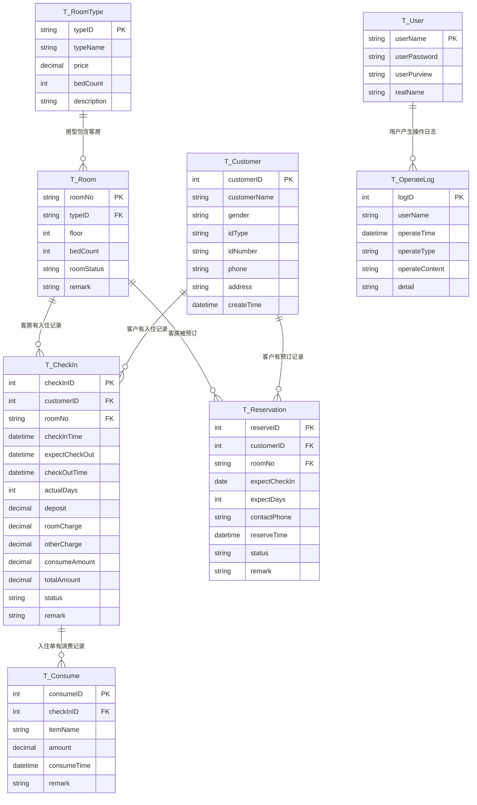

# 智慧酒店管理系统 - 产品需求文档（PRD）

> 文档创建日期：2026-07-15
> 项目来源：东北石油大学 面向对象课程设计
> 文档版本：v1.0
> 项目编号：cs-6

---

## 1. 需求背景

### 1.1 业务背景

中小型酒店、宾馆在日常运营中面临房态管理混乱、入住退房流程繁琐、消费记账零散、营业数据难以统计等问题。传统的手工记账或简易表格管理方式容易出现：房间状态更新不及时导致重复开单、押金/住宿费计算错误、客户消费明细不清、交接班账目核对困难等痛点。亟需一套集成化的酒店管理信息系统，覆盖从客房预订、入住登记、消费记账到结算退房的全业务流程。

### 1.2 触发来源

本项目为东北石油大学计算机与信息技术学院"面向对象课程设计"课程实践任务。功能模块严格按照任务书要求设计：客房类型管理、客房管理、客户信息管理、客户入住、客户结算五大基础模块，并实现任务书建议的扩展功能（客房预定、消费附加服务、营业统计图表）。

### 1.3 现状与痛点

- **房态不透明**：前台无法快速获知哪些房间空闲、哪些在住、哪些维护中，容易造成开重房
- **结算易出错**：住宿费按天自动计算、押金抵扣、附加消费汇总依赖人工心算，易出错引发纠纷
- **消费记账散**：客人在店期间的餐饮、小商品等消费没有统一记录，退房时容易漏结
- **预订管理空白**：电话预订没有电子化登记，容易出现预订冲突或漏接预订
- **决策无数据**：管理者无法快速获知入住率、营收情况、热门房型等经营指标

### 1.4 证据强度标注

- 5个核心功能模块：`[任务书定义]` — 由课程设计任务书明确指定
- 客房预订、附加消费、营业统计：`[任务书扩展建议]` — 任务书明确给出的扩展方向
- 续住/换房、房态看板、操作日志：`[PM 设计]` — 基于酒店实际业务闭环的合理延伸

---

## 2. 目标与范围

### 2.1 产品目标

构建一套基于 **C/S 三层架构** 的智慧酒店管理系统，在基础的客房/客户/入住/退房 CRUD 之上，重点实现**房态可视化看板、消费明细记账、预订管理、营业日报统计**四大特色业务闭环，使酒店管理工作规范化、系统化、程序化。

### 2.2 项目约束

| 约束项 | 内容 |
|--------|------|
| 开发环境 | Microsoft Visual Studio 2022 |
| 编程语言 | C# (.NET 8.0 WinForms) |
| 数据库 | SQL Server 2019+ |
| 架构模式 | C/S 三层架构（UI / BLL / DAL），DAL 采用泛型 BaseRepository 基类 |
| UI 模式 | MDI 父窗体 + 左侧 TreeView 导航 + Panel 嵌入子窗体 |
| 完成期限 | 第 18-19 周 |

### 2.3 与现有项目的差异化定位

> 本项目为全新业务领域（酒店管理），与 cs-1/cs-5（图书馆）、cs-2/3/4（校园超市）业务完全不同，天然不存在功能重复。在技术架构上延续 cs-5 的成熟分层模式，但形成自身的业务特色。

| 差异维度 | **本项目（cs-6 智慧酒店）** | cs-5 智慧图书馆 |
|----------|---------------------------|----------------|
| **核心业务对象** | 客房、入住单、消费、结算 | 图书、借阅、预约、罚款 |
| **核心特色** | 房态看板可视化 + 消费记账 + 预订管理 + 营业统计 | 预约排队 + 逾期罚款 |
| **首页看板** | 房态图（用颜色方块展示每个房间状态） | 统计卡片 + 排行榜 |
| **状态机复杂度** | 客房状态：空闲→入住→空闲/维护；入住单状态：预订→在住→已结/取消 | 预约状态：排队→待取→完成/取消 |
| **费用计算** | 按天计算住宿费 + 押金抵扣 + 附加消费汇总 = 应收/应退 | 固定单价 × 逾期天数 = 罚款 |
| **新增模块** | 消费记账、房态看板、营业统计、预订管理 | 预约管理、罚款管理 |

### 2.4 范围界定

| 类别 | 包含 | 不包含 |
|------|------|--------|
| 客房类型管理 | 房型增删改查、房价/床位数配置、删除前关联校验 | 房价日历（节假日调价）、房间图片上传 |
| 客房管理 | 客房增删改查、楼层/房号/房型/状态维护、房态颜色看板 | 门锁系统对接、房间清洁排班 |
| 客户信息管理 | 客户档案增删改查、证件信息登记、多条件模糊查询、入住历史查询 | 会员等级/积分体系、客户画像分析 |
| 预订管理 | 预订登记、预订查询、取消预订、预订转入住 | 在线预订、短信通知、预付款 |
| 入住登记 | 选房入住、自动计算住宿费、押金收取、入住天数自动计算 | 身份证读卡器对接、人脸登记 |
| 消费记账 | 在住客人附加消费记账（餐饮、小商品等）、消费明细查询 | 库存管理、采购入库 |
| 续住/换房 | 在住客人续住延住、换房调整、差价自动计算 | 升降级换房差价策略配置 |
| 结算退房 | 住宿费+消费汇总、押金抵扣、自动计算应收/应退、退房后房态自动改为空闲 | 发票管理、在线支付、挂账 |
| 营业统计 | 今日入住/退房/在住统计、营收统计、入住率统计、房型入住排行 | 月度/年度报表、导出PDF、可视化图表控件 |
| 系统用户管理 | 用户增删改、密码修改、权限控制、操作日志 | 多级权限体系（仅管理员/前台两级） |

> **删除策略**：本项目所有删除操作均为**物理删除**（DELETE FROM），不采用逻辑删除（软标记）。删除前必须通过 BLL 层校验关联数据是否存在（如：有在住记录的客户不可删除、有关联客房的房型不可删除），校验不通过则抛出 BusinessException 并提示用户。操作日志表除外——日志记录不可删除，仅支持查询。

---

## 3. 用户与场景

### 3.1 用户角色

| 角色 | 描述 | 操作权限 | 使用频率 |
|------|------|----------|----------|
| **管理员** | 酒店经理/老板，负责系统全部数据维护和营业查看 | 全部功能：房型/客房/客户/预订/入住/消费/结算/统计/用户/日志 | 中频（每日查看营业） |
| **前台操作员** | 前台接待人员，负责日常接待业务 | 日常业务：房态看板、客户管理、预订、入住登记、消费记账、续住换房、结算退房；不含用户管理、数据删除 | 高频（每日） |

### 3.2 核心场景

| 优先级 | 场景 | 角色 | 描述 |
|--------|------|------|------|
| P0 | 前台登录开房 | 前台 | 客人到店→查询空闲房间→选择房型房号→登记客户信息→收取押金→办理入住→房态变为"在住" |
| P0 | 客人结账退房 | 前台 | 客人退房→调出入住记录→自动汇总住宿费+附加消费→抵扣押金→计算应收/应退→结账→房态变为"空闲" |
| P0 | 房态概览 | 前台/管理员 | 打开首页房态看板，直观看到每层每个房间的状态（空闲/在住/维护），点击房间可直接办理业务 |
| P1 | 电话预订房间 | 前台 | 客人电话预订→选择房型和预计入住日期→登记客户信息→预留房间→房态变为"预留" |
| P1 | 预订客人到店 | 前台 | 查找预订记录→直接转入住登记（自动带入客户和房型信息）→办理入住 |
| P1 | 客人在店消费 | 前台 | 客人在餐厅吃饭或购买小商品→录入消费项目和金额→记入该客人账单→退房时统一结算 |
| P1 | 客人续住 | 前台 | 客人要求续住→修改预计退房日期→自动加收续住天数房费→押金不足时补收 |
| P1 | 客人换房 | 前台 | 客人因各种原因要求换房→为其选择新房间→结算原房间费用→办理新房间入住→更新房态 |
| P1 | 维护房间 | 管理员 | 房间需要维修/清洁→将房态设为"维护中"→维护完成后改回"空闲" |
| P1 | 客户信息查询 | 前台/管理员 | 按姓名/证件号/手机号等多条件查询客户档案和历史入住记录 |
| P2 | 营业统计查看 | 管理员 | 查看今日入住数、退房数、在住数、今日营收、累计营收、入住率、热门房型 |
| P2 | 操作日志查看 | 管理员 | 查看谁在什么时间办理了入住/退房/结账等关键操作 |

### 3.3 系统功能模块图

```mermaid
graph TD
    A[智慧酒店管理系统] --> B[系统登录]
    A --> C[主窗体 MDI+TreeView]
    C --> C0[房态看板首页]
    A --> D[客房类型管理]
    A --> E[客房管理]
    A --> F[客户信息管理]
    A --> G[预订管理]
    A --> H[入住管理]
    A --> I[消费记账]
    A --> J[结算退房]
    A --> K[营业统计]
    A --> L[系统用户管理]
    A --> M[操作日志]

    B --> B1[用户名/密码/身份验证]
    B --> B2[登录失败处理]

    D --> D1[房型增删改查]
    D --> D2[房价/床位数配置]

    E --> E1[客房增删改查]
    E --> E2[房态维护（空闲/在住/预留/维护）]

    F --> F1[客户增删改查]
    F --> F2[多条件灵活查询]
    F --> F3[入住历史查询]

    G --> G1[预订登记]
    G --> G2[预订查询/取消]
    G --> G3[预订转入住]

    H --> H1[选房入住登记]
    H --> H2[续住办理]
    H --> H3[换房办理]
    H --> H4[押金管理]

    I --> I1[消费录入]
    I --> I2[消费明细查询]

    J --> J1[费用自动汇总]
    J --> J2[押金抵扣]
    J --> J3[应收/应退计算]
    J --> J4[退房结账]

    C0 --> C01[楼层-房间网格布局]
    C0 --> C02[颜色区分房态]
    C0 --> C03[点击房间快捷操作]

    K --> K1[今日营业概览]
    K --> K2[入住率统计]
    K --> K3[房型入住排行]
```



---

## 4. 功能需求

### 4.1 功能概览表

| 编号 | 模块 | 功能描述 |
|------|------|----------|
| F-01 | 系统登录 | 输入用户名、密码，选择身份（管理员/前台），验证通过后进入 MDI 主窗体并加载房态看板；失败则提示并清空密码。三项均不可为空。 |
| F-02 | 主窗体与导航 | MDI 容器窗体，左侧 TreeView 导航树（按功能模块分组），右侧 Panel 区域嵌入子窗体；顶部显示当前用户信息和退出按钮；根据权限动态启用/禁用节点。 |
| F-03 | 房态看板首页 | 登录后默认显示：按楼层分组展示所有房间，用不同颜色方块表示房态（空闲=绿色、在住=红色、预留=蓝色、维护=黄色），点击房间可弹出快捷菜单（入住/结账/设为维护）。顶部显示今日统计卡片。 |
| F-04 | 客房类型-增删改查 | 房型编号/名称/房价/床位数的增删改查，按名称模糊查询；删除前检查关联客房。预置房型：豪华套间、标准套间、三人间、标准间、单人间、其它。 |
| F-05 | 客房-增删改查 | 客房增删改查，支持楼号楼层/房号/房型/房态多条件查询；房态包括：空闲、在住、预留、维护；选中行回填输入区，房号主键不可修改。 |
| F-06 | 客房-房态维护 | 可将空闲房间设为维护中，维护完成后设回空闲；在住/预留状态不可手动强制修改（由入住/退房/预订业务自动驱动）。 |
| F-07 | 客户-增删改查 | 客户档案增删改查，支持姓名/证件号/手机号模糊查询；证件类型：身份证、护照、军官证、其他；删除前检查是否有在住记录。 |
| F-08 | 客户-入住历史 | 选中客户可查看其历史入住记录（入住时间、退房时间、房间、消费总额）。 |
| F-09 | 预订-登记 | 选择客户、房型、预计入住日期、预计退房天数、联系电话，登记预订。同一房间同一日期段不可重复预订。预订后房态变为"预留"。 |
| F-10 | 预订-查询/取消 | 按客户姓名/日期/状态查询预订记录；可取消未入住的预订，取消后房态恢复为"空闲"。 |
| F-11 | 预订-转入住 | 预订客人到店后，选中预订记录点击"转入住"，自动带入客户信息和房型，选择具体房间，收取押金后完成入住，房态变为"在住"。 |
| F-12 | 入住-登记 | 两种方式：（1）空闲房间直接入住：选房→选/新建客户→收押金→入住；（2）预订转入住：见F-11。自动计算预计退房日期=入住日期+入住天数。入住成功后房态变为"在住"。 |
| F-13 | 入住-查询 | 按房间号/客户姓名/入住日期范围查询在住和历史入住记录。 |
| F-14 | 续住办理 | 在住客人要求续住，输入续住天数，自动修改预计退房日期，计算需补收押金（如有）。 |
| F-15 | 换房办理 | 在住客人要求换房，选择目标空闲房间，结算原房间截至当天的费用（从押金中暂扣），为新房间办理入住（沿用原押金，多退少补），原房间变为空闲/维护，新房间变为在住。 |
| F-16 | 消费-录入 | 为在住客人录入附加消费：消费项目（餐饮、小商品、其他）、消费金额、消费时间、备注。消费记录关联到入住单，退房时统一结算。 |
| F-17 | 消费-查询 | 按入住单/日期范围查询消费明细。 |
| F-18 | 结算-退房 | 调出在住记录，系统**自动预填参考值**（住宿费按入住天数×房型单价计算，附加消费自动汇总），所有金额字段（住宿费、其他费用、总金额）均为可编辑输入框，前台可手动修改/调整。确认结账后，以界面上手动填写的最终数字为准直接保存到数据库，入住单状态变为"已结账"，房态自动改为"空闲"。 |
| F-19 | 营业统计 | 今日统计卡片（今日入住数、今日退房数、当前在住数、今日营收）；入住率统计；房型入住排行；按日期范围查询营收汇总。 |
| F-20 | 用户管理 | 管理员对用户增删改，密码哈希加密；禁止删除自身账号；权限：管理员/前台。 |
| F-21 | 修改密码 | 当前用户验证旧密码后修改为新密码。 |
| F-22 | 操作日志 | 记录关键操作（登录、入住、退房、结账、取消预订、换房、续住）的操作者、时间、操作类型、操作对象；管理员可查看。 |

### 4.2 模块详细设计

#### 4.2.1 系统登录模块

**业务逻辑**：输入用户名、密码，下拉选择身份。系统查询 `T_User` 验证用户名存在性、密码哈希一致性、权限匹配。全部通过则：记录登录日志 → 创建主窗体 → 隐藏登录窗 → 显示主窗体并加载房态看板。失败则弹出错误、清空密码框、聚焦。

**界面元素**：
- Label 标题标签
- TextBox 用户名输入框
- TextBox 密码输入框（`UseSystemPasswordChar = true`）
- ComboBox 身份选择框（DropDownList 样式，选项：管理员、前台）
- Button 登录按钮、退出按钮

**规则约束**：
- 三个字段均不可为空
- 密码采用 SHA-256 哈希存储（区别于 cs-5 的 MD5）
- 前台操作员无用户管理、删除数据、操作日志权限

**权限分发**：登录成功后将用户名和权限存入全局静态类 `CurrentUser`，主窗体根据权限控制 TreeView 节点可用性和按钮可用性。

#### 4.2.2 主窗体与导航模块

**布局结构**：
```
┌─────────────────────────────────────────────────────┐
│ [Logo] 智慧酒店管理系统   当前用户: admin [管理员]    │
│                                          [退出登录] │
├──────────────┬──────────────────────────────────────┤
│  🏠 房态看板  │                                      │
│  🛏️ 客房管理  │                                      │
│    ├ 客房类型│     右侧 Panel 区域（嵌入子窗体）      │
│    └ 客房信息│                                      │
│  👤 客户管理  │                                      │
│  📅 预订管理  │                                      │
│  📝 入住管理  │                                      │
│  💰 消费记账  │                                      │
│  ✅ 结算退房  │                                      │
│  📊 营业统计  │                                      │
│  🔧 系统管理  │                                      │
│    ├ 用户管理│                                      │
│    └ 操作日志│                                      │
└──────────────┴──────────────────────────────────────┘
```

**交互逻辑**：
- 点击 TreeView 节点 → 销毁右侧 Panel 中已有子窗体 → 实例化新子窗体 → 设置 `TopLevel=false`、`Parent=panel`、`Dock=Fill` → 显示
- 点击退出登录 → 关闭所有 MDI 子窗体 → 显示登录窗体 → 隐藏主窗体
- 点击关闭按钮 → 确认后终止应用程序

**权限控制**：
- 管理员：全部节点可见可用，所有按钮可用
- 前台：用户管理、操作日志节点**直接隐藏**（不显示在 TreeView 中，而非灰显禁用）；数据删除按钮禁用（只能添加和修改，不能物理删除）

#### 4.2.3 房态看板模块（本项目核心差异化特色）

**房态颜色编码**：
| 状态 | 颜色 | 说明 |
|------|------|------|
| 空闲 | 🟩 绿色（LightGreen） | 可入住 |
| 在住 | 🟥 红色（LightCoral） | 有客人入住 |
| 预留 | 🟦 蓝色（LightBlue） | 已被预订预留 |
| 维护 | 🟨 黄色（LightYellow） | 维修/清洁中，不可售 |

**统计卡片（顶部4个）**：
| 卡片 | SQL 查询 |
|------|----------|
| 今日入住 | `SELECT COUNT(*) FROM T_CheckIn WHERE CONVERT(DATE,checkInTime)=GETDATE() AND status!='已取消'` |
| 今日退房 | `SELECT COUNT(*) FROM T_CheckIn WHERE CONVERT(DATE,checkOutTime)=GETDATE() AND status='已结账'` |
| 当前在住 | `SELECT COUNT(*) FROM T_CheckIn WHERE status='在住'` |
| 今日营收 | `SELECT ISNULL(SUM(totalAmount),0) FROM T_CheckIn WHERE CONVERT(DATE,checkOutTime)=GETDATE() AND status='已结账'` |

**房间网格布局**：
- 按楼层分组（如 1楼、2楼、3楼...），每层一个 GroupBox 分组框
- 每个房间是一个带颜色的方块 Panel（固定尺寸 **70×50**），显示房号文字
- 每行最多放置 **8 个**房间方块，超出自动换行
- 方块间距：水平 8px、垂直 6px
- 外层容器使用 `FlowLayoutPanel` + `AutoScroll=True`，支持大量房间（如 200+ 间）时滚动查看
- 方块背景色使用 `SystemColors` 浅色系（LightGreen / LightCoral / LightBlue / LightYellow），确保房号文字清晰可读
- 点击房间方块：
  - 空闲房间：弹出菜单 → 【办理入住】【设为维护】
  - 在住房间：弹出菜单 → 【办理退房】【录入消费】【续住】【换房】【查看详情】
  - 预留房间：弹出菜单 → 【预订转入住】【取消预订】
  - 维护房间：弹出菜单 → 【恢复空闲】

**刷新机制**：进入看板自动加载；其他业务操作完成后可手动点击"刷新"按钮更新房态。

#### 4.2.4 客房类型管理模块

**业务逻辑**：房型增删改查，每个房型有单价（元/天）和床位数。
- 预置6种房型数据（初始化SQL脚本插入）：豪华套间、标准套间、三人间、标准间、单人间、其它
- 删除前检查是否有关联客房记录
- 房价为 DECIMAL(8,2)，必须大于0
- 床位数为 INT，必须大于0

#### 4.2.5 客房管理模块

**业务逻辑**：客房信息包括房号、房型、楼层、床位数（默认从房型继承，可覆盖）、备注、房态。
- 房号规则：建议采用"楼层+序号"（如 301、302），但系统不做强制校验
- 新增客房时默认状态为"空闲"
- 房态正常情况下由业务驱动自动变更（入住→在住，结账→空闲，预订→预留，取消预订→空闲），不允许手动随意修改
- 可手动将"空闲"设为"维护"，或将"维护"恢复为"空闲"
- 删除前检查：该房间没有在住或预留记录

**房态状态机**：
```
     ┌─────────────────────────────────────────────┐
     │                                             │
     ▼                                             │
   空闲 ──(预订成功)──→ 预留 ──(取消预订)──→ 空闲    │
     │                   │                         │
     │(入住/预订转入住)    │(预订转入住)              │
     ▼                   ▼                         │
   在住 ───────────────────────────────────────────┘
     │
     │(需要维修清洁)         (维护完成)
     ▼                        │
   维护 ──────────────────────┘
     │
     │(结账退房)
     ▼
   空闲
```

#### 4.2.6 客户信息管理模块

**业务逻辑**：客户档案包含姓名、性别、证件类型、证件号码、手机号、地址等。
- 证件类型下拉选择：身份证、护照、军官证、其他
- 手机号做格式校验（11位数字，课程设计阶段可做简单校验）
- 支持姓名模糊、证件号精确、手机号模糊三种条件组合查询
- 选中客户可点击"入住历史"查看其历史入住记录列表
- 删除前检查：该客户当前没有在住记录

#### 4.2.7 预订管理模块

**预订业务规则**：
- 预订时需指定：客户（可选择已有或新建）、房型、预计入住日期、预计入住天数、联系电话
- 预订时不指定具体房间号（只预定房型），到店入住时再分配房间；或者可直接预留指定房间（简化实现：预订即预留指定房间）
- **简化方案（课程设计）**：预订时直接选择具体房间，预订成功后该房间状态变为"预留"
- 同一房间在同一时间段内不可重复预订（时间重叠校验）
- 预订不收取押金（简化处理）
- 预订状态：待入住、已入住、已取消、已过期
- 超过预计入住日期1天仍未入住的预订，系统自动标记为"已过期"
- **自动过期机制**：每次登录成功或打开房态看板时，系统自动扫描 `T_Reservation` 表中 `status='待入住' AND expectCheckIn < DATEADD(DAY, -1, GETDATE())` 的记录，将其状态更新为"已过期"，同时恢复对应房间状态为"空闲"
- 对应验收标准见 AC-11.1

**预订转入住（F-11）**：
- 选中"待入住"状态的预订，点击"转入住"
- 自动带入客户信息、房型、房间号、预计入住日期、预计天数
- 前台收取押金后确认入住，预订状态变为"已入住"，入住单生成，房态变为"在住"

#### 4.2.8 入住管理模块（核心业务）

**入住登记（F-12）流程**：
1. 选择一个"空闲"状态的房间
2. 选择客户（可查询已有客户，或快速新建客户）
3. 输入入住天数（默认1天），系统自动计算预计退房日期=当前日期+入住天数
4. 输入收取的押金金额（默认建议为1天房费，可修改）
5. 确认入住：
   - 验证：房间为空闲、客户存在、押金≥0、入住天数≥1
   - 开启事务：
     - INSERT 入住记录（checkInTime=GETDATE(), status='在住'）
     - UPDATE 房间状态为'在住'
   - 记录操作日志

**续住办理（F-14）流程**：
1. 选中"在住"状态的入住记录
2. 输入续住天数（≥1）
3. 系统计算新的预计退房日期=原预计退房日期+续住天数
4. 计算续住费用=续住天数×房型单价
5. 提示是否需要补收押金（可选）
6. 确认更新入住记录

**换房办理（F-15）流程**：
1. 选中"在住"状态的入住记录（原房间）
2. 选择一个"空闲"状态的目标房间
3. 系统计算原房间截至当前的实际住宿费用（按已住天数×单价）
4. 提示原押金是否足够覆盖原房间费用，多退少补
5. 开启事务：
   - 原房间结账处理（费用结清，状态改为'已结账'或'换房结账'）
   - 目标房间办理新入住（沿用客户信息，押金用原押金抵扣/补收）
   - 原房间状态改为'空闲'，目标房间状态改为'在住'
6. 记录操作日志

> **说明**：换房为复杂业务，课程设计阶段采用以下简化方案（已折中）：
> 1. 换房时在原入住单的 `remark` 字段中记录换房时间点和原房间号（如 `[换房] 2026-07-15 14:00 从301换至502`）
> 2. 更新入住单 `roomNo` 为新房间号，原房间改空闲、新房间改在住
> 3. **退房结算时按分段计算**：系统根据 `remark` 中的换房记录，自动将住宿费拆分为「原房间天数×原单价 + 新房间天数×新单价」，分别预填到住宿费输入框供前台确认
> 4. 若 `remark` 中有多次换房记录，则按时间顺序逐段计算
> 5. 如时间紧张，可降级为：换房后统一按新房间价格计算，前台在结算页手动调整住宿费差额

#### 4.2.9 消费记账模块

**业务逻辑**：为在住客人录入酒店内附加消费（如餐厅就餐、购买矿泉水/泡面等小商品、洗衣服务等）。
- 消费记录关联到入住单（checkInID）
- 消费项目：餐饮、小商品、洗衣、其他（下拉选择，也可输入自定义内容）
- 消费金额：DECIMAL(8,2)，必须大于0
- 消费时间：默认当前时间，可修改
- 备注：可填
- 退房结账时自动汇总该入住单下所有消费记录的总额，预填到结算页的"附加消费总额"输入框

> **职责边界**：消费记账模块仅记录**服务性消费**（餐饮、小商品、洗衣等）。损坏赔偿、折扣优惠、抹零等调账操作统一走结算页的"其他费用"字段（正数加收/负数减免），不在消费记账中录入。

**消费查询**：按入住单、按日期范围查询消费明细。

#### 4.2.10 结算退房模块（核心业务）

**参考值自动预填逻辑（仅作初始填充，允许手动修改）**：
```
实际入住天数 = DATEDIFF(DAY, checkInTime, GETDATE()) + 1
参考住宿费 = 实际入住天数 × 房型单价
参考附加消费 = SELECT ISNULL(SUM(amount),0) FROM T_Consume WHERE checkInID=@checkInID
参考总费用 = 参考住宿费 + 参考附加消费
参考应收应退 = 参考总费用 - 已收押金
```

**界面字段设计**（所有金额字段均为可编辑输入框，数字类型）：
| 字段 | 类型 | 初始值来源 | 可编辑 |
|------|------|-----------|--------|
| 房号/客户/入住时间/押金 | 只读显示 | 入住单数据 | 否 |
| 实际入住天数 | 数字输入框 | 系统计算预填 | **是**（可手动修改） |
| 住宿费 | 数字输入框 | 参考住宿费预填 | **是**（可手动修改） |
| 其他费用 | 数字输入框 | 0（手动输入赔偿/折扣等） | **是**（正数加收、负数减免） |
| 附加消费总额 | 数字输入框 | 参考附加消费预填 | **是**（可手动增删调整） |

> **字段职责说明**：附加消费总额汇总的是消费记账模块（4.2.9）中录入的服务性消费（餐饮/小商品/洗衣）。损坏赔偿、折扣优惠、抹零等调账操作统一走"其他费用"字段，不在消费记账模块中录入，避免重复计费。
| 总金额 | 数字输入框 | 住宿费+其他费用+附加消费，前台也可直接输入 | **是** |
| 应收/应退 | 只读显示 | 总金额 - 押金（自动实时计算显示） | 否（随总金额变动） |

**退房流程**：
1. 查找并选中"在住"状态的入住记录（可按房号、客户姓名查询）
2. 系统调出该入住单信息，**自动计算并预填**参考值到各输入框（住宿费、天数、附加消费、总金额）
3. 前台根据实际情况**手动核对和调整**各项金额：
   - 可修改实际入住天数（如提前退房按实际天数算，或超时酌情加收/减免）
   - 可直接修改住宿费金额（如协议价、折扣、抹零）
   - 可在"其他费用"栏输入赔偿费、折扣减免等（正数为加收，负数为减免）
   - 可修改附加消费总额（如漏录/错录消费直接在结算页调整）
   - 可直接输入总金额最终值
4. 系统实时计算显示应收/应退 = 总金额 - 押金
5. 前台确认金额无误后，点击"确认结账"
6. 开启事务：
   - UPDATE 入住单：checkOutTime=GETDATE(), actualDays=界面输入的天数, roomCharge=界面输入的住宿费, totalAmount=界面输入的总金额, status='已结账'
   - UPDATE 房间状态为'空闲'
7. 记录操作日志
8. 弹出结账成功提示，显示应收/应退金额

**设计说明**：
> 系统自动计算仅提供参考初始值，**最终保存到数据库的数字完全以结账页面上操作员手动填写/确认的值为准**，符合课程设计老师"数字直接填到数据表里"的要求。这种设计既减少了前台重复计算录入的工作量，又保留了人工调整的灵活性（如抹零、折扣、协商赔偿等实际场景）。

**特殊规则**：
- 提前退房：系统预填实际天数的费用，前台可根据情况手动调整
- 超时退房：系统可自动按超天数预填，前台可酌情修改
- 损坏赔偿：可通过"其他费用"录入，也可提前在消费记账中录入
- 抹零/优惠：直接在住宿费或总金额上修改为最终数字即可

#### 4.2.11 营业统计模块

**今日营业概览卡片**（同看板4个卡片）：今日入住、今日退房、当前在住、今日营收。

**入住率统计**：
- 当前入住率 = 当前在住房间数 / 总可用房间数（空闲+在住，排除维护）× 100%

**房型入住排行**（按入住次数统计）：
```sql
SELECT TOP 5 rt.typeName, COUNT(*) cnt 
FROM T_CheckIn ci 
JOIN T_Room r ON ci.roomNo=r.roomNo 
JOIN T_RoomType rt ON r.typeID=rt.typeID 
WHERE ci.status='已结账'
GROUP BY rt.typeName 
ORDER BY cnt DESC
```

**营收查询**：可选择日期范围（默认今日），查询该时间段内结账的总营收、入住数、平均客单价。

> **说明**：课程设计阶段使用 DataGridView 展示统计数据和列表，不引入第三方图表控件。如任务书要求"用曲线等图形方式展示"，可使用基本的自定义绘制或柱状图用多个Panel宽度表示。
>
> **SQL 归属**：统计模块的聚合查询 SQL 统一放在 DAL 层对应 Dao 中（如 `StatisticsDao` 或直接在各业务 Dao 中新增统计方法），BLL 层仅负责调用和格式化展示数据，不在 UI 层直接拼接 SQL。

#### 4.2.12 系统用户管理模块

- 用户增删改查，密码字段以 SHA-256 哈希存储
- 添加用户：验证用户名唯一，两次密码一致
- 修改用户：密码可留空（留空则不修改密码）
- 删除用户：不能删除当前登录账号
- 权限选项：管理员、前台

#### 4.2.13 操作日志模块

**记录内容**：
- 登录/登出
- 入住登记、续住、换房
- 退房结账
- 预订登记、取消预订、预订转入住
- 消费录入
- 房态变更（设为维护/恢复空闲）

**日志字段**：logID（自增）、userName、operateTime、operateType、operateContent、detail

**展示**：管理员可查看日志列表，按用户/操作类型/时间范围筛选。日志不可修改、不可删除（仅查询）。

---

## 5. 数据模型

### 5.1 数据表设计

数据库名：`HotelDB`，共 **9 张表**。

#### 5.1.1 系统用户表 T_User

| 列名 | 说明 | 类型 | 约束 |
|------|------|------|------|
| userName | 用户名 | NVARCHAR(16) | 主键 |
| userPassword | 密码（SHA-256 64位） | NVARCHAR(64) | 非空 |
| userPurview | 权限 | NVARCHAR(8) | '管理员' 或 '前台' |
| realName | 真实姓名 | NVARCHAR(20) | 可空 |

#### 5.1.2 客房类型表 T_RoomType

| 列名 | 说明 | 类型 | 约束 |
|------|------|------|------|
| typeID | 类型编号 | NVARCHAR(10) | 主键 |
| typeName | 类型名称 | NVARCHAR(20) | 非空，唯一（豪华套间/标准套间/三人间/标准间/单人间/其它） |
| price | 单价（元/天） | DECIMAL(8,2) | >0，非空 |
| bedCount | 默认床位数 | INT | >0，非空 |
| description | 描述 | NVARCHAR(200) | 可空 |

#### 5.1.3 客房信息表 T_Room

| 列名 | 说明 | 类型 | 约束 |
|------|------|------|------|
| roomNo | 房间号 | NVARCHAR(10) | 主键（如"301"） |
| typeID | 客房类型 | NVARCHAR(10) | 外键→T_RoomType，非空 |
| floor | 楼层 | INT | >0，非空 |
| bedCount | 床位数 | INT | >0，非空（默认从房型继承） |
| roomStatus | 房间状态 | NVARCHAR(6) | '空闲'/'在住'/'预留'/'维护'，默认'空闲' |
| remark | 备注 | NVARCHAR(200) | 可空 |

#### 5.1.4 客户信息表 T_Customer

| 列名 | 说明 | 类型 | 约束 |
|------|------|------|------|
| customerID | 客户编号 | INT IDENTITY(1,1) | 主键 |
| customerName | 姓名 | NVARCHAR(20) | 非空 |
| gender | 性别 | NVARCHAR(2) | '男'/'女' |
| idType | 证件类型 | NVARCHAR(10) | '身份证'/'护照'/'军官证'/'其他'，非空 |
| idNumber | 证件号码 | NVARCHAR(30) | 非空 |
| phone | 手机号 | NVARCHAR(15) | 可空 |
| address | 地址 | NVARCHAR(200) | 可空 |
| createTime | 登记时间 | DATETIME | 非空，默认GETDATE() |

#### 5.1.5 预订记录表 T_Reservation

| 列名 | 说明 | 类型 | 约束 |
|------|------|------|------|
| reserveID | 预订编号 | INT IDENTITY(1,1) | 主键 |
| customerID | 客户编号 | INT | 外键→T_Customer，非空 |
| roomNo | 预留房间号 | NVARCHAR(10) | 外键→T_Room，非空 |
| expectCheckIn | 预计入住日期 | DATE | 非空 |
| expectDays | 预计入住天数 | INT | >0，非空 |
| contactPhone | 联系电话 | NVARCHAR(15) | 非空 |
| reserveTime | 预订时间 | DATETIME | 非空，默认GETDATE() |
| status | 预订状态 | NVARCHAR(8) | '待入住'/'已入住'/'已取消'/'已过期'，默认'待入住' |
| remark | 备注 | NVARCHAR(200) | 可空 |

#### 5.1.6 入住记录表 T_CheckIn（核心业务表）

| 列名 | 说明 | 类型 | 约束 |
|------|------|------|------|
| checkInID | 入住单号 | INT IDENTITY(1,1) | 主键 |
| customerID | 客户编号 | INT | 外键→T_Customer，非空 |
| roomNo | 房间号 | NVARCHAR(10) | 外键→T_Room，非空 |
| checkInTime | 入住时间 | DATETIME | 非空，默认GETDATE() |
| expectCheckOut | 预计退房时间 | DATETIME | 非空 |
| checkOutTime | 实际退房时间 | DATETIME | 可空（结账时填写） |
| actualDays | 实际入住天数 | INT | 可空（结账时手动填写） |
| deposit | 押金金额 | DECIMAL(8,2) | ≥0，非空 |
| roomCharge | 住宿费 | DECIMAL(8,2) | 可空（结账时手动填写，系统预填参考值） |
| otherCharge | 其他费用 | DECIMAL(8,2) | 可空，默认0（结账时手动填写：赔偿/折扣等，正数加收/负数减免） |
| consumeAmount | 附加消费总额 | DECIMAL(8,2) | 可空，默认0（结账时手动填写，系统预填参考值） |
| totalAmount | 总费用 | DECIMAL(10,2) | 可空（结账时手动填写最终值） |
| status | 入住状态 | NVARCHAR(6) | '在住'/'已结账'/'已取消'，默认'在住' |
| remark | 备注 | NVARCHAR(200) | 可空（换房时记录换房轨迹，格式见4.2.8说明） |

> **字段语义说明**：`actualDays`、`roomCharge`、`otherCharge`、`consumeAmount`、`totalAmount` 均为**结账快照字段**——在退房结账那一刻，以操作员手动填写/确认的最终值为准写入数据库，不与明细表（T_Consume）强制实时一致。`actualDays` 与 `DATEDIFF(checkInTime, checkOutTime)` 可能存在差异（如前台手动调整天数），以 `actualDays` 为准。

#### 5.1.7 消费记录表 T_Consume

| 列名 | 说明 | 类型 | 约束 |
|------|------|------|------|
| consumeID | 消费编号 | INT IDENTITY(1,1) | 主键 |
| checkInID | 入住单号 | INT | 外键→T_CheckIn，非空 |
| itemName | 消费项目 | NVARCHAR(50) | 非空（餐饮/小商品/洗衣/其他） |
| amount | 消费金额 | DECIMAL(8,2) | >0，非空 |
| consumeTime | 消费时间 | DATETIME | 非空，默认GETDATE() |
| remark | 备注 | NVARCHAR(200) | 可空 |

#### 5.1.8 操作日志表 T_OperateLog

| 列名 | 说明 | 类型 | 约束 |
|------|------|------|------|
| logID | 日志编号 | INT IDENTITY(1,1) | 主键 |
| userName | 操作者用户名 | NVARCHAR(16) | 非空 |
| operateTime | 操作时间 | DATETIME | 非空，默认GETDATE() |
| operateType | 操作类型 | NVARCHAR(20) | 非空（'登录'/'入住'/'退房'/'续住'/'换房'/'预订'/'取消预订'/'消费'/'设维护'/'恢复空闲'等） |
| operateContent | 操作对象 | NVARCHAR(100) | 非空（如'房间：301'、'入住单：1001'） |
| detail | 详细说明 | NVARCHAR(300) | 可空 |

### 5.2 表关系 ER 图



### 5.3 数据库索引建议

以下索引建议在 `seed_data.sql` 中通过 `CREATE INDEX` 语句创建，以保障查询性能：

| 表 | 索引列 | 类型 | 说明 |
|----|--------|------|------|
| T_Room | roomStatus | 非聚集索引 | 房态看板按状态筛选、入住时查空闲房间 |
| T_Room | floor | 非聚集索引 | 房态看板按楼层分组 |
| T_CheckIn | status | 非聚集索引 | 查询在住/已结账记录 |
| T_CheckIn | customerID | 非聚集索引 | 客户入住历史查询 |
| T_CheckIn | roomNo | 非聚集索引 | 按房间查入住记录 |
| T_CheckIn | checkInTime, checkOutTime | 非聚集索引 | 按日期范围查询 |
| T_Customer | customerName | 非聚集索引 | 客户姓名模糊查询 |
| T_Reservation | status | 非聚集索引 | 预订状态筛选、自动过期扫描 |
| T_Consume | checkInID | 非聚集索引 | 按入住单汇总消费 |
| T_OperateLog | operateTime | 非聚集索引 | 日志按时间范围查询 |

---

## 6. 架构设计

### 6.1 分层架构总览

```
┌─────────────────────────────────────────────────────────────┐
│                    UI 层（Forms）                            │
│  FrmLogin  FrmMain(MDI)  FrmRoomBoard  FrmRoomType  FrmRoom │
│  FrmCustomer  FrmReservation  FrmCheckIn  FrmConsume         │
│  FrmCheckOut  FrmStatistics  FrmUser  FrmChangePassword     │
│  FrmOperateLog                                               │
├─────────────────────────────────────────────────────────────┤
│                    BLL 层（Mgr）                             │
│  RoomTypeManager  RoomManager  CustomerManager              │
│  ReservationManager  CheckInManager  ConsumeManager         │
│  CheckOutManager  StatisticsManager  UserManager  LogManager│
├─────────────────────────────────────────────────────────────┤
│                    DAL 层（Dao）                             │
│  BaseRepository<T>（泛型基类：公共CRUD）                      │
│  RoomTypeDao  RoomDao  CustomerDao  ReservationDao          │
│  CheckInDao  ConsumeDao  UserDao  LogDao                    │
├─────────────────────────────────────────────────────────────┤
│                    Models 层                                 │
│  UserInfo  RoomTypeInfo  RoomInfo  CustomerInfo             │
│  ReservationInfo  CheckInInfo  ConsumeInfo  OperateLogInfo  │
├─────────────────────────────────────────────────────────────┤
│                    Common 层（工具类）                        │
│  DBConnection  SecurityUtil(SHA-256)  ValidateUtil          │
│  UiHelper  BusinessConstants  CurrentUser  BusinessException│
│  RoomStatusConstants  ReservationStatusConstants            │
└─────────────────────────────────────────────────────────────┘
                              ↓
                       SQL Server 数据库
```

### 6.2 各层职责

| 层级 | 职责 | 依赖 |
|------|------|------|
| **UI 层（Forms）** | 界面渲染、房态看板绘制、用户输入接收、数据绑定、异常消息展示、调用 BLL | BLL 层、Common 层 |
| **BLL 层（Mgr）** | 业务逻辑校验、事务管理、费用计算、房态状态机流转、业务规则执行、异常封装为 BusinessException | DAL 层、Models 层、Common 层 |
| **DAL 层（Dao）** | 数据库 CRUD 操作、参数化查询、数据映射（DataReader→实体对象） | Models 层、Common 层（DBConnection） |
| **Models 层** | 纯 POCO 实体类，与数据库表一一对应 | 无 |
| **Common 层** | 数据库连接、SHA-256加密、输入校验、UI辅助、全局常量（含房态/预订状态常量）、业务异常、全局用户状态 | 无 |

### 6.3 泛型基类设计

沿用 cs-5 的成熟 `BaseRepository<T>` 设计，封装公共 CRUD。

### 6.4 命名规范

| 层级 | 规范 | 示例 |
|------|------|------|
| Models | `*Info` 后缀 | `RoomInfo`、`CustomerInfo`、`CheckInInfo`、`ConsumeInfo`、`ReservationInfo`、`UserInfo`、`OperateLogInfo`、`RoomTypeInfo` |
| DAL | `*Dao` 后缀，继承 `BaseRepository<T>` | `RoomDao`、`CustomerDao`、`CheckInDao`、`ConsumeDao`、`ReservationDao`、`UserDao`、`LogDao`、`RoomTypeDao` |
| BLL | `*Manager` 后缀 | `RoomManager`、`CustomerManager`、`CheckInManager`、`ConsumeManager`、`CheckOutManager`、`ReservationManager`、`StatisticsManager`、`UserManager`、`LogManager`、`RoomTypeManager` |
| Forms | `Frm*` 前缀 | `FrmLogin`、`FrmMain`、`FrmRoomBoard`（房态看板）、`FrmRoom`、`FrmRoomType`、`FrmCustomer`、`FrmReservation`、`FrmCheckIn`、`FrmConsume`、`FrmCheckOut`、`FrmStatistics`、`FrmUser`、`FrmChangePassword`、`FrmOperateLog` |
| Common | `*Util`/`*Helper`/`*Constants`/`*Exception` | `SecurityUtil`、`ValidateUtil`、`UiHelper`、`DBConnection`、`BusinessConstants`、`RoomStatusConstants`、`BusinessException`、`CurrentUser` |
| 数据库表 | `T_` 前缀 | `T_User`、`T_Room`、`T_RoomType`、`T_Customer`、`T_Reservation`、`T_CheckIn`、`T_Consume`、`T_OperateLog` |

**命名特色**：BLL 层使用 `*Manager` 后缀（区别于 cs-5 的 `*Biz`、cs-1 的 `*Service`），体现酒店业务"管理"的语义。

### 6.5 BLL 层核心方法签名（接口契约）

以下为各 Manager 类的公开方法签名，作为 UI 层调用的接口契约。方法签名遵循 `返回值 方法名(参数)` 格式，`void` 表示无返回值。

#### CheckInManager（入住/退房/续住/换房）

```
CheckInInfo CheckIn(string roomNo, int customerID, int days, decimal deposit)
void ExtendStay(int checkInID, int extraDays)
void ChangeRoom(int checkInID, string newRoomNo)
List<CheckInInfo> GetOccupiedList()
List<CheckInInfo> GetHistoryList()
CheckInInfo GetById(int checkInID)
void CheckOut(CheckInInfo info)  // 参数包含手动填写的所有费用字段
```

#### RoomManager（客房管理）

```
List<RoomInfo> GetAll()
List<RoomInfo> GetByFloor(int floor)
List<RoomInfo> GetFreeRooms()
void UpdateStatus(string roomNo, string newStatus)
```

#### CustomerManager（客户管理）

```
List<CustomerInfo> Search(string name, string idNumber, string phone)
List<CheckInInfo> GetHistory(int customerID)
void Delete(int customerID)  // 有在住记录时抛异常
```

#### ReservationManager（预订管理）

```
void Reserve(ReservationInfo info)
void Cancel(int reserveID)
CheckInInfo ConvertToCheckIn(int reserveID, decimal deposit)
void AutoExpire()  // 登录/看板加载时调用，自动过期超期预订
```

#### ConsumeManager（消费管理）

```
void Add(ConsumeInfo info)
List<ConsumeInfo> GetByCheckIn(int checkInID)
decimal GetTotalByCheckIn(int checkInID)
```

#### StatisticsManager（统计管理）

```
StatisticsInfo GetTodayOverview()
decimal GetOccupancyRate()
List<KeyValuePair<string, int>> GetRoomTypeRanking()
decimal GetRevenueByDateRange(DateTime from, DateTime to)
```

#### UserManager / LogManager（用户与日志）

```
UserInfo Login(string userName, string password, string purview)
void ChangePassword(string userName, string oldPwd, string newPwd)
List<OperateLogInfo> GetLogs(string userName, string operateType, DateTime? from, DateTime? to)
```

### 6.6 cs-5 代码复用清单

以下文件可直接从 cs-5 项目复制后微调使用，无需从零编写：

| 文件 | 来源 | 复用方式 | 改动说明 |
|------|------|----------|----------|
| `BaseRepository.cs` | cs-5 | 直接复用 | 泛型 CRUD 基类，无需改动 |
| `DBConnection.cs` | cs-5 | 直接复用 | 修改连接字符串键名为 `HotelDB` |
| `UiHelper.cs` | cs-5 | 直接复用 | 无需改动 |
| `BusinessException.cs` | cs-5 | 直接复用 | 无需改动 |
| `CurrentUser.cs` | cs-5 | 直接复用 | 无需改动 |
| `SecurityUtil.cs` | cs-5 | **需改动** | 哈希算法从 MD5 改为 SHA-256 |
| `ValidateUtil.cs` | cs-5 | 直接复用 | 无需改动 |
| `BusinessConstants.cs` | cs-5 | 重写 | 业务常量完全不同，参考结构重写 |
| `FrmLogin.cs` | cs-5 | 参考结构 | 增加身份选择下拉框，UI 重写 |
| `FrmMain.cs` | cs-5 | 参考结构 | 导航树改为酒店菜单，增加房态看板首页 |

---

## 7. 非功能需求

| 类别 | 需求描述 |
|------|----------|
| **性能** | 简单查询响应 < 1秒；房态看板加载（≤100间房）< 2秒；费用计算 < 100毫秒 |
| **安全性** | 密码 SHA-256 哈希存储；全参数化查询防 SQL 注入；连接字符串在 App.config 配置；前台操作员无删除权限 |
| **事务一致性** | 入住+房态变更、退房+房态变更+费用计算、预订+房态变更都在数据库事务内完成，保证原子性 |
| **并发安全** | 入住时校验房间状态必须为'空闲'，使用事务+状态校验避免重复开同一房间 |
| **可用性** | 操作全程不崩溃；数据库连接失败时给出友好提示；非法输入给出明确字段级错误提示；费用计算结果清晰展示，避免纠纷 |
| **易用性** | TreeView 导航清晰；房态看板颜色直观，一眼看出房间状态；关键操作（删除、结账）有二次确认；成功/失败有 MessageBox 反馈；点击房态方块可快捷办理业务 |
| **可维护性** | DAL 泛型基类减少重复代码；业务常量（房态、价格计算规则）集中管理；全中文注释；各层职责清晰不越界 |
| **容错性** | 所有数据库操作 try-catch 封装，BLL 层抛出 BusinessException，UI 层分别用 Warning/Error 图标提示 |

---

## 8. 业务常量定义

| 常量名 | 值 | 说明 |
|--------|-----|------|
| `CONN_STR_KEY` | "HotelDB" | App.config 连接字符串键名 |
| `DEFAULT_DEPOSIT_DAYS` | 1 | 默认押金按1天房费收取 |
| `ROOM_STATUS_FREE` | "空闲" | 房间状态：空闲可入住 |
| `ROOM_STATUS_OCCUPIED` | "在住" | 房间状态：有客人入住 |
| `ROOM_STATUS_RESERVED` | "预留" | 房间状态：已被预订 |
| `ROOM_STATUS_MAINTENANCE` | "维护" | 房间状态：维护中不可售 |
| `RESERVE_STATUS_WAITING` | "待入住" | 预订状态：待入住 |
| `RESERVE_STATUS_CHECKEDIN` | "已入住" | 预订状态：已转入住 |
| `RESERVE_STATUS_CANCELLED` | "已取消" | 预订状态：已取消 |
| `RESERVE_STATUS_EXPIRED` | "已过期" | 预订状态：已过期 |
| `CHECKIN_STATUS_OCCUPIED` | "在住" | 入住状态：在住 |
| `CHECKIN_STATUS_CHECKEDOUT` | "已结账" | 入住状态：已结账退房 |
| `CHECKIN_STATUS_CANCELLED` | "已取消" | 入住状态：已取消 |

---

## 9. 验收标准

| 编号 | 验收项 | 验收标准 |
|------|--------|----------|
| AC-01 | 管理员登录 | 输入正确 admin 账号密码，选择管理员身份，成功进入 MDI 主窗体并加载房态看板，TreeView 全部节点可用 |
| AC-02 | 前台登录 | 前台用户登录后，用户管理、操作日志节点不可用，删除按钮禁用 |
| AC-03 | 房态看板显示 | 按楼层展示所有房间方块，颜色与房态对应正确（空闲绿/在住红/预留蓝/维护黄），顶部统计卡片数字正确 |
| AC-04 | 房态点击操作 | 点击空闲房间弹出"入住/设维护"菜单；点击在住房间弹出"退房/消费/续住"菜单；各菜单项可正确跳转对应功能 |
| AC-05 | 客房类型 CRUD | 增删改查正常，初始化SQL预置6种房型，删除有关联客房的房型被拦截 |
| AC-06 | 客房 CRUD | 增删改查正常，新增客房默认空闲，删除有在住/预留的客房被拦截 |
| AC-07 | 房态维护 | 空闲房间可设为维护，维护房间可恢复空闲；在住/预留房间不允许手动改空闲 |
| AC-08 | 客户 CRUD | 增删改查、姓名/证件号/手机号查询正常，性别和证件类型下拉选择，删除有在住记录的客户被拦截 |
| AC-09 | 客户入住历史 | 选中客户可查看其历史入住记录列表 |
| AC-10 | 预订登记 | 选择客户、房间、日期和天数，预订成功后房态变为预留；同一房间时间重叠的预订被拦截 |
| AC-11 | 预订取消 | 待入住预订可取消，取消后房态恢复空闲 |
| AC-11.1 | 预订自动过期 | 登录或打开房态看板时，超过预计入住日期1天的待入住预订自动标记为"已过期"，对应房间恢复"空闲" |
| AC-12 | 预订转入住 | 待入住预订可转入住，自动带入客户和房间信息，收押金后完成入住，房态变为在住 |
| AC-13 | 入住登记 | 选空闲房间→选客户→填天数和押金→入住成功，房态变为在住，入住记录生成；非空闲房间入住被拦截 |
| AC-14 | 续住办理 | 在住记录可续住，预计退房日期正确延后 |
| AC-15 | 换房办理 | 在住记录可换至空闲房间，原房间恢复空闲，新房间变为在住 |
| AC-16 | 消费录入 | 为在住客人录入消费，消费记录关联到入住单 |
| AC-17 | 消费查询 | 按入住单/日期查询消费明细正确 |
| AC-18 | 退房结账参考值预填与手动录入 | 调出在住记录后，系统自动预填住宿费、天数、消费等参考值到对应输入框；所有金额字段均可手动修改；修改住宿费/其他费用/消费额/总金额后应收应退实时计算；确认结账后以手动填写的最终值保存到数据库。**测试数据**：详见下方"结算测试用例" |
| AC-19 | 退房成功流程 | 确认结账后入住单变为已结账，记录退房时间和手动填写的各项费用，房态自动变为空闲 |
| AC-20 | 营业统计 | 今日入住/退房/在住/营收统计数字正确，房型入住排行有数据 |
| AC-21 | 用户管理 | 用户增删改正常，不能删除当前登录用户，密码以 SHA-256 存储 |
| AC-22 | 密码修改 | 旧密码验证通过后才可修改新密码 |
| AC-23 | 操作日志 | 入住、退房、预订、取消、消费、换房、续住等关键操作均有日志记录，管理员可查看 |
| AC-24 | 参数化查询 | 输入单引号等特殊字符不报错、不引发 SQL 注入 |

### 结算测试用例

以下为 AC-18 / AC-19 的具体测试数据，开发自测时至少覆盖场景 A、B、C：

| 场景 | 房型单价 | 入住天数 | 住宿费(预填) | 消费总额(预填) | 其他费用 | 押金 | 总金额(手动确认) | 应收(+)/应退(-) | 说明 |
|------|----------|----------|-------------|---------------|----------|------|-----------------|-----------------|------|
| A-正常退房 | 198 | 2 | 396 | 30 | 0 | 500 | 426 | 退 74 | 押金充足，退差额 |
| B-押金不足 | 198 | 1 | 198 | 50 | 0 | 100 | 248 | 应收 148 | 客人需补交 |
| C-有折扣抹零 | 268 | 3 | 804 | 0 | -54(优惠) | 800 | 750 | 退 50 | 前台手动改总金额为750 |
| D-有赔偿加收 | 138 | 1 | 138 | 20 | 50(赔偿) | 200 | 208 | 应收 8 | 赔偿走"其他费用" |
| E-手动改天数 | 198 | 3(预填) | 594(预填) | 0 | 0 | 600 | 396 | 退 204 | 前台手动改天数为2、住宿费为396 |

> **测试要点**：预填值仅作参考，最终以手动输入值为准；应收/应退 = 总金额 - 押金（实时计算）。

---

## 10. 初始化数据

系统首次运行时通过 `seed_data.sql` 脚本预置以下基础数据：

1. **默认管理员账号**：用户名 `admin`，密码 `admin123`（SHA-256加密后存储）
2. **6种客房类型**：
   - RT01 豪华套间 588元/天 2床
   - RT02 标准套间 368元/天 2床
   - RT03 三人间 268元/天 3床
   - RT04 标准间 198元/天 2床
   - RT05 单人间 138元/天 1床
   - RT06 其它 100元/天 1床
3. **示例客房**（可自行增减）：
   - 2楼：201、202、203、204、205、206
   - 3楼：301、302、303、304、305、306
   - 房间类型按房号分布（单号标准间、双号单人间、尾号6为套间等，示例数据随意）

---

## 11. 假设与待确认项

| 编号 | 内容 | 状态 |
|------|------|------|
| A-01 | 密码加密使用 SHA-256（区别于 cs-1 的 SHA-256 相同，cs-5 的 MD5 不同，形成技术差异） | 已设定 |
| A-02 | BLL 层命名使用 `*Manager` 后缀（区别于 cs-5 的 `*Biz`、cs-1 的 `*Service`） | 已设定 |
| A-03 | 入住天数参考值采用 DATEDIFF(day)+1 计算（入住当天算1天），仅用于预填输入框，前台可手动修改实际天数和住宿费 | 已设定（参考值预填，最终手动录入） |
| A-04 | 预订采用"直接预留指定房间"的简化方案，而非"只订房型、到店排房" | 已设定 |
| A-05 | 换房功能采用分段计算方案：换房时在 remark 记录换房时间点，退房时按原房间天数×原单价 + 新房间天数×新单价分段计算；如时间紧张可降级为统一按新房价计算+前台手动调整 | 已设定（可降级） |
| A-06 | 续住只需延长预计退房日期，不强制补收押金 | 已设定 |
| A-07 | 营业统计使用 DataGridView 列表展示，不使用第三方图表控件；如需图表可使用简单自定义绘制柱状图 | 已设定 |
| A-08 | 消费项目预设下拉选项（餐饮/小商品/洗衣/其他），赔偿/折扣/抹零统一走结算页"其他费用"字段 | 已设定 |
| A-09 | 不实现钟点房、午夜房、会员折扣、节假日调价等复杂房价策略 | 已设定（不做） |
| A-10 | 房态看板使用自绘 Panel/Button 方块实现，不使用第三方控件 | 已设定 |
| A-12 | **结算退房页面所有金额字段（天数、住宿费、其他费用、附加消费、总金额）均为可编辑输入框，系统仅预填参考值，最终保存到数据库的值以操作员手动填写/确认为准**（符合课程设计老师"数字直接填到数据表里"的要求） | 已设定（老师要求） |

---

## 12. 术语表

| 术语 | 说明 |
|------|------|
| C/S 架构 | 客户端/服务器架构，客户端通过局域网访问数据库 |
| 三层架构 | UI（界面层）/ BLL（业务逻辑层）/ DAL（数据访问层）+ Models（实体层） |
| MDI | 多文档界面，主窗体作为容器，子窗体嵌入主窗体中显示 |
| TreeView | 树形导航控件，以层级结构展示功能菜单 |
| 房态看板 | 用颜色方块直观展示所有房间当前状态的可视化首页 |
| 入住单 | 记录一次入住事件的核心单据，关联客户、房间、时间、押金、费用 |
| 续住 | 在住客人延长住宿时间，修改预计退房日期 |
| 换房 | 在住客人从当前房间换到另一房间 |
| 附加消费 | 客人在店期间除住宿费外的其他消费（餐饮、商品等） |
| 结账退房 | 客人离店时汇总各项费用，抵扣押金，多退少补，完成退房 |
| SHA-256 | 一种安全哈希算法，本项目用于密码加密存储（64位十六进制串） |
